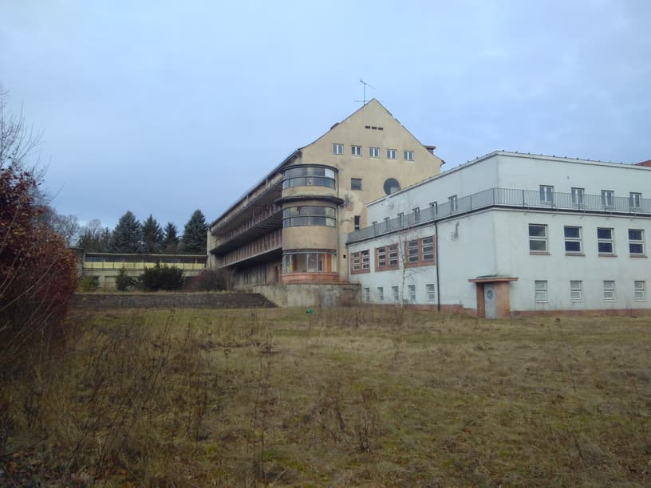
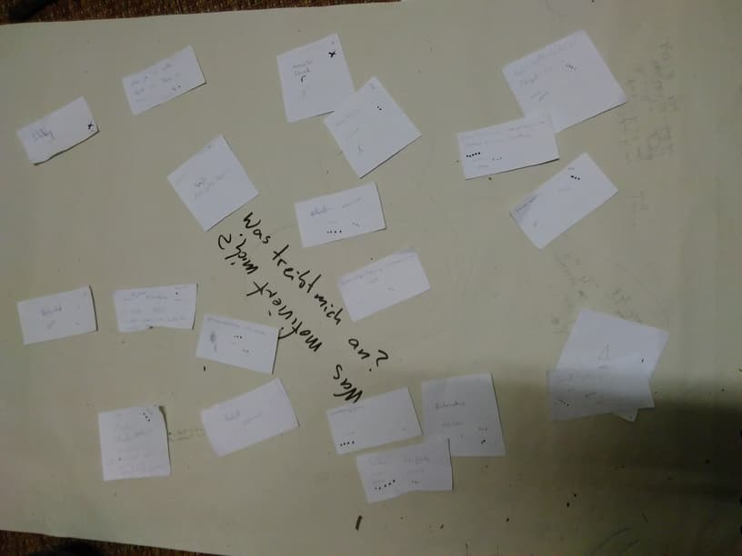
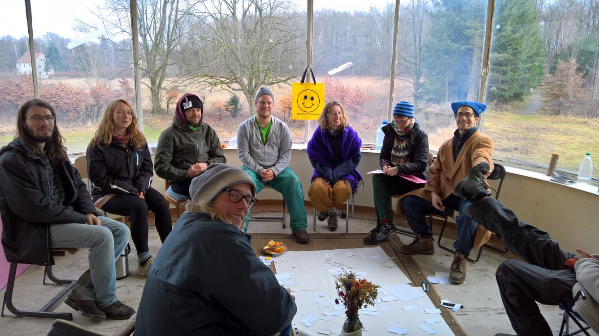

**The yunity heartbeat** - what has each team done, what are they doing and what do they need help with.

## Wh-y-unity meetings Harzgerode.

Over the course of last week a small number of yuniteers finally managed to meet up in person to discuss the deeper questions of our endeavor and organization, namely:

*   Why are we doing what we are doing?
*   How does this relate to yunity?
*   What is yunity?
*   What do we want it to be?

The people meeting in Harzgerode were [Paul Free](https://yunity.atlassian.net/wiki/display/~Paul+Free) , [Janina Abels](https://yunity.atlassian.net/wiki/display/~Janina) , [Laurina](https://yunity.atlassian.net/wiki/display/~laurina) , [Matthias Larisch](https://yunity.atlassian.net/wiki/display/~matthias) and [Bodhi Neiser](https://yunity.atlassian.net/wiki/display/~Bodhi) , partly accompanied by [fr4nk 0nf1r3](https://yunity.atlassian.net/wiki/display/~fr4nk0nf1r3) and Lisa, and joined by [Douglas Webb](https://yunity.atlassian.net/wiki/display/~dmhwebb) , [Philip Engelbutzeder](https://yunity.atlassian.net/wiki/display/~butze7) and [Rosina Klotz](https://yunity.atlassian.net/wiki/display/~rosina) for the very last day. Also, [Nick Sellen](https://yunity.atlassian.net/wiki/display/~nicksellen) and [Tilmann](https://yunity.atlassian.net/wiki/display/~tiltec) followed the process remotely and sometimes supported it with comments.

The initial idea was to approach the topics going from the abstract to the conctete, meaning that the personal level is addressed first, to get clarity on one's own driving forces, goals and values, to then come to a shared group perspective almost naturally. However, this turned out to be a very lenghty and sometimes unsatisfying procedure, so that we decided to reverse the process midweek. [Janina Abels](https://yunity.atlassian.net/wiki/display/~Janina) took on the responsibility to document the talks and [wrote many wiki pages](https://yunity.atlassian.net/wiki/spaces/YUCU/pages/89509593/Why+yunity) , which are mostly unfinished up to now, but she's positive to finish them in the coming days.

Outcomes:

* The self-realization, that yunity is a network rather than a project or a community.
* The general opinion, that this is not a bad thing.
* A [proposal for a set of group values](https://yunity.atlassian.net/wiki/spaces/YUCU/pages/89830156/Proposed+group+values), to serve as an addition to the vision and mission of yunity.
* The realization that this process has just started and will probably never be finished completely.

Documentation:

Day One, Sunday 2017-03-12
*   [Communication needs](https://yunity.atlassian.net/wiki/display/YUN/Communication+needs)
*   [Identity](https://yunity.atlassian.net/wiki/display/YUN/Identity)

Day Two, Monday 2017-03-13
*   [Personal motivations](https://yunity.atlassian.net/wiki/display/YUN/Personal+motivations)

Day Three, Tuesday 2017-03-14
*   [Personal motivations](https://yunity.atlassian.net/wiki/display/YUN/Personal+motivations)

Day Four, Wednesday 2017-03-15
*   [Personal needs](https://yunity.atlassian.net/wiki/display/YUN/Personal+needs)
*   [Change of direction: from the concrete to the abstract](https://yunity.atlassian.net/wiki/display/YUN/Change+of+direction%3A+from+the+concrete+to+the+abstract)

Day Five, Thursday 2017-03-16
*   [Change of direction: from the concrete to the abstract](https://yunity.atlassian.net/wiki/display/YUN/Change+of+direction%3A+from+the+concrete+to+the+abstract)

Day Six, Friday 2017-03-17
*   [Personal values](https://yunity.atlassian.net/wiki/display/YUN/Personal+values)
*   [Proposed group values](https://yunity.atlassian.net/wiki/display/YUN/Proposed+group+values)

Day Seven, Saturday 2017-03-18
*   [Where to go from here](https://yunity.atlassian.net/wiki/display/YUN/Where+to+go+from+here)

Day Eight, Sunday 2017-03-19
*   [Review, feedback and closing](https://yunity.atlassian.net/wiki/display/YUN/Review%2C+feedback+and+closing)

## Foodsaving Tool.

[Visit on foodsaving.world](https://foodsaving.world/)

So many new contributors! Since we gained a lot of womanpower during the last weeks (and some guys joined as well... ;) ), we are now in a phase where everybody works to find their place in the project and figures out how to work together most productively and pleasantly. More words are written in #foodsaving-tool on Slack than code is committed on github, but that is completely fine and necessary for people to turn into an actual team. The mood in the chat is great and now we even had our very first gif posted in the channel, because tomi was so thrilled by the discussion about admin privileges:

[Tilmann](https://yunity.atlassian.net/wiki/display/~tiltec) - who is on a bike trip since November last year - just reached the southern coast of Spain and didn't have much time, electricity or wifi during the last week, so his capacities to act as a team leader were limited. In the coming days he's going to cross the Straight of Gibraltar - probably by boat, this time...^^ - and who knows how much time, electricity and wifi he'll find in Morocco. This is the perfect moment for the new contributors to self-organize and bring the project forward as they see fit, by relying on peer-reviews and open communication. Go foodsaving-tool team! :D

## [Foodsharing.de](http://Foodsharing.de) Development.

Stuff is happening again with regards to [foodsharing.de](http://foodsharing.de) development! Raphael Wintrich came back and is ready and motivated to progress open sourcing. It still is unclear how the old mastermind and the newer contributors will work together, but [Nick Sellen](https://yunity.atlassian.net/wiki/display/~nicksellen) is managing communications and after some calls and in-person meetings on the upcoming 'foodsharing goes open source' hackathon - where it is planned to really get down to business with a few focused devs - it should be possible to work together productively.

## Foodsaving Worldwide.

#### In Progress

* [Janina Abels](https://yunity.atlassian.net/wiki/display/~Janina) and [Joachim Thome](https://yunity.atlassian.net/wiki/display/~Joachim+Thome) are planning their trip to Bilbao in April, to support Unai in starting a local foodsaving and -sharing initiative.
* The foodsavers of Göteborg are starting to really use the foodsaving tool and with Nicolas Sahlqvist a developer out of their group joined the foodsaving tool team.

#### Challenges/help needed

*   Do you happen to have contacts in Bilbao? Please let us know! :)

## About the heartbeat.

The heartbeat is a biweekly summary of what happens in yunity. It is meant to give an overview over our currents actions and topics.

#### When and how does it happen?

Every other weekend we collect information on a wiki page and publish it on Sunday or the following Monday as a wiki blog article.

Afterwards we add a nice abstract and share it on [facebook](https://www.facebook.com/yunity.org/) .

#### How to contribute?

Talk to us in [#heartbeat](https://yunity.slack.com/messages/heartbeat/) on Slack about the content, the layout or any other heartbeat related issues and ideas!
