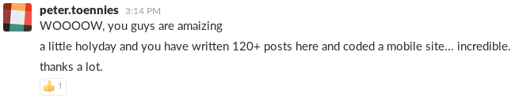
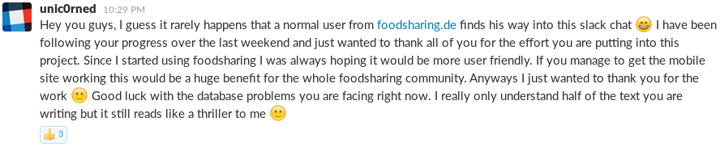
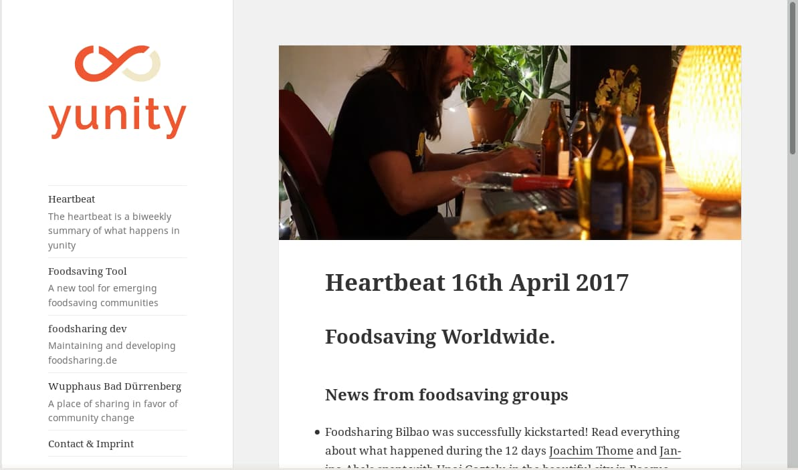
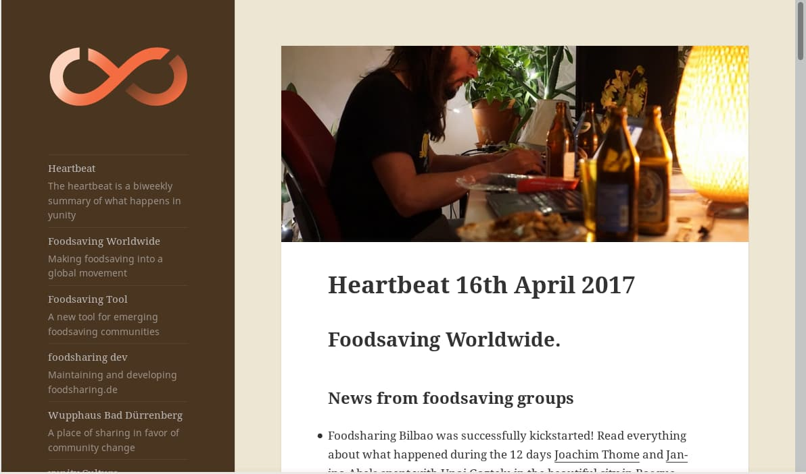

**The yunity heartbeat** - what has each team done, what are they doing and what do they need help with.

## Foodsaving Worldwide.

* We started a new small project to help people save food on every occasion: The foodsaving language guide. [So far it's just a pad](https://pad.disroot.org/p/fslanguageguide) , where we collect useful phrases, that can be used to talk to shop owners. We hope to come up with a nice collection, that will then be translated into as many languages as possible, to on the one hand help foodsaving groups to build up cooperations and on the other to enable freegan travelers to live off the surplus of abundant consumer societies, in which dumpster diving proves difficult.

### News from foodsaving groups

* foodsharing Bilbao had [its first distribution event](https://www.facebook.com/events/445975849075194/) at Karmela on April 27th.
* Did you know that on April 29th there was World Disco Soup Day? Well the foodsharing groups in Maastricht and Copenhagen did, and so they did what was due: Hosting disco soup events! :D
* foodsharing Poland and its ever-growing army of Food-Share Points has now been featured in an article in a magazine! See the Polish original [here](http://cojestgrane24.wyborcza.pl/cjg24/1,13,21634177,147811,Jadlodzielnie-w-Polsce--Uczymy-sie-nie-wyrzucac-je.html). (We already did a raw text-only translation in a pad, which you can access [here](https://pad.riseup.net/p/fspolskaarticle), and are still waiting for permission to publish the translated version on foodsaving.today.)
* [Janina Abels](https://yunity.atlassian.net/wiki/display/~Janina) recently stumbled upon this [video about foodsharing Madrid](http://laaventuradeaprender.educalab.es/-/foodsharing-espana). Unable to tell how old it is, she added Luis Tamayo on facebook and is now hoping to hear the whole story from him. It hopefully is one, that is still ongoing! ;)
* [Janina Abels](https://yunity.atlassian.net/wiki/display/~Janina) is also in contact with a motivated guy named Angel from Valencia, who is wondering why there is a foodsharing Valencia facebook group, but no activity. Maybe he can be coached - just like Unai was - and enabled to reactivate the foodsharing project of Valencia. And maybe that will be a reason to revisit this beautiful city, Janina and Tilmann just came by in February... ;)
* The last piece of intel from the Spain research is, that there apparently is a foodsharing group in León. Alvaro Saiz Ruiz - the man behind Nevera Solidaria, who [Janina Abels](https://yunity.atlassian.net/wiki/display/~Janina) and [Unai Gaztelu](https://yunity.atlassian.net/wiki/display/~Mettodo) visited in Galdako - said so, but we have not been in contact with them so far. We found [a page from 2015](http://www.recuore.com/foodsharing-leon/) , where they apparently took part in the Recuore Festival (there also is [a video](https://www.youtube.com/watch?v=F8sUjt-B8DM), that shows a whole hour of discussion about food waste!) and [another page](https://www.deotramanera.co/ayudar/economicamente-dinero/foodsharing-disco-sopa-cuando-repartir-comida-es-cosa-todos) from around the same time lists even more interesting parties, that work for the same goal as we do, but there's nothing more recent to find as of now. What happened there? Who are or have been the main people behind these initiatives? What became of them? Foodsaving research can be like a detective story sometimes...^^

### [foodsaving.today](https://foodsaving.today/)

* The second part of the series of blog posts from Gothenburg was published. This time it's all about the practical challenges a foodsaving project is confronted with when trying to get stores to cooperate. [Read here](https://foodsaving.today/en/blog/2017/04/21/foodsharing-gothenburg-part2) how the people of Gothenburg chose to deal with them!

### [foodsaving.world](https://foodsaving.world/)

Our project constantly attracts the interest of developers; we only need to find out how to grow the core group, currently consisting of Tilmann, Lars, Nick and Janina. Other than that, bits of progress were made:

* added a link to [our facebook group](https://www.facebook.com/groups/foodsaving.worldwide/) - thanks to [Pablo Carmona](https://github.com/PabloCarmona)
* proper templating support for e-mails - thanks to [ShababShahriar aka s2k](https://github.com/ShababShahriar)

The changes will be online soon. For the brave and curious: you can already try them out on [dev.foodsaving.world](https://dev.foodsaving.world) .

### [foodsharing.de](http://foodsharing.de)

There is a new post on the foodsharing devblog concerning [the recent developments at the Easter hackathon](https://devblog.foodsharing.de/2017/04/18/easter-foodsharing-hackathon.html) in Berlin. [Matthias Larisch](https://yunity.atlassian.net/wiki/display/~matthias) and Raphel Wintrich came to [Nick Sellen](https://yunity.atlassian.net/wiki/display/~nicksellen) 's place and the three of them were coding together productively, writing more than 120 messages in #foodsharing-dev on Slack and inspired some enthusiastic feedback:

## Harzgerode.

Since the beginning of 2017 Harzgerode has been a place for yuniteers to go to. The former children's clinic in the Harz mountains in central Germany is situated in the forest, but still offers a great food situation for dumpster divers. There are intact windows and clean rooms, running water, electricity and internet, as well as a lot of space and the benevolent support of [Bernd Rühl](https://yunity.atlassian.net/wiki/display/~bernd) . At first it was mainly some people looking for shelter and comfort, being exhausted from the harsh winter in Bad Dürrenberg. Then the wh-y-unity meetings were held in the former clinic and now more and more yuniteers go where more and more yuniteers go - we know that dynamic...

But it's not only or mainly yunity folks, who populate the building and compound. Since it is such a great area, this year's [undjetzt?! conference](http://www.undjetzt-konferenz.de/) will take place in Harzgerode and maybe even the [Utopival](http://www.utopival.org/) . Those two events are very close to yunity, be it thematically or personally, so synergies will definitely form! For example, compost toilets and solar showers are already being built to serve all of the events.

## yunity Website.

As announced in [the last heartbeat](https://yunity.org/en/heartbeat/2017-04-16) , [Nick Sellen](https://yunity.atlassian.net/wiki/display/~nicksellen) started working on a new and pretty minimal website for [yunity.org](http://yunity.org). [Tilmann](https://yunity.atlassian.net/wiki/display/~tiltec) and [Janina Abels](https://yunity.atlassian.net/wiki/display/~Janina) are supporting him in this endeavor and now what's mostly missing is feedback from other yuniteers if we want to exchange the good old [project.yunity.org](https://project.yunity.org/) homepage with the proposed [new.yunity.org](https://new.yunity.org/en) one - which is still a work in progress of course.

If we can get to any kind of agreement the next heartbeat will already be published on [yunity.org](http://yunity.org) directly (no 'project' or 'new' will compromise the simple beauty of the url anymore then...).

These are two proposals of how it could look like:

## About the heartbeat.

The heartbeat is a biweekly summary of what happens in yunity. It is meant to give an overview over our currents actions and topics.

##### When and how does it happen?

Every other weekend we collect information on a wiki page and publish it on Sunday or the following Monday as a wiki blog article.

Afterwards we add a nice abstract and share it on [facebook](https://www.facebook.com/yunity.org/) .

##### How to contribute?

Talk to us in [#heartbeat](https://yunity.slack.com/messages/heartbeat/) on Slack about the content, the layout or any other heartbeat related issues and ideas!
