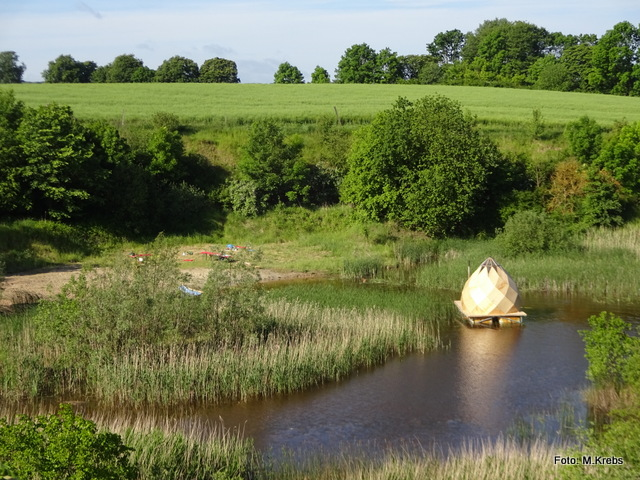

**The yunity heartbeat** - news from the world of sharing, fresh every two weeks.

## Festivals

During the summer lots of festivals take place and provide us with great opportunities to network, learn and save resources in a fun and social environment!

### Humus Festival

From the 4th to the 11th of June the [Humus Festival](http://humus-festival.de/) took place at [Kulturgut Freiland](http://kulturgut-freiland.de/gelaende/) in the North-East of Germany. It was meant to bring together people from the different but related backgrounds of foodsharing, permaculture and wilderness awareness - and that's exactly what it did! It was a week full of interesting workshops treating all kinds of subjects from Thai massage to Bokashi composting, from sensing nature to sewing wounds and from hypnosis to baking bread. Every day we were fed three amazing vegan/vegetarian meals, that were made partly from saved food. Butze was there from the very beginning and made sure a [flake](https://www.youtube.com/watch?v=73SRZKvHqUA) was installed to enable people to share whatever they want directly on the spot - without the need for any kind of online platform.
We bathed in the lake, we sweat in the floating sauna and we sang at the fire. And just like that a lot of new connections were established, so that there is e.g. a newly found - and hopefully growing! - network of people in Berlin, who are united by the need to build something bigger, that is beneficial for the city, the people and the world. Do you want to join in as well? Then visit the [humus forum](http://humus-festival.de/forum/index.php), create an account and take part! ...or tell Janina on Slack and she will connect you! ;)

### MOVE Utopia

Next week the [MOVE Utopia conference](http://move-utopia.de/wp-content/uploads/2017/03/Aufruf_eng.pdf) will take place in Berlin and bring together lots of different movements working for social and ecological change. Some of us have been involved in organizing this big event from the very beginning, so we're looking forward to amazing outcomes, which then will be covered by a whole specialized issue of the [Oya magazine](http://www.oya-online.de/home/index.html)!

### Foodsharing.de festival season

With the Hurricane and Southside festivals taking place in two weeks in the North and South of Germany respectively, the festivals season for German foodsavers is opening as well! Let's save tons of food, tents, camping chairs, sleeping bags and all the other camping supplies, like sunscreen, toothpaste! And all the good beer can't go to waste either, of course... ;)

## Foodsaving Worldwide

### News from foodsaving groups 

### [foodsaving.today](https://foodsaving.today)

### [foodsaving.world](https://foodsaving.world)

## About the heartbeat.

The heartbeat is a biweekly summary of what happens in yunity. It is meant to give an overview over our currents actions and topics.

### When and how does it happen?

Every other weekend we collect information on a wiki page and publish it on Sunday or the following Monday as a wiki blog article.

Afterwards we add a nice abstract and share it on [facebook](https://www.facebook.com/yunity.org/).

### How to contribute?

Talk to us in [#heartbeat](https://yunity.slack.com/messages/heartbeat/) on [Slack](https://slackin.yunity.org) about the content, the layout or any other heartbeat related issues and ideas!