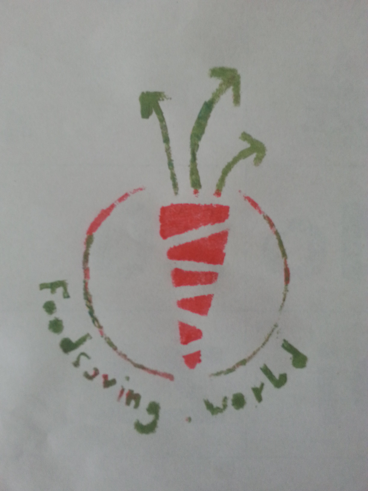

**The yunity heartbeat** - news from the world of sharing, fresh every two weeks.

## Planning a multisharing platform

## [Berlin Hackathon plannings](https://yunity.org/en/events/2017-06-14-hackathon)

According to the attendance sheet, we are expecting

- 3 devs to work on foodsharing.de and the new _foodsharing light_ code
- 4 devs to work on trustroots.org code
- 4 devs to work on foodsaving.world code.

Additionally, there will be people who are interested in having a look at the projects or will support the hackathon with food deliveries and cooking. Speaking of food: we will pick up food from lots of [foodsharing.de](https://foodsharing.de) cooperations in Berlin and made an agreement with [Wilmersburger](https://www.wilmersburger.de), who will send us a packet of vegan cheese.

For further promotion of the foodsaving tool at the hackathon, Laurina converted the logo into a stencil. Now we can print on shirts and other surfaces :)

We are looking forward to meet you in the evening of on July 14th!

## [foodsharing.de](https://foodsharing.de)

Next steps towards converting foodsharing.de PHP backend code into the Laravel framework have been done by Raphael W. He created a new Laravel project to try out a possible code structure. After feedback from Nick he plans to use the gained knowledge to integrate those ideas into the main foodsharing.de repository. It is unclear yet how Laravel's _Eloquent_ ORM will relate to the recently introduced [foodsharing-api](https://github.com/foodsharing-dev/foodsharing-api), which uses the _Doctrine_ ORM. 

## [foodsaving.today](https://foodsaving.today)

We got a new article about [Foodsharing Bilbao](https://foodsaving.today/en/blog/2017/06/30/foodsharing-bilbao-the-beginning) on foodsaving.today, written by Unai, one of the founders.

> We have weekly foodshare events at Karmela and Bilbiko Kultur Etxea. We have contacted big supermarkets such as Lidl and ALDI. We are going to present Foodsharing Bilbao and prepare food in an event organised by the Space Exchange Network and at a neighbourhood assembly. We have been invited to organise a Disco Soup in Sarean that might take place soon or after this summer. We will be live on air soon in a local radio station. We are active!

## [foodsaving.world](https://foodsaving.world)

There have been a lot of discussions in the last two weeks revolving around the next steps of the foodsaving tool.

## WuppHaus Wurzen

## Harzgerode

Planning of the Pflanzenkläranlage, Invitation to a work camp
https://www.youtube.com/watch?v=UTtHYLnnLxs

---

## About the heartbeat.

The heartbeat is a biweekly summary of what happens in yunity. It is meant to give an overview over our currents actions and topics.

### When and how does it happen?

Every other weekend we collect information on a wiki page and publish it on Sunday or the following Monday as a wiki blog article.

Afterwards we add a nice abstract and share it on [facebook](https://www.facebook.com/yunity.org/).

### How to contribute?

Talk to us in [#heartbeat](https://yunity.slack.com/messages/heartbeat/) on [Slack](https://slackin.yunity.org) about the content, the layout or any other heartbeat related issues and ideas!
