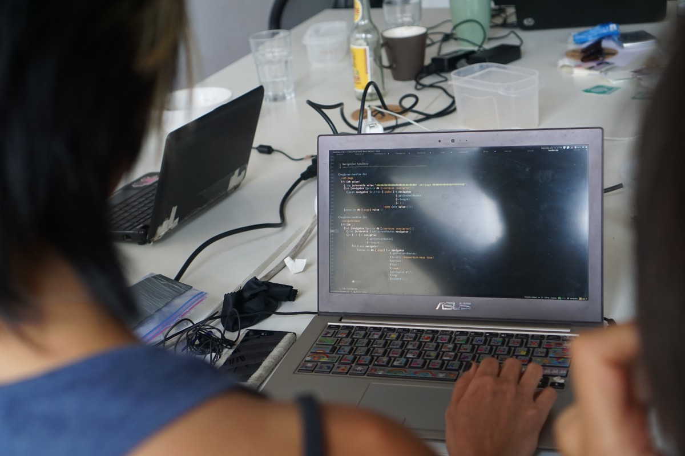
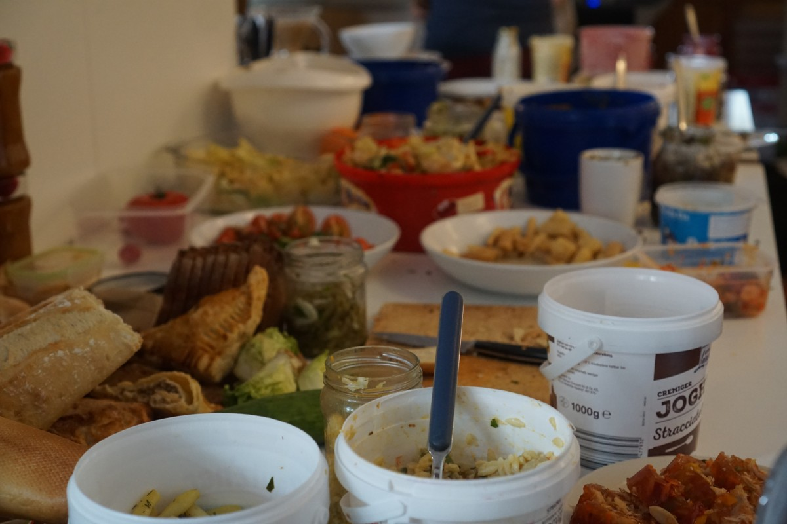
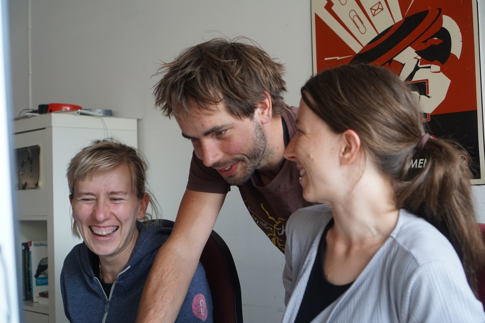
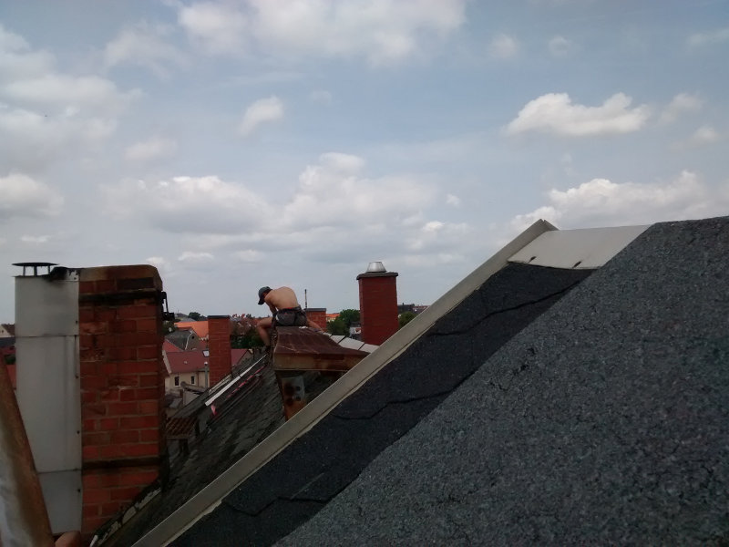

**The yunity heartbeat** - news from the world of sharing, fresh every two weeks.

## Hackathon in Berlin

From July 14 to 16 we spent two and a half productive days at [coup](http://co-up.de/), ate saved food and worked on our projects. Read more details below!

### foodsharing.de light

We (mostly Matthias, with a bit of consulting by Tilmann and Nick) rebuilt foodsharing-api backend on the hackathon and are now using Django REST Framework (Python), same as foodsaving.world. By this, it is easier for us to collaborate more with foodsaving.world.
The site is deployed and usable on https://beta.light.foodsharing.de/
It is not yet ready to be published widespread as there are some more optimization, changes and fixes to be done, but you are free to give the link out to people.

_(edited by Tilmann)_

### [foodsaving.world](https://foodsaving.world)

> We are [Marie & Ines](https://twitter.com/nk42) and we work on Foodsaving backend during our [RailsGirls Summer of Code](https://railsgirlssummerofcode.org/). We started two weeks ago and the first thing we noticed was: we have to learn much more technical stuff (about APIs, Django shell, serializers, base models and at least 42 other things) to become good, productive contributors. And we are going to become that!
>
> The Hackathon was incredibly helpful for that. Tilmann explained the overall code structure and testing while Nick did a lot of code reading with us ("reading together” might sound strange, but it’s actually a great thing!). And then there were all these great people sharing food, cooking, hugging (even if they just know you for about 10 seconds) or working on their own projects. We had a great weekend! Thank you all!!!

We had discussions about the backend database model, the relationship to foodsharing.de and foodsharing.de light, upcoming features and how we figure out what features we want to have at all.

Tilmann worked on a feature that allows members of a group on foodsaving.world to invite other people via email. It should be released by the next heartbeat.

Code changes during the last two weeks (also from before the hackathon):

- New pick-up date list design to highlight the pick-up the user signed up for and the ones that are open

- Joining a group is now done via a page that lists all groups that the user is not part of, then the user sees the group's info page and can click "join"
- Design improvements to improve the experience on small displays

_(edited by Tilmann)_

### [trustroots.org](http://trustroots.org)

> Our main focus was to work on a mobile app for Trustroots: basically to have something simple to install onto your phone so that we can properly get started with mobile apps and improve on them in future. We experimented with several ways to do this and learned a lot! We are running last tests and expect to publish something for everyone soon.
>
> We also introduced several new people into Trustroots development, had fun, talked about future ideas and made many new friends!
>
> Kenny also joined us for an afternoon to record a podcast episode about Trustroots during the hackathon, [check it out](http://www.freestyletravelshow.com/2017/07/12-trustroots-w-mikael.html)!
>
> This was so much fun, everyone!

_(by Mikael from Trustroots)_

## News from foodsaving groups

- Bruno from Gothenburg visited Berlin! He, his girlfriend Madde and Laurina spent a nice evening at Janina's place, where some BBQ, lots of talking and serious networking took place! ;) Before that Janina took the two Swedes to a typical pick-up at a small bakery in a metro station. Madde took some pictures and said to write something about this experience. We're looking forward to reading that! :)
- We got an email from Ecuador! Chalo says there is big interest in starting a foodsaving group, and that he'd love to build on our experiences to do so. Funnily enough, while doing foodsharing on the Feel festival Tilmann and Janina discovered that Fausto - a foodsaver from Munich, who has Ecuadorian roots - is friends with Chalo and already plans going back to South America in the near future. This connection will definitely help us strengthening the bond to the Ecuadorian foodsaving community!
- Another mail reached us, this time from Colombia! Daniela also thinks that saving food is a great idea and she was mainly looking for agruments and tips on how to convince store owners to cooperate. We linked her to the guide we wrote about [how to build and maintein cooperations with stores](https://yunity.atlassian.net/wiki/display/FSINT/How+to+build+and+maintain+cooperations+with+stores) and encouraged Chalo to also get in contact, since Ecuador and Colombia are neighboring countried and their circumstances and challenges could be similar. Apart from that networking is _always_ good... ;)

## Kanthäuser Wurzen

As written in [the last issue](../2017-07-09), we finally bought the houses in Wurzen! The roof is not completely waterproof yet, so immediate measures are taken by some pioneers, who took on the task of climing the roof and applying bitumen.

The houses are not in a terrible state (compared to Bad Dürrenberg it's a safe haven...), but there's still a lot to do. The pipes and wires need to be checked and probably repaired, the heating doesn't work, the rooms are mostly empty and on top of that we found out, that there's the toxic GDR insecticide Holytox 59 in the wood of the roof.

On the other hand, we have running water and internet is ordered... ;) We already collected some unused furniture from Leipzig (thanks to ebay Kleinanzeigen's gift feature) and mood and motivation are high!

Just to give you a more personal impression of the state of things in Wurzen, this is was Nick wrote in [#wupphouse_wurzen](https://yunity.slack.com/messages/C3RS56Z38/) on [Slack](https://slackin.yunity.org) after being there in the super early days:

> I left Wurzen yesterday and am back in Berlin for a bit now. When I was cycling down I was wondering why I was going there, 2 days cycling for a few days without electricity, etc.. and my skills are not so relevant for construction/roof kind of stuff. And seemed there was a lot of stuff to be doing here in Berlin too.
> 
> But after having been there I realise it was totally worth it, it felt exciting to be there, new possiblities, seeing something come from nothing (ok, not nothing, just something less). The resourcefulness of the group amazed me as it usually does with you people - each problem that came up was solved somewhat organically, and almost without any costs we made a little home there.

For more details read the [minutes from the daily meetings](https://yunity.atlassian.net/wiki/display/WW/After+moving+in%3A+Meeting+Minutes), where we try to collect every bit of info with regards to the construction works, the social setup, the general feelings of the participants, our needs, ideas and plans.

## Work camp in Harzgerode

The artificial wetlands are in the process of being constructed now! The participants are few but energetic and progress is made every day! According to Bodhi the work is a lot of fun and especially riding the excavator definitely is a highlight for many! ^^

Still, more hands are very welcome to safely complete this project before the [undjetzt?! conference](http://www.undjetzt-konferenz.de/) will start. So if you want to come by and help out you'll be greeted by smiles, hugs and thankful faces! Simply contact the [Gemeinschaftsstifter](http://gemeinschaftsstifter.de/kontakt/) for more detailed information.

---

## About the heartbeat.

The heartbeat is a biweekly summary of what happens in yunity. It is meant to give an overview over our currents actions and topics.

### When and how does it happen?

Every other weekend we collect information on a wiki page and publish it on Sunday or the following Monday as a wiki blog article.

Afterwards we add a nice abstract and share it on [facebook](https://www.facebook.com/yunity.org/).

### How to contribute?

Talk to us in [#heartbeat](https://yunity.slack.com/messages/heartbeat/) on [Slack](https://slackin.yunity.org) about the content, the layout or any other heartbeat related issues and ideas!
