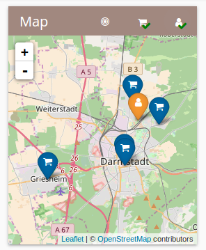

**The yunity heartbeat** - news from the world of sharing, fresh every two weeks.

## [foodsharing.de light](https://foodsharing.de)

We merged the first contributions from a new contributor, a skilled programmer called [Jannis](https://github.com/derhuerst/), who joined us at the hackathon. He's [improved the metadata](https://github.com/foodsharing-dev/foodsharing-light/commits?author=derhuerst) of the site.

He also started work on solving some tricky issues on the nodejs chat server which the existing and light versions of the site both need to conncet to - this is the last remaining issue before we can publish the light version of the site further!

===

Tilmann is working on improving the display of chat messages when the content gets too wide, and ensuring we are correctly escaping and autolinking the content.

Martin [continues to work](https://github.com/foodsharing-dev/foodsharing-light/commits/quasar-beta) on upgrading us to the latest version of Quasar, thanks!

_(by Nick)_

## [foodsaving.world](https://foodsaving.world)

Ines and Marie from RGSoC are [working to finalize](https://github.com/yunity/foodsaving-backend/issues/253#issuecomment-318612543) the [pick-up feedback feature](https://github.com/yunity/foodsaving-frontend/issues/159) on the back-end, while Lars already created [a user interface draft](https://github.com/yunity/foodsaving-frontend/pull/581).

Dave, Nick, Ana, Ines, Marie, and Daniel were at Soundcloud for a retrospective of the last month:

There was a lot of consensus on the speed at which Ines and Marie are progressing:

In an activity surge, Nick made much progress on [his back-end implementation](https://github.com/yunity/foodsaving-backend/pull/333) of the _Conversations_ feature, awaiting review now. Whilst working on that, he also had the idea to improve the test infrastructure, namely [watching files for changes and running only affected test](https://github.com/yunity/foodsaving-backend/pull/334). All that to boost our test coverage further up, even it's [already at 98%](https://codecov.io/gh/yunity/foodsaving-backend)!

### Further changes and improvements

- Users can add their location, members of the group can see where other members are located. This feature is meant to improve pick-up coordination and sharing of food.
- The store overview map got much more responsive: it zooms to the currently selected store and shows other stores and users with reduced opacity

- The location input is now the same on group, store and user forms and the visibility of the address search field has been improved
- "Home" button added to all pages that links to the landing page
- Store list gets now sorted by name
- Bug fix: store map was sometimes not visible when the store didn't have an address
- Refresh data from the server when clicking on stores and the group. If two users were modifying data, it could lead to outdated values before.
- Fix "blank page" bug when user is logged out or URL is invalid. It redirects to the login page now.
- The backend development setup should be easier now thanks to [the Dockerfile](https://github.com/yunity/foodsaving-backend/pull/331) created by Ines, Marie and their coaches.
- `Django-channels` for doing _websockets_ were added in preparation of the _Conversations_ feature
- When signing up, E-Mail addresses are now [considered case-insensitive](https://github.com/yunity/foodsaving-backend/pull/327) to prevent errors. For example, `test@example.com` and `Test@example.com` can't be used at the same time.
- The API documentation is now only available via `/docs/`, e.g. [foodsaving.world/docs/](https://foodsaving.world/docs/), while `/api/` returns raw `JSON` data.

_(by Tilmann and Nick)_

## News from foodsaving groups

An [article about Foodsharing Maastricht](https://foodsaving.today/en/blog/2017/07/29/foodsharing-maastricht-discovery) was added to [foodsaving.today](https://foodsaving.today):

> Recently, we picked up food from three smaller supermarkets on a regular basis and we started to cooperate with the food supplier of the university, which already greatly improves the sustainability of our university. On a national level, we just joined the Dutch-wide Foodsharing foundation, which was also just recently founded.

## [Kanthäuser Wurzen](https://yunity.org/en/wurzen)

The buildings on Kantstraße go steadily forward... There are some holes in the old bitumen roof which were not sealed with one coat of bitumen paint, another layer will be added when the necessary equipment is in place.

A first event was held to meet the neighbors over cake and coffee and although not many came it was nice and/or informative to meet up. Connections were also made to local initiatives such as [Mehr Generationen Haus](http://www.zuversichtverein.de/), [Netzwerk für Demokratische Kultur](http://www.ndk-wurzen.de/), local Kleingärten (allotments) and another local housing project.

Janina, Laurina, Doug and Matthias formally associated a project group in order to coordinate without having a boss or privatizing the resource, documents in public soon. There are 5 new house plants and people seem pretty happy.

_(by Doug)_

## [Gemeinschaftsstifter Harzgerode](https://www.gemeinschaftsstifter.info/)

Harzgerode has been a hive of activity these past weeks, and this shows no sign of slowing down.

### Work Camp
The Work Camp was a roaring success. A team of yuniteers, volunteers, engineers, and people with dirty ears came together with shovels and spades, and built what will now be the community’s own in-house water treatment basin.

### [undjetzt?! Konferenz](http://www.undjetzt-konferenz.de/)
The _undjetzt?! Konferenz_ will run from the 18th - 25th August, and already people have begun to descend on the grounds of former Heilstätte Harzgerode. Preparation for the festivities are well underway decorating the stages, building the venues, and stockpiling the food that are going to help make this event in the green German heart of the Harz mountains a golden pilgrimage. The team have an ambitious list of things they would like to have in place before the conference begins, so do feel welcome to head to Harzgerode early. Helping hands are always appreciated.

_(by Adam)_

### Invitation to found an ecovillage coop

In September, the hosts of the UJ conference will offer Founding Weekends to found the future community that build up a coop held ecovillage. They are looking for ambitious and responsible people who would like to settle there and start great projects around healthy and sustainable ways of living, renewable energies, permaculture, electric mobility in rural areas. It will be a place for young and old people, couples and families. In middle term there will be a school, kindergarten, a mall for the wohle bunch of community made products and much more.

_(by Bernd)_

## [Dargeluetz](http://dargeluetz.weebly.com/)

_Joachim reports from [Schenker Dargeluetz](http://dargeluetz.weebly.com/):_

> We had a very productive and a very stressful July. Productive because we now have the brickpress from Austria here and an additional person, Wolfgang, joined the community last month who is super helpful.
>
> Stressful because there is a lot of work to do but only few of the people that lived here longterm for now are capable and willing to do work.
> The people that have lived here over the last 2 years have let the buildings rot away and did not manage to keep the place in a clean state or even keep a proper communication towards the heads of the organization.
> Instead it was a dominant mentality of “ignorance is bliss” which ruled here and got clearer to me observing the people here over the past months.
> That leads to the next issue. At the moment I am clarifying as project leader who actually wants to stay in the project to contribute and who might want to check out either other projects or just find themselves a standard flat.
>
> Since I am addressing this issue in my well known sensitive manner :-P I got a lot of emotional resistance from most of the longterm inhabitants, which was quite annoying.
>
> But now that the heads of the organization are informed and involved in the communication process things start to clear up and the actual community building process can start(yay!)
>
> Which brings me to:
> A building week/workshop is in the planning for end of September. There we will build a clay dome and a Biomeiler!
> The Biomeiler combines heating, gasproduction and composting in one system. We will also build a showerloop and a wall heating with that.
> Event will soon apear [on the webpage](http://dargeluetz.weebly.com/veranstaltungen.html).
> If your German sucks contact me directly by the email address below.
>
> And we are recruiting new members! So if you are interested in actively supporting a highly idealistic project to build a commons based economy come join us :-)
>
> Contact me via:  [joachimthome69@gmail.com](mailto:joachimthome69@gmail.com)
>
> Near us, in Blievenstorf, another project of a friend is finally in a state to be restarted. After he had three years of being blocked by his relatives the open eco lab Blievenstorf will now steadily move towards hosting open source hardware projects.
> We are in contact and will see [what kind of machines](https://blog.opensourceecology.de/de/2015/02/ose-germany-technologie-basisstation-blievenstorf/) we want to build together in the upcoming years.
>
> I also want to invite all yuniteers to come by to hang out here in the north.
> Programming will also soon be possible in larger groups. We are working on a communal sleeping and a communal office room.
>
> Be up to date via the blog:
> http://dargeluetz.weebly.com/blog
>
> And see you soon :-)

---

## About the heartbeat.

The heartbeat is a biweekly summary of what happens in yunity. It is meant to give an overview over our currents actions and topics.

### When and how does it happen?

Every other weekend we collect information on a wiki page and publish it on Sunday or the following Monday as a wiki blog article.

Afterwards we add a nice abstract and share it on [facebook](https://www.facebook.com/yunity.org/).

### How to contribute?

Talk to us in [#heartbeat](https://yunity.slack.com/messages/heartbeat/) on [Slack](https://slackin.yunity.org) about the content, the layout or any other heartbeat related issues and ideas!
