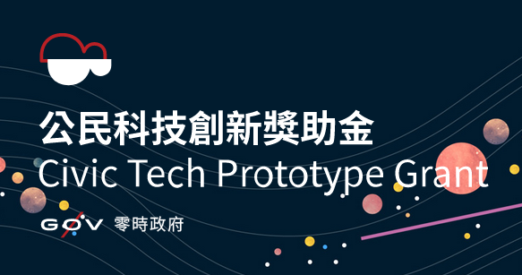
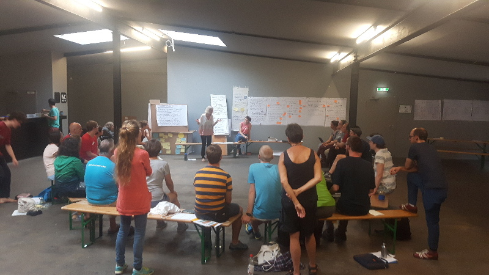

**The yunity heartbeat** - news from the world of sharing, fresh every two weeks.

## [foodsaving.world](https://foodsaving.world)

Foodsharing Taiwan won the [g0v grant](https://grants.g0v.tw/) and will use the money that they'll receive partially to support foodsaving.world development!

It is the 2017 Autumn g0v Civic Tech Prototype Grant specifically, which will support the necessary steps for foodsharing Taiwan to really start using the foodsaving tool. Thanks to Stefan, who wrote a [long and detailed application](https://goo.gl/DykQfV), where he explained the need for foodsaving and the advantages of having a platform to do so, foodsharing Taiwan will now receive 500.000 TWD. After taxes (which will be huge since Stefan is a foreigner) the money will be used to finance local things for Taiwan first of course, like printing flyers and paying travel costs for meetings and presentations. What's left afterwards will be distributed between active contributors to the foodsaving tool using a time tracking system.

For more info visit our new wiki page concerning [funding and sponsoring](https://yunity.atlassian.net/wiki/spaces/FSINT/pages/92879471/Funding+Sponsorships).

The rails girls make progress!

Marie and Ines still spend every day learning about code using our precious foodsaving tool as example. They post daily logs to their RGSoC team page, so [check it out](https://teams.railsgirlssummerofcode.org/teams/632) for more details!

_(by Janina)_

## foodsharing festival

From August 18th to 20th the big annual foodsharing festival took place in Berlin!

Before the event officially began, there was already the newfound delegate's meeting on Friday. Janina took part on behalf of international groups and found the day to be surprisingly productive:
* approx. 30 delegates from cities all over Germany, as well as some from Austria and Switzerland came together to discuss hot foodsharing topics
* we were supported by a professional moderator, who made sure we didn't get lost in too specific talks and concentrated more on collecting topics for the whole community to further work on
* in the end we identified the most pressing issues and even found people being willing to take responsibility to further pursue them

The hottest topic definitely was the uncertainty and fear the restructuration of foodsharing.de's organizational setup brought with it. Should every local group register an association now? If not, what actually happens? What are the benefits and disadvantages of either way? Can't we just carry on like we did before..? Questions like these show the turmoil foodsharing.de as a whole is in at the moment and - of course - we couldn't completely answer them. There are different opinions and lines of reasoning and the process of the restructuration just started. But that it _did_ start is undeniable.

Other, more concrete topics were the lack of communication between the cities and regions, the outdated wiki, the ambiguous quiz, the fact that foodsharing.de still is only available in German and - last but definitely not least - the problems with the online platform itself.

But as I said before, people signed up to tackle these things, solutions are being discussed and refined and there is momentum again in the supraregional organization of foodsharing.de

_(by Janina)_

## Wurzen

We had our first decsion making process and using score voting we finally chose a name for the project: Kanthaus will be the official name from now on (maybe not too surprising, because it has been the inofficial one all along... ;))

Apart from that Laurina wrote a first application for funding, is still researching more opportunities and got in contact with the mayor's office. On September 5th there will be an official meeting with the mayor of Wurzen, we're very excited!

Matthias finally found an electrician, who is not busy until November, and on August 22nd electricity in the Kanthaus will be activated, yay!

_(by Janina)_

---

## About the heartbeat.

The heartbeat is a biweekly summary of what happens in yunity. It is meant to give an overview over our currents actions and topics.

### When and how does it happen?

Every other weekend we collect information on a wiki page and publish it on Sunday or the following Monday as a wiki blog article.

Afterwards we add a nice abstract and share it on [facebook](https://www.facebook.com/yunity.org/).

### How to contribute?

Talk to us in [#heartbeat](https://yunity.slack.com/messages/heartbeat/) on [Slack](https://slackin.yunity.org) about the content, the layout or any other heartbeat related issues and ideas!
