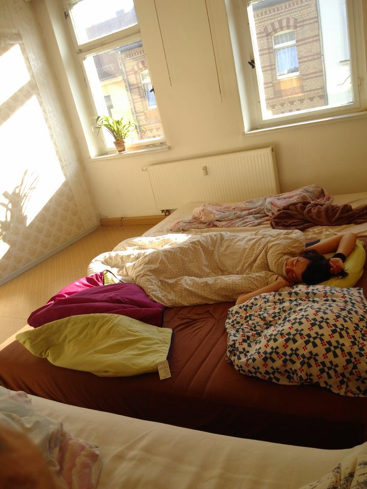
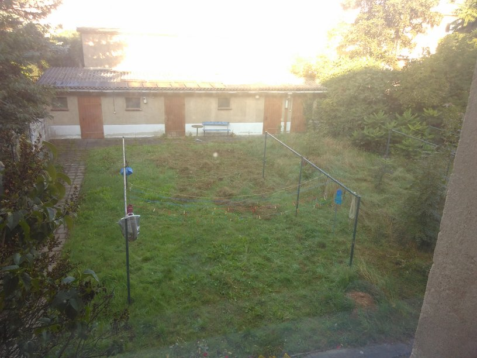
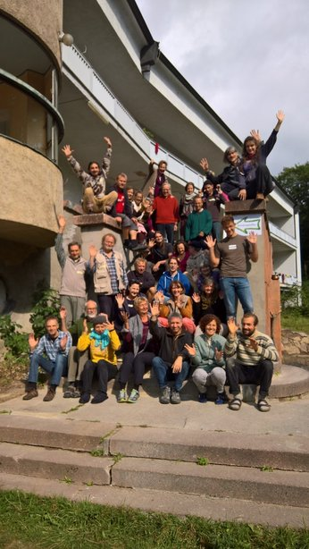

**The yunity heartbeat** - news from the world of sharing, fresh every two weeks.

## [foodsaving.world](https://foodsaving.world)

### Rails Girls Success

The RailsGirls are getting more and more experienced sailing over the ocean of code! Read everything about their first big adventure in [their very own fairy tale](https://blog.foodsaving.world/2017/09/01/railsgirls-fairy-tale.html).

### Latest development activity

Since the last changelog in [Heartbeat 2017-08-06](2017-08-06), a lot of things happened! I'm going to highlight relevant discussions and changes.

#### Discussions

- Kristijan clarified that the ["terms before you can join a group"](https://github.com/yunity/foodsaving-frontend/issues/324) should be marked explicitly as user-provided, see also the discussion in ["minimal admin roles"](https://github.com/yunity/foodsaving-backend/issues/350)
- Nick and Tilmann are working hard to [evaluate frontend framework candidates](https://github.com/yunity/foodsaving-frontend/issues/593). So far, they looked at Angular4, React and Vue.JS. The latter is the current favourite, pending a more formal evalution and consensus among the development team. It also became clear that a library of pre-made UI components is the most critical piece of software for us, as we are lacking designers.
- We came to the conclusion that we need to create a proper [project info website](https://github.com/yunity/foodsaving-frontend/issues/601) that should be visible on foodsaving.world. Nick already finished the initial setup, now it needs to be decided what content we want to have on it.
- As part of the previous point, we considered renaming the foodsaving tool to a more abstract name, like _karrott_ (inspired by the logo)
- Kristijan proposed an [out-of-the-box solution to handle newcomers](https://github.com/yunity/foodsaving-frontend/issues/546#issuecomment-326497599) while the feature is not yet implemented
- Kristijan published his thoughts on [a legal entity for foodsaving.world](https://github.com/yunity/foodsaving-frontend/issues/606) and a [data privacy statement](https://github.com/yunity/foodsaving-frontend/issues/607), partly inspired by the struggles that foodsharing.de has nowadays
- The discussion on [store teams](https://github.com/yunity/foodsaving-frontend/issues/360) was fueled by a comment from Stefan who wished to manage his foodsavers with one group per store. Much of the conversation can be found in the #foodsaving-tool Slack channel.

#### Coding progress

- New: Ines and Marie implemented [user feedback for pick-ups](https://github.com/yunity/foodsaving-backend/pull/342)
- Changed: Finished pick-up dates [are now kept in the database](https://github.com/yunity/foodsaving-backend/pull/344) to make feedback possible (Tilmann)
- Changed: Pick-up series modifications [don't modify a dependent pick-up if a user has joined it](https://github.com/yunity/foodsaving-backend/pull/346) (Tilmann)
- New: [Push notification infrastructure](https://github.com/yunity/foodsaving-backend/pull/356), using Google FCM
- @azzang, a new contributor, created a [common front-end service to determine the screen size](https://github.com/yunity/foodsaving-frontend/pull/599)
- Nick is looking for solutions on how to implement [a rules and permissions system](https://github.com/yunity/foodsaving-backend/issues/353) in Django.
- Back-end refactoring and code cleanup, code coverage now reaches 99%!
- On Kristijan's request, Nick provided a graphic schema overview of the foodsaving tool database:

- New: [Conversations](https://github.com/yunity/foodsaving-backend/pull/333) backend, including [significant changes to the deployment](https://github.com/yunity/foodsaving-backend/pull/340)
- In progress: [User interface for conversations](https://github.com/yunity/foodsaving-frontend/pull/597)

_by Tilmann_

### Networking

We exchanged some mails with Ethan Welty from [fallingfruits.org](https://fallingfruit.org/) and found out that we can definitely help each other out: He is interested in our frontend framework research and he was very pleased to see the amazing [database of sharecity](http://sharecity.ie/research/sharecity100-database/). We were intrigued when he told us about the [Boulder Food Rescue Robot](https://robot.boulderfoodrescue.org/), which is a software pretty similar to our foodsaving tool karrott.

_by Janina_

## [Foodsharing.de](https://foodsharing.de) development

We had two phone calls, involving Nick, Raphael, Matthias and Tilmann, discussing topics like direction of foodsharing.de development, the Prototype fund, open sourcing and foodsharing light. There was consensus to make the foodsharing.de code open source as fast as possible, although Matthias wanted to wait for a bit more time. Raphael wants to progress with migrationg foodsharing.de code into the Laravel framework, but it's unclear if it can be done in small steps or if it would involve a major rewrite. The question came up how the existing front-end should be handled, which is currently written in a mix of PHP strings and client-side scripts. One solution could include moving all development efforts into foodsharing light (which would be a complete rewrite), but we didn't decide yet if that fulfills all requirements and wishes.

Some coding progress:

foodsharing.de now supports multiple chat sessions per user. This is needed if you use foodsharing.de and [foodsharing light](https://beta.light.foodsharing.de) at the same time. Before this improvement, only one of the pages would receive chat messages in realtime, while the other would need a full page reload. Nick worked hard to implement better session handling, which touches our Node.JS chat server and the PHP back-end.

Raphael fixed the usage of special characters in share point names, especially the " character caused rendering problems.

Matthias updated the deployment of both foodsharing.de and foodsharing light on 2017-08-28, which was encountered by some problems that could luckily be fixed quickly. Still, it shows that we need a better deployment procedure for foodsharing.de code.

_by Tilmann_

## Wurzen
More furniture, more structure, more visitors: Slowly but steadily we take control of the Kanthaus. We find creative solutions to everyday problems and make the houses ours:
- Laurina and Anna trimmed the grass in the garden using a sickle.
- Matthias installed a solarpowered printer. Okay, it only works in brightest sunlight, but we _can_ print pages if the timeing is right!
- Janina and Laurina became foodsharing ambassadors for the district 'Muldentalkreis' and are starting to build cooperations now.
- Adam found a pretty nice dumpster diving spot to survive in the meantime... ;)
- Mona built a small but cozy healing space in the 22.
- Matthias bought a nice gas cooker, because we are running out of camping gas and it will apparently still take a while until we get the normal gas connection for the house. Also, using camping gas cookers for a longer period of time is just _really_ annoying and we'll still be able to make use of the nice one even after we can use the normal stoves. E.g. for big garden parties next summer! :)
- Adam found a new friend while he was busking in the city center: A lovely lady who picked him up and gave him food. She came by again and took Adam and Wolfi to church, where they were able to save a pretty big amount of sandwiches.

_by Janina_

## Harzgerode
The [undjetzt conference](http://www.undjetzt-konferenz.de/) is over and was a big success! More than hundred people came together for a week full of workshops and communal spirit. There was a trampolin, concerts at night and great vegan food (some of it saved). This year's conference saw many workshops of people, who are related to yunity: Luisa and Rosina talked about the benefits of sharing over exchanging, Laurina made people think about how to make decisions, Lara led people through the wonderful world of wild herbs, Janina shared what happens in the international field of foodsaving initiatives and Butze and Lauritz came by with the [Flake](http://flake.world/).

After the conference ended Bernd and the [Gemeinschaftsstifter](https://www.gemeinschaftsstifter.info/) started the first round of their community building process. To use his words:
> A powerful prelude to the founding month full of information, interaction and intense work on various topics, which are now being continued by 33 co-founders!

The community that is forming now is part of the Gemeinschaftsstifter and if you have any questions please contact them directly via email to harz@gemeinschaftsstifter.info

_by Janina_ 

## Dargelütz
Interested to know how to build a compost-base bioenergy system à la [Jean Pain](https://en.wikipedia.org/wiki/Jean_Pain)? Then you should mark the end of September in your calendar, as there is [a free workshop on exactly this](http://dargeluetz.weebly.com/biomeilerworkshop.html) in Dargelütz!
There also is a new blog post by Joachim. He shares how a wet summer makes claywork difficult and how one can still prevail when putting in some brains. [Enjoy the (German) post](http://dargeluetz.weebly.com/blog/wenn-das-wasser-nicht-aus-der-werkstatt-will)!

_by Janina_
---

## About the heartbeat.

The heartbeat is a biweekly summary of what happens in yunity. It is meant to give an overview over our currents actions and topics.

### When and how does it happen?

Every other weekend we collect information on a wiki page and publish it on Sunday or the following Monday as a wiki blog article.

Afterwards we add a nice abstract and share it on [facebook](https://www.facebook.com/yunity.org/).

### How to contribute?

Talk to us in [#heartbeat](https://yunity.slack.com/messages/heartbeat/) on [Slack](https://slackin.yunity.org) about the content, the layout or any other heartbeat related issues and ideas!
