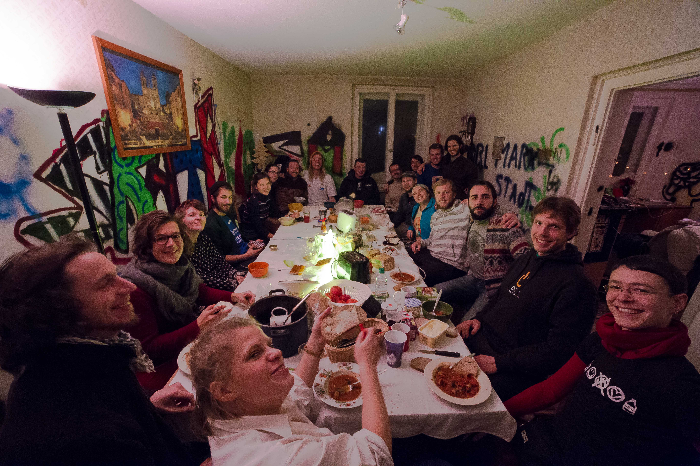
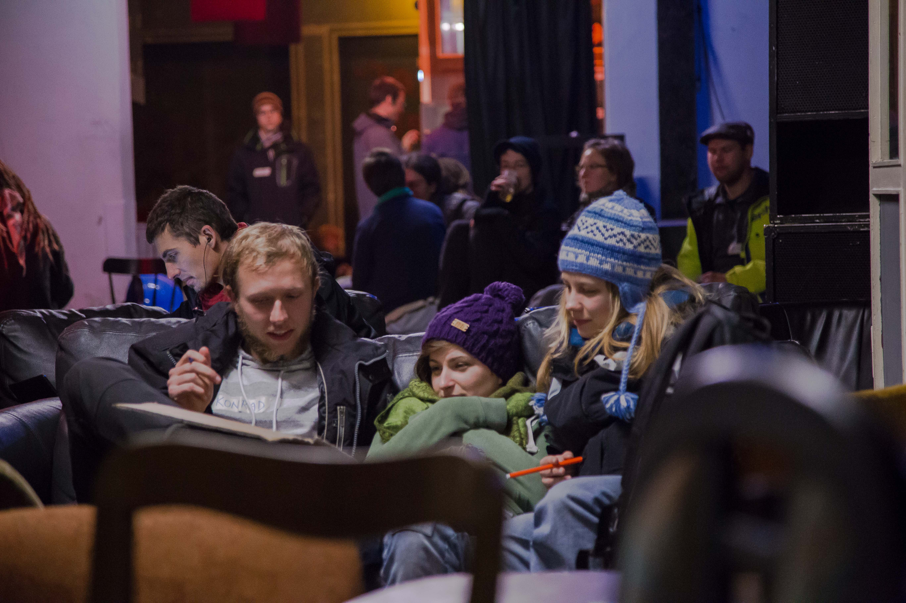
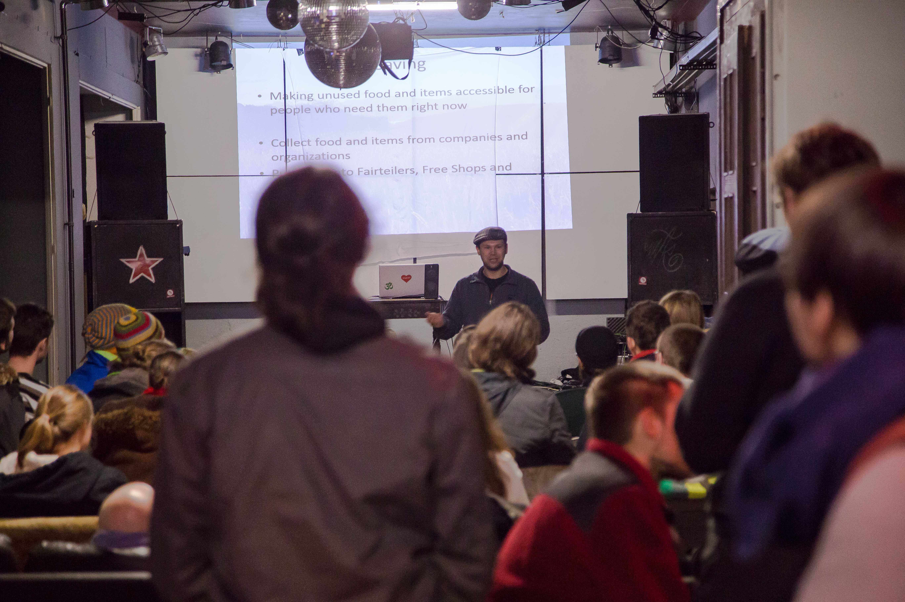

    

yunity is an open project, made from the people for the people, and still is in the midst of being developed. More and more people are interested in it and want to contribute - and we want to give every one of them the opportunity to get in touch with us personally and to experience the warm welcome they deserve. That’s why we initiated the very first OpenWuppDays in Chemnitz. Full of anticipation we prepared this weekend to let everybody have deep insights in our project and the working groups Product, Design, Development, IT-Service, Legal, Structure, PR and Translation.

===

yunity is an open project, made from the people for the people, and still is in the midst of being developed. More and more people are interested in it and want to contribute - and we want to give every one of them the opportunity to get in touch with us personally and to experience the warm welcome they deserve. That’s why we initiated the very first OpenWuppDays in Chemnitz. Full of anticipation we prepared this weekend to let everybody have deep insights in our project and the working groups Product, Design, Development, IT-Service, Legal, Structure, PR and Translation.

During our first big public event, we asked the new contributors what yunity and the vision behind it meant to them individually. We received many different wordings coming from various perspectives, which in the end displayed the common philosophy.

*"yunity is an opportunity for each of us to make our society more sustainable. And to do it with fun!"*

At the OpenWuppDays in Chemnitz fun was as omnipresent as were deep conversations and delicious free food. People of most diverse backrounds had the opportunity to come together, get to know each other and - last but definitely not least - to giggle, smile and laugh together all the time! Real personal contact proves once again to be the most powerful driving force of the yunity idea, along the lines of:

*"yunity is a platform for people to connect and to organize so they can share and save resources."*

Because people who are connecting and organizing to work together on a promising project are in a great mood just for this reason already!

*"yunity is sharing and bringing the idea of sharing to everybody who is willing to spread more happiness."*

To spread the idea there also were presentations about sharing in general, different approaches to sharing and the specific case of yunity. Many people came to listen and discuss and the event as a whole can definitely be deemed a success!

There were not only local guests coming in from the town of Chemnitz, but also some really motivated folks who traveled from locations as far away as Warsaw or Italy just to be with us on this weekend. Lots of thanks to everyone who took the time and effort to become part of this amazing event! The established connections will not vanish, and the yunity family is growing faster than ever! :)

*"yunity is an unique and wonderful possibility to harmonically reside in this world with others."*

More pictures of the [OpenWuppDays](https://www.facebook.com/media/set/?set=a.963378950422925.1073741829.687292871364869&type=3).