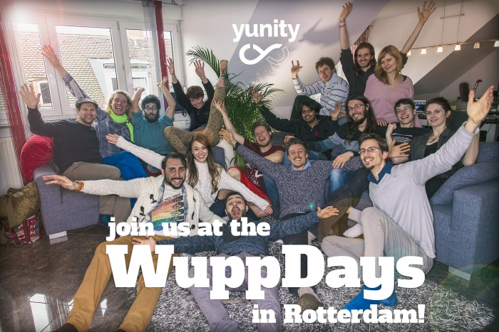
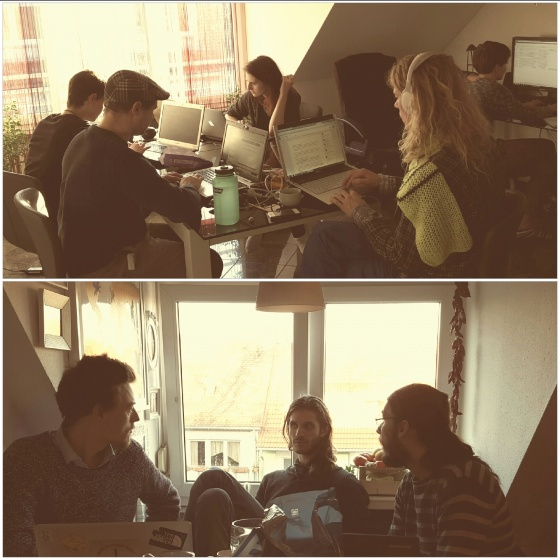

    

yunity - a project, platform and movement is coming to Rotterdam from 2016-03-21 to 2016-04-10. Visit us, join us and make change possible! We are as enthusiastically working as always, maybe even more, because the year 2016 will be full of yunity activity...

===

**yunity - a project, platform and movement is coming to Rotterdam from 2016-03-21 to 2016-04-10. Visit us, join us and make change possible!**

We are as enthusiastically working as always, maybe even more, because the year 2016 will be full of yunity activity! The **WuppDays #6 (21/03 to 10/04)** will be held **in Rotterdam** and will reunite us again and for three whole weeks. 
As you can see in the list of upcoming team activities below, we are busy as bees and can’t wait to move forward with the project, the product and the movement as fast and as well as we can. Therefore, we still need lots of **help from people like you!** If you’d like to contribute with your vocation and skills or find your place in the team, please come meet us at the WuppDays and join yunity! 
Enjoy the invitation video for WuppDays #6 and to get a glimpse of what the WuppDays are about, see this beautiful [video about the WuppDays #1].

<iframe width="560" height="315" src="https://www.youtube.com/embed/aeSqHoDQzGE" frameborder="0" allowfullscreen></iframe>

**What will the teams be up to in Rotterdam?**
We already have a lot of things in mind that we’d like to tackle when we are together in one spot again, as well several tasks where we are looking forward for your support and contribution: 

- the **design team** will be continue working on the designs for the website (mobile and web version) therefore we are looking for skilled UI/UX designer and illustrators. Furthermore they will design business cards and graphics for social media and need support of creative graphic designers.

- the **public relations** team will advance the documentation of the WuppDays and are looking for professional photographers, dedicated filmmakers and video animators. Furthermore yunity will go on tour promoting the yunity movement and arrange the yunity festival. Please feel welcomed to join here as an authentic communication expert with specialised knowledge in social media as they will improve our future social media strategy.

- the **it-service team** will implement our new project web site. They will use Wordpress and need support from CMS experts for that.

- the **product team** will be working on extracting the information about user needs for yunity from the existing foodsharing.de plattform. If you are familiar with the foodsharing.de it would be a prerequisite to help here. Otherwise please join if you want to establish a new foodsharing community in Europe or anywhere else.

- our **development team** will continue to code the yunity platform. If you are interested in backend or frontend development and using Django (Python) and AngularJS, you are welcome to join in.

- our **structure team** will be stress testing our documentation (especially our decision making process) therefore people with fresh eyes are very useful for giving feedback. Secondly they will assess the collaborative tools currently used and others they don’t know about yet. They intend collecting and comparing these in order to select the most appropriate ones. Thirdly they will be researching existing organisations doing similar things to yunity as loads of other people are doing great stuff out there and we may be interested collaborating with them or using their resources. So please contact our structure team if you are familiar with similar projects or backgrounds.

- our **research team** will define its scope, example tasks and statement. This team is still at an early stage but has already jumped into some research: Especially user need from the foodsharing community will be analysed. Furthermore the research team will evaluate the database of existing sharing networks.existing

- **translation team** will keep on translating diverse contents for the yunity project page and yunity plattform - translation of foodsharing.de wiki, migration to wordpress and other little tasks which pop up incessantly during the wuppdays. The translation team is ready to incorporate new translators for English, German and French as well as further languages aiming multilingual versions of the website, video, newsletter etc. For proofreading purpose especially native english speakers are always needed. 

The **WuppDays and open WuppDays are free of cost**. Since the beginning yunity aims to use as little money as possible. We have always held the WuppDays at venues which provided us a pleasant working atmosphere for free. In addition to that we save food, cook and clean ourself. The WuppDays are a beautiful experience of community spirit where everybody contributes with their time and energy. Nobody is charged, everything is unconditionally - we already celebrate the world of yunity during the WuppDays!

If you cannot make it the full time, there is still the possibility to gain a deeper inside of yunity at the **Open WuppDay on the 2nd of April**. We will start with a open house presentation about yunity and the development process at **3pm in Rotterdam**. Later you will get the chance to get directly in contact with our different teams.

You are all **warmly welcomed to become part of this unique movement for change** - gathering and sharing our existing resources such as knowledge, skills, things, spaces and passion with people of diverse backgrounds from all around the world united in a common vision!

[**Apply now!**](https://project.yunity.org/join-the-team) We are looking forward to seeing you in Rotterdam!
If you have any further question, please write us an email: [mail@yunity.org](mailto:mail@yunity.org)

If you can not be in Rotterdam, please stay in touch with yunity!
[Facebook](http://www.facebook.com/yunity.org), [blog](https://project.yunity.org/blog), or [subscribe to our newsletter](https://project.yunity.org/#newsletter).

**Yours truly yunity Team**