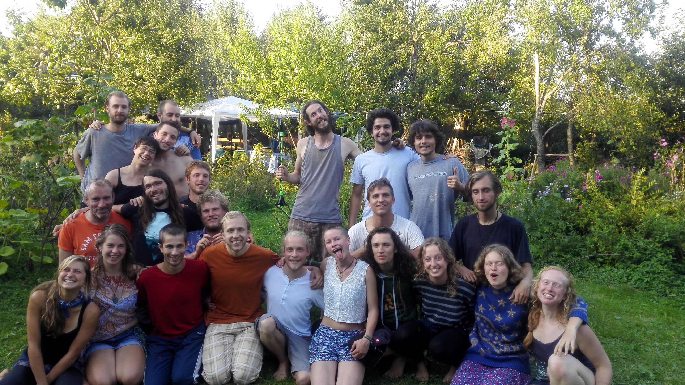
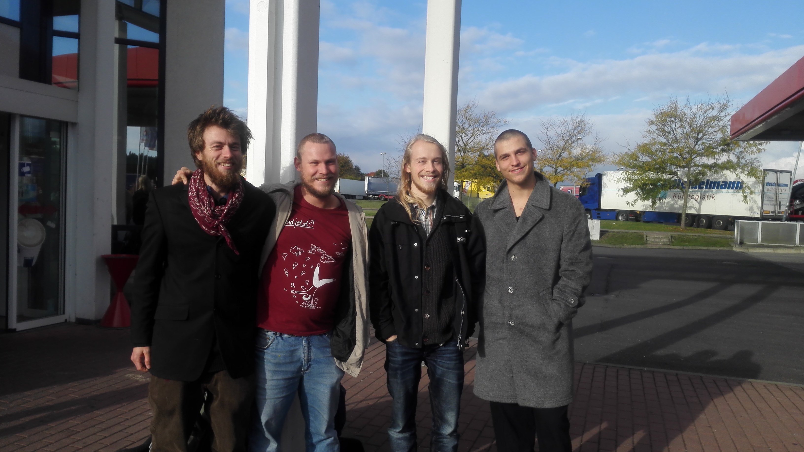

    

During this summer yunity faced moments of upheaval and change, especially due to the resignation of Raphael Fellmer, who decided to put his energy into founding a non-profit organization called Sharecy. But that didn't stop the people who were involved from doing what they were doing - yunity thrives!

===

During this summer yunity faced moments of upheaval and change, especially due to the resignation of Raphael Fellmer, who decided to put his energy into founding a non-profit organization called [Sharecy](http://http://sharecy.org/). But that didn't stop the people who were involved from doing what they were doing - yunity thrives: The coding at [foodsharing.de](http://foodsharing.de/) is restarted, we will be going to various places to encourage foodsaving and general sharing and the yunity community is still meeting and sharing happy times. 

In this post we want to elaborate on the relationship between yunity and foodsharing.de and yunity and Sharecy. Furthermore we want to give you a short summery of what people in yunity are focusing on right now.

**The short story so far**

(For the longer version click [here](https://yunity.atlassian.net/wiki/display/YUN/1.+The+story+so+far))

Even though the fight against food waste started way sooner of course, our story starts with [foodsharing](http://foodsharing.de/). The idea is to save surplus food from businesses before they throw it away and to share it unconditionally with fellow humans. An online tool was developed to enable volunteers to save and share food. With the foodsharing community growing, the idea of general unconditional sharing got clearer.

Then there was yunity. Focusing not only on saving and sharing food, but on every resource imaginable, the plan was to develop a platform to enable people to make their dream become reality. A group of diverse people assembled to form an idealistic project, that wanted to operate in a non-hierarchical, self-organized and moneyless way. Most of the next 6-7 months was trying to get more clarity on the specifications of the product, as well as team building.

In summer 2016 [Raphael Fellmer](http://www.raphaelfellmer.de/2016/09/10/development-of-sharecy-org-platform-for-worldwide-saving-and-sharing/) and Martin Schott found, that the progress of the software development was too little and decided to try a different approach.
After the above-mentioned two were starting a crowd-funding campaign for a multi-sharing tool, they met Alexander Piutti, who convinced them to leave the community building aspect behind and only concentrate on the core-element of their business: saving food on a bigger scale, which is including B2B-services: They are planning a proof of concept in Berlin, where they pick up food from farmer's and wholesale markets with trucks, bring it to a huge storage room and then deliver it to restaurants and supermarkets. Sharecy wants to use funds from crowdfunding campaigns, government grants and donations, to finance up the process of getting started. Currently it is in the state of getting the approval for a Non-Profit-Organization. In June Raphael explained how he saw the need for a diversified approach, that consists of a 'yunity movement' seperate from a professional 'yunity organization' in [a long post](https://yunity.atlassian.net/wiki/pages/viewpage.action?pageId=43909277) on Slack.

**What is yunity *now*?**

The many remaining yuniteers pursue building up a real-life network of communities and individuals interested in sharing. The yunity movement is like a tribe of people, who share a love for sustainability, trust and self-determination. Some more consequent or extreme than others, they all consume consciously and carefully and try to save resources wherever possible. Despite the diversity of people and ideas, the atmosphere in yunity is inclusive and appreciative. We have developed a culture of listening and comprehension when it comes to dialogues between opinions and when humans share physical contact, especially during [lamâsch](https://yunity.atlassian.net/wiki/pages/viewpage.action?pageId=41812082).

A group of us has been traveling from one alternative gathering to another this summer, others went to music festivals with foodsharing, but all spread the word, lived the culture and connected to a lot of people. The [WuppBreak in Neuried](https://yunity.atlassian.net/wiki/display/YUN/WuppBreak+September+2016) in September, which was intended to be a little meet-up of some core contributors to celebrate the end of summer, turned out to be the most visited yunity event ever. The [Berlin Hackathon](https://yunity.atlassian.net/wiki/pages/viewpage.action?pageId=65241160) attracted new developers and boosted developer motivation for both, foodsharing.de and the [foodsaving tool](https://yunity.atlassian.net/wiki/display/YUN/Foodsaving+Tool). Different groups with different focus areas emerge in yunity, find room for collaboration and synergize. We are far from broken or aimless, in fact, we have a lot to do:
* The [FSINT and yunity tours](https://yunity.atlassian.net/wiki/display/TOUR/FSINT+Tours) will mobilize and connect lots of different people interested in unconditional sharing all over Europe and beyond.
* The spirit of self-organization and [awesome active autonomy](https://yunity.atlassian.net/wiki/display/YUN/Awesome+Active+Autonomy) will be spread through real-life contact.
* The reopened work on the code of foodsharing.de and the following communication, especially via the [new foodsharing devblog](https://devblog.foodsharing.de/index.en.html), will improve our contact to this community.
* A [lean tool to manage store pick-ups](https://yunity.atlassian.net/wiki/display/YUN/Foodsaving+Tool) and [lots of documentation](https://yunity.atlassian.net/wiki/display/FSINT/Material+to+get+started) will support the emerging foodsaving communities.
* A [book about group decision making](https://douginamug.gitbooks.io/a-systemic-consensus-manual-testing/content/) and systemic consensus will inspire other communities.
* A [house](https://yunity.atlassian.net/wiki/pages/viewpage.action?pageId=74776581) will be found for the yunity family to move in and become a template for other places of communal living.
* Secrets and difficulties of the [lamâsching culture](https://yunity.atlassian.net/wiki/pages/viewpage.action?pageId=16843226) will continue to be unveiled.

**What is foodsharing to yunity?**

A lot of yuniteers are part of the foodsharing.de community themselves and all share the same motivation to combat food waste and waste in general. foodsharing.de is the origin of the yunity project and a great thing to build on: In Summer 2015 Raphael Fellmer made a video with a call for action to make foodsharing international and open source. Around 30 people followed the invitation and gathered in Italy at the WuppDays #1 to built a new foodsharing website that allows to extent the scope of sharing towards whatever people love to share in their lives - books, items, resources, skills...

Especially some developers in yunity have a big affiliation to foodsharing, since they are also the ones taking care of the foodsharing.de code. Due to realizing that the envisioned yunity platform will probably not be able to fully replace foodsharing.de anytime soon, these developers decided to dive into the code of the old software once again and document it on the [foodsharing dev blog](https://devblog.foodsharing.de/index.en.html).

In the future we'd like to intensify the contact to and collaboration with the existing community of foodsharing.de, as we think that we all dream the same dream and work towards the same goals. We want to strengthen the contact to active people, aim especially for a collaboration with snowflake and want to invite every foodsaver that is interested in sharing the experience in countries where foodsharing doesn't exist yet. You want to join our endeavor to build and support foodsharing initiatives worldwide? Join us!

**What is Sharecy to yunity?**

Especially the two months of silence from Raphael's side between the [syscon that wasn't in his favor](https://business.konsensieren.eu/en/konsensierung/3xbmc581c/ergebnis) and the [clarifying meeting in Kirchheim II](https://yunity.atlassian.net/wiki/display/YUN/2016-08-07+Different+paths), left quite some people in yunity confused and brought some tension. After explaining his reasons for leaving and his future plans everybody was at ease again. The relationships in yunity are strong and the friendship to Raphael Fellmer is alive. Although yunity does not follow the approach of paying people to tell them what to do, we support the endeavor of saving food on a bigger scale and wish Raphael Fellmer and Martin Schott well in pursuing their dreams.