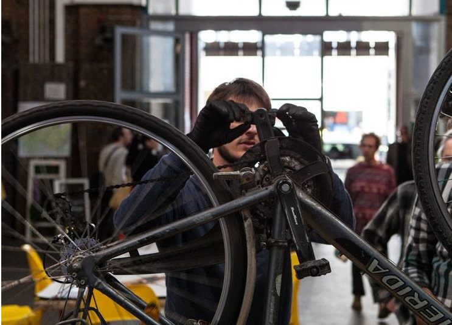

    

The yunity team would like to find a permanent location - a ‘WuppSpace’, where the team can work on the project, live the culture of sharing and saving resources and skills, and where everyone can feel at home.

Holding the WuppDays at changing locations requires lots of organizing and coordinating. First of all, it’s necessary to find an appropriate space every time anew. Additionally, a supply of saved foods needs to be secured on site (thanks to  the cooperation with foodsharing we have been able to do so, so far). Then, upon  arrival at the location, it is necessary for the first arrivers to prepare the site (setting up sleeping spaces, working rooms, kitchen, general cleaning and maintenance) - which can be a lot of effort, depending on the conditions. 

So the search has started!  We imagine a lively community house, full of yunity spirit. While thinking of a permanent WuppSpace, lots of ideas and possibilities come to our minds, and our motivation grows. The most important thing for us, is the capacity of the space.  It should be able to accommodate at least 20-30 people, and have appropriate facilities for a community to live and work in, as well as space for creative collaboration and events - either held by us or external participants. We would also like to use the permanent WuppSpace to support and connect local initiatives in the surrounding area. In terms of location, a central location in a town or city would be ideal, as it would allow ease of access to many people and could also easily serve as  a meeting place for sharing of resources, skills and ideas of all kinds.

The permanent WuppSpace will be crucial for the yunity platform to be brought into reality. It will enable contributors from various cities and countries to come together at one fixed place to work efficiently on the project, while living their everyday ‘wupping’ life.

It will also be a place where the concept of saving unused resources and distributing them to people who need them right now, will be demonstrated in everyday life. By bringing  already abundant and existing resources and skills, together with an emerging communal spirit via personal encounters full of trust and meaning, the surroundings of the permanent WuppSpace will transform into the social sphere of unconditional sharing which we envision. 
This means, that the vision of yunity will already be brought to life, in the permanent WuppSpace.

The saving and sharing of food will we expanded to all resources imaginable, for example: books, flowers, clothes and other things which the retail industry intended to be thrown away after a short period of time. The yunity ‘headquarters’ will also house a foodsharing ‘Fair-Share Point’, a free shop, workshops and a repair-cafe. Furthermore, free resources, such as cars, tools or machines, which are not used all the time, can be distributed so that others can benefit from them. On top of the pooling of objects, food and space, the WuppSpace will also be a place where knowledge and skills are shared and where workshops and activities about everything concerning sustainability will be offered. Various initiatives and grassroots movements for change, for example: urban gardening, groups of Transition Town, help for refugees, language tandems etc., will find room to build and strengthen collaborations and to have a greater impact together.

If you happen to know an appropriate location, own a house or have any kind of information about possible sites for the realization of a permanent WuppSpace, please let us know via [email](mailto:mail@yunity.org). And if you want to help us spread the word offline, feel free to use [this pdf-file](WuppSpaceQuest_EN.pdf).

Thank you for your help and support! We are looking forward to hearing from you!

yours truly,
yunity team