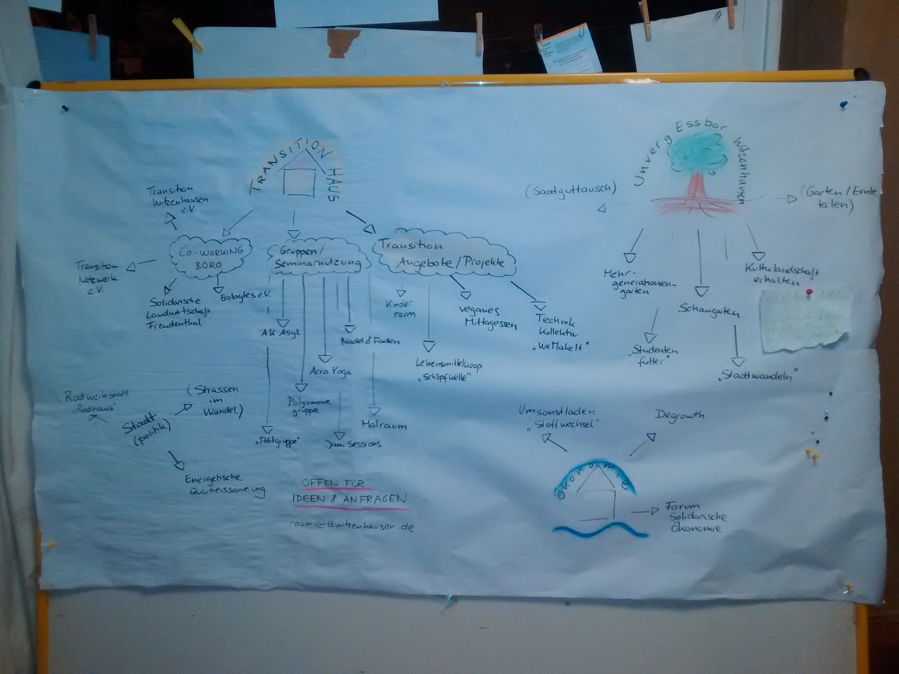
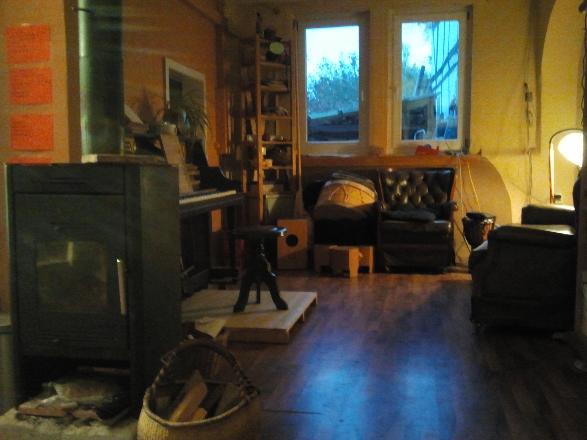
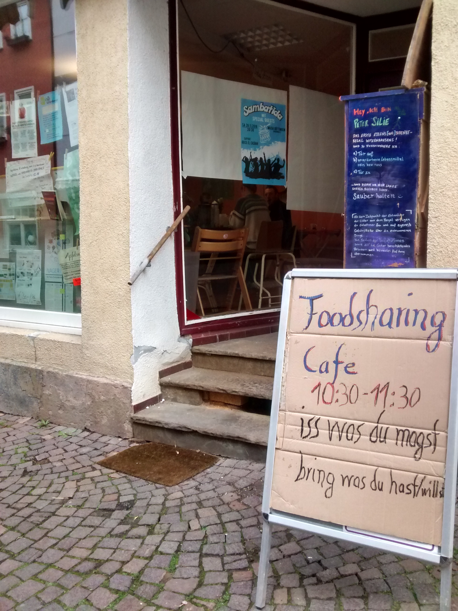

    

Welcome to the Wuppdays #12 in Witzenhausen. This time we're hosted by a Transition Town(TT) initiative. So it's a great place to network, learn from each other and support where we can.
Do you want to join? We would like to have you here! But have a look into the following description to find out if these wuppdays and circumstances are interesting to you.

===

Welcome to the Wuppdays #12 in Witzenhausen. This time we're hosted by a **Transition Town** (TT) initiative. So it's a great place to network, learn and support each other where we can.
Do you want to join? We would like to have you here! But have a look into the following description to find out if these particular WuppDays and circumstances are interesting to you.

### About the place
The Transition House is located in Witzenhausen. A little town popular for being the first place in Germany to only/fully study ecological agriculture, which seems to have a great influence. Although the city is small there are many initiatives doing social and commons work.

It's a great opportunity to explore and open rooms for transparent communication and to encourage more people to get active. The group of TT is looking for support to build a working team to  maintain the house. This includes practical work like repairing broken showers, but also creating a team that is transparent and welcoming in its communication.
The place is looking for people willing to contribute.

### What is happening here?
The Transition House is like a platform developing transition, be it internal or external. There's a meeting room, which can be and is used as an open café or for jam sessions, meetings, workshops etc.
It is also a great opportunity to find out what you/we have to offer while hosting these events. There's a recurring repair café in the hacking space. A cooking team brings people together and provides food in exchange for voluntary donations.
There's a co-working space, mainly used by ecobytes and transformap and a gallery for painting...etc.

## Rooms
Four floors are hosting a diverse spectrum of groups. Engaging with the different groups, and finding out how we can support each other is more then appropriate and we're looking forward to the synergies we'll build.

### Sleeping
There are three rooms which are used as sleeping spaces. There are around 6 mattresses at the moment, a couch to sleep on and some camping mattresses. Besides that, there also is a living room with a sofa bed fit for 2-3 people in the so-called hacking space floor. All in all the TRansition House can host around 15 people.

### Food
There are some supermarkets around, where dumpster diving is possible. Foodsharing cooperations don't exist up until now. There is a farmer's market in driving distance. Can be by bike or car (which Hans-Christian Eick got offered). If someone likes to work with the initiative Solawi ([community supported agriculture](https://en.wikipedia.org/wiki/Community-supported_agriculture)) that would be another possibility to get some leftovers (which would even be organic!).

### Community situation
Everyone we met so far is really open and friendly. The place is very welcoming. Communication between those who already have been involved in this TT project for a longer period of time sometimes presents some unresolved conflicts, but nothing dramatic. When people with different working styles and diverse opinions work together for some time this is quite normal. So there are some unfulfilled needs. In case you are interested in contributing to the process of solving these issues you are welcome to try doing so!

### Why to have WuppDays here?
There are a couple of initiatives here that have goals very similar to ours. Since they are working for free commons, every support we give here is supporting yunity. It supports  strengthening the network around commons economy and local initiatives. 
Ecobytes and transformap are also located here. Both are connected to the idea of creating a multi-sharing online platform. Maxim from inventaire (book sharing) - very enthusiastic about open data - will be  here as well.

### What to do during WuppDays?
Well it's WuppDays, so everyone should feel encouraged to do what they feel like doing! Still, there are some household tasks that always need to be taken care of and we're creating a kanban, where we list the open tasks nicely. Apart from that, we are working on all the subprojects, that emerged over the course of the last months. Some of the already active projects and ideas, as well as recurring things always happening at WuppDays, are:

* glocall yunity (discussing about the concept and building a web page)
* foodsaving tool (continuing to work on the foodsaving tool (mainly by Tilmann))
* hosting events (AK Asyl, küfa, yunity, freemarket, living and action spaces, decision making...etc. )
* communication within yunity (internal and external....incl. information flow, exclusion/inclusion, online tools...etc.) 
* mapping
* WuppHouse meetings
* dumpster diving
* cooking
* facilitation
* documentation
* building a house team
* setting up foodsharing
* wild food picking
* lamâsching
* ....and much more, if we do so

### Frameworks
As an addition to this, there are two frameworks which came out of the meeting from 03.11.2016 with folks from TT: Normally people pay, but with yunity it's different. For us they came up with two guidelines:
* "Volunteering as donation"
* "If you like to use money, donation is appreciated"

### Timeframe

This time the WuppDays contain of 2 different timeframes:
The first one is fixed and takes place starting now until the 15th of November.
After this WuppDays hopefully will continue. Whether this will happen or not will be decided around the 10th, depending on how well all of the different needs are met.
The timeframe for the prolonged WuppDays would be at least 2 more weeks.

### What you could bring with you

* motivation
* openness
* sleeping bag (there are some blankets but not enough for all. If you don't have a sleeping bag don't worry, we'll find a solution) 
* camping mattress (if you have one, bring it. If not it's also fine.)
* food (if you could manage to bring some saved food on your way here, that would be great. In this moment we're missing potatoes, bread, pasta, lentils etc. update about this in the Witzenhausen channel. But **please** don't go buying stuff!)

So you're still reading? Seems like you are really considering to come?
If you wanna come, please fill out [this poll](https://poll.disroot.org/2CClNZUU8MdreNYU) showingto show when you'd like to come and [this pad](https://pad.disroot.org/p/witzenhausen) to decriobe your interest a bit.

Chat with us about these WuppDays in the specifically created channels on [rocket.chat](https://yunity.rocket.chat/channel/wuppdays_witzenhausen) or [Slack](https://yunity.slack.com/messages/wuppdays_witzenhausen/)! 

**Okay, where do I have to go?**

Brückenstraße 20  
37213 Witzenhausen  
(*Click* [here](https://www.openstreetmap.org/note/771241#map=15/51.3937/9.7738&layers=N) *to see the exact location on OpenStreetMap.*)

Easy to reach via hitchhiking. Taking the train also works. There's a train station directly in Witzenhausen.

**Hope to see you soon!**

#### Talk to us: 
rocket.chat: http://yunity.rocket.chat/channel/wuppdays_witzenhausen

slack: http://yunity.slack.com/messages/wuppdays_witzenhausen

discourse: http://yunity.trydiscourse.com/t/wuppdays-12-witzenhausen/227

twitter: https://twitter.com/yunityorg

gnusocial: https://gnusocial.de/yunity

mail: mail@yunity.org