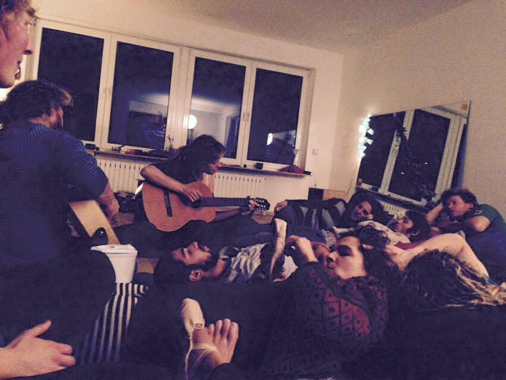
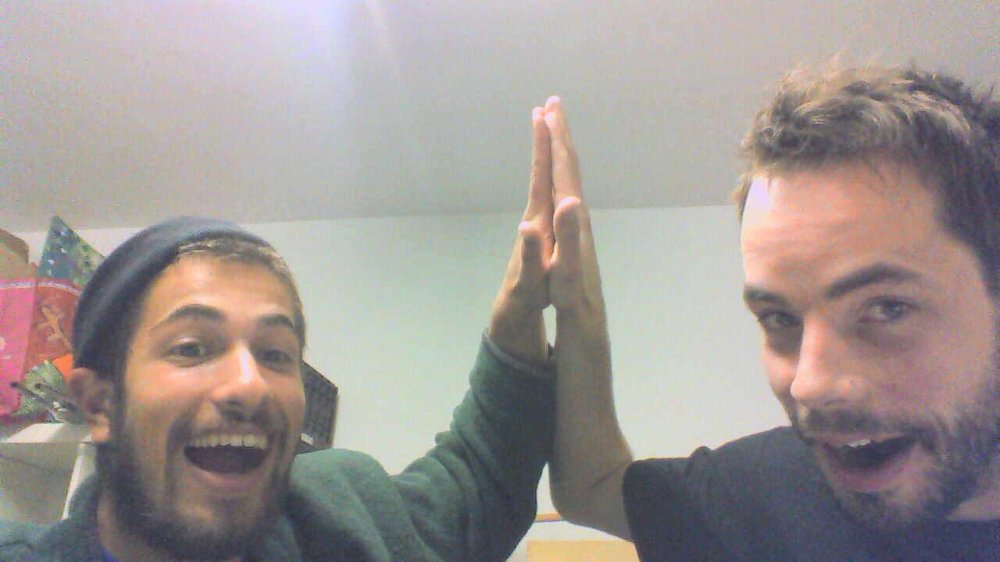

    

The second WuppDays began a little colder than the first, but that's what happens when you travel 500 Km North over the Alps from Malo to Mainz. Apples and plums replaced the kaki and pomegranates of Italy, and seeing the moisture of our breath confirmed we were definitely in Germany.

Although cold in climate, the warmth of the team could not be chilled: It had been 4 weeks since most of the team had seen each other last and the reunion was almost tear-jerking. Those that couldn't make it - you were missed! And so began the next WuppDays (residential project sprint) hosted by the wonderful people at Liebermenschhaus. Team bonding at the open-mic night;

We began the WuppDays with a structured discussion (retrospective) about how we found the last stretch of project work (iteration) between the end of WuppDays #1 and the beginning of this WuppDays. This was a period of about four weeks where most people were working from different places across Europe mainly through online collaboration. Three things were selected for discussion;
- **What still puzzles us:** What are the goals of the project and how do we actually achieve them?
- **What we did poorly:** Working in a distributed fashion
- **What we did well:** Keeping the positivity alive!

In many ways, the theme of this WuppDays was 'definition'. Definition of what teams do and are called, definition of terms relating to the product, definition of development stages, etc.

A union between Design and Development teams gave rise to several 'Product' marathon-meetings where a direct dialogue between the two led to valuable clarification for both sides. Development did what they set out to do and got a basic version up and running. Design made some more detailed mock-ups of what the product might look like and visualised user-flows and how 'groups of users' might interact.

Legal got going on, and is weighing up the various options for where best to register the organisation. Also, a policy on the 'Use of money' with regards to the project was created.

Communication [IT] and PR teams were busy: Deciding on which wiki software to use then setting it up, reevaluating Slack use, preparing a solution to translate the foodsharing.de wiki, Preparing strategies to use social media, and much more. Progress with the wiki;

Structure got involved all over the place, keeping the schedule, facilitating retrospectives, thinking about product development stages, how to include beginners, etc.

So it really was a sprint - no days were taken off by the Wuppers, but we managed to push onwards with energy and achieve a lot. We could not have done it without the kindness of our hosts at the Liebermenschhaus (Raphi, Melinda, Toby, Pia, Lotte, Nadine, Nicholas and Charlie) - thanks again for your warmth and inclusiveness, we really felt at home. Another special mention to the Foodsharing community at Mainz who helped nourish our minds and bodies with saved food.

Wuppers over and out,
x