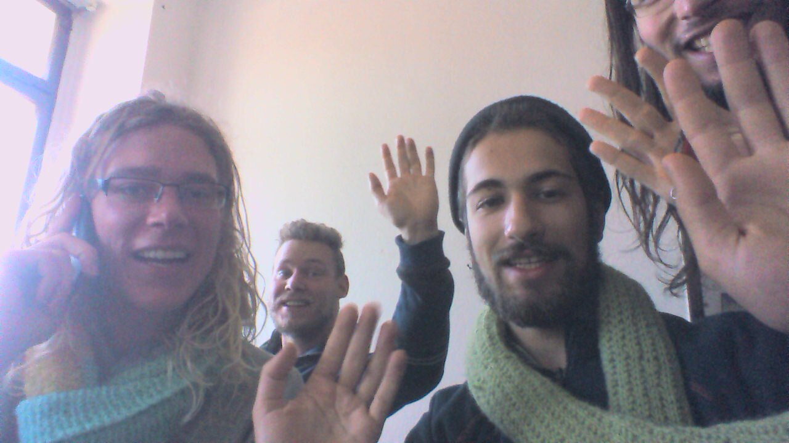

    

One candle-lit dinner near the end of WuppDays #2 (Mainz), the subject of the where we should meet again was brought up. Just like that, some hard working yuniteers managed to find somewhere in Chemnitz (formerly Karl-Marx-Stadt from 1953 to 1990) and on 2015-11-27 a small team met up and began wupping. The Haus, 'HB6', that kindly offered to host us was vibrant in history and colour-scheme against a backdrop of gray, GDR utilitarianism: previously abandoned, later occupied by squatters and now lent to artists and learners to release their creativity.

This WuppDays had fewer participants than usual, which in combination with the spirit of the Haus provided a different feeling to the other WuppDays. With fewer people, we got to know each other better and the hosts managed to persuade to relax a couple times! That's not to say we did less, we managed to do a fair bit in the two week sprint: the content on yunity.org was fully revised (not perfect, still much better), yunity.org was translated into German (if you want to translate it into another language, please [join our team](https://project.yunity.org/join-the-team)), proposals for how yunity.org might cater for foodsharing.de and internationalise the foodsharing movement were documented...

Another sub-project that had a fair bit of progress made on it was the WuppHaus. For a while now, there has been talk of how great it would be for the yunity project to have a permanent space. As much as we enjoy being hosted, there are a lot of work-flow advantages to having a regular working space. We visited some properties in Chemnitz for inspiration and began an internal survey to see what yuniteers are looking for. It's not going to happen tomorrow, but might be sooner than you expect.

yunity aside (gasp), we had a lot of fun doing some anti-food-waste activism which involved chasing Bodhi, Philip and Matthias around the Christmas market, each taking it in turn to dress up as a 'Schoko-Nikolaus'. Most people understood what was going on, but some looked pretty concerned about why a poor Santa impersonator was getting chased after! The foodsharing initiative, “[Leere Tonne](http://www.leeretonne.de/)”, aims to legally bind stores not to throw away food and the signatures we collected will be given to members of the German parliament in the near future.

We have confirmed the next WuppDays: it will take place in another location in Chemnitz from 2016-01-02 to 2016-01-17. There is room for 30 participants, let us know if you want to join. There will also be an open weekend on 2016-01-09 & 2016-01-10 for anyone to drop by and meet the team.

Dear Chemnitz, HB6, we really enjoyed ourselves, felt welcome and look forward to seeing you again in the next year.

Yours,
yunity team