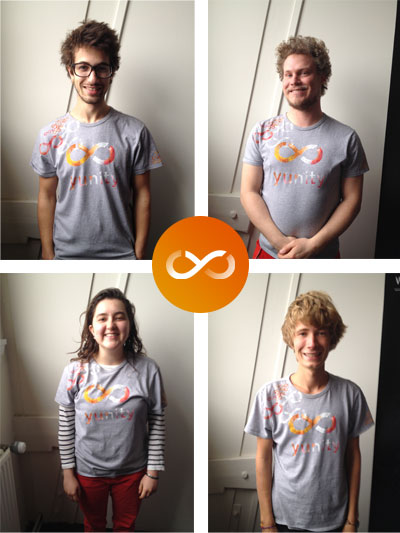

    

A lot has been happening since the last blog post! Many developers have been reaching out to yunity, looking for a positive, decisive project that they could contribute to. And now the WuppDays #6 have started in Rotterdam...

===

A lot has been happening since the last blog post! But perhaps you have been a witness of this, if you are following our more and more active [Facebook community](http://facebook.com/yunity.org)?

#Wupping progress

Lately, many developers have been reaching out to yunity, looking for a positive, decisive project that they could contribute to. Very good timing indeed, as we have now structured ourselves in a way that makes it much easier for coders to join. Our newly formed [**Product Team**](https://yunity.atlassian.net/wiki/display/YUN/Product+Team) is working hard on defining the many little but crucial specifications of yunity's [Minimum Viable Product](https://yunity.atlassian.net/wiki/display/YUN/Product+Team), and this will enable developers to get even more active. As we like to put it, the flow is flowing ;-). In the meantime, the [Structure Team](https://yunity.atlassian.net/wiki/display/YUN/Structure+Team) has been testing out a well appreciated online version of systemic consensus, a very good basis for future efficient decision making within a larger group.

A beautiful outcome of these '[SysCons](https://yunity.atlassian.net/wiki/display/YUN/Systemic+consensus)' was the unanimity reached when we realized what was missing after our [logo](https://project.yunity.org/blog/post/we-have-logo), that is to say, **yunity's slogan**! In the most direct, optimistic simplicity: **imagine sharing everything.**

#Rotterdam WuppDays

And now the [WuppDays #6](https://project.yunity.org/blog/post/join-us-wuppdays-rotterdam) have started in Rotterdam, where we are hosted in an old school. But we are not the only guests - a global team of people with similar visions is working on [Noomap](http://noomap.info/) and [United Earth](https://united-earth.vision/). We have all come to realize the importance of joining forces for change and concrete solutions... United Earth aims to be the unifier
of unifiers, serving to promote and facilitate a globally co-created cultural transition. And right across the room, Noomap is developing software to make the internet more democratic, fair and intertwined. Once again, a new location for the WuppDays is a great playground for us to activate our sharing values: we invite the various visitors of the building and the other teams to help themselves to the food resources we managed to find (foodsharing at wholesale markets, bakeries, etc.), while they invite us to share their working-space. We've also saved many abandoned mattresses and started upcycling shirts into self-designed yunity wear! This led to the idea of creating a clothes upcycling workshop during our [Open WuppDay](https://www.facebook.com/events/1521350761500064/).

#TEDxTalk

Last but not least, let us introduce our recent treasure: on the 27th of January, [Raphael Fellmer gave a **TEDxTalk**](https://www.youtube.com/watch?v=nqj6fH2i9go) in Utrecht. In this 15 minutes presentation, he explains his moneyless journey, his experience with foodsharing and what yunity wishes to achieve. Without describing it any further…Enjoy!

#New contributors

Presenting **one of the new contributors of yunity**: Tatiana Podlesnova

I'm from Russia and currently happily living in Netherlands.
I love to contribute to making the world a better place in many ways. Whether it's through creating art, customizing clothes or helping out similarly minded people like the people at yunity. I'm here to set up
a moneyless clothing project about upcycling and customizing secondhand clothes.

I hope I can inspire more people to join us in making this world a better place.

#Join the team!

If **you** want to contribute with your skills to yunity, [**join our team**](https://project.yunity.org/join-the-team) and come to the next WuppDays from the 14-27th of May in south of Germany! We are looking forward to you!

We wish you sunny days!

Yours truly, yunity Team