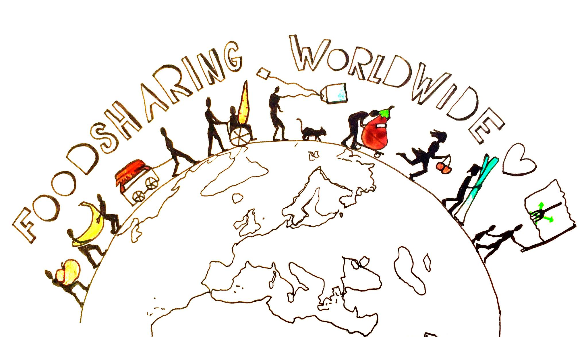

> Networking, sharing experiences and supporting each other to make more of the edible food that currently goes to waste

* Public website: [foodsaving.today](https://foodsaving.today/en)
* Wiki space: [yunity.atlassian.net/wiki/spaces/FSINT](https://yunity.atlassian.net/wiki/spaces/FSINT)
* Public facebook group: [facebook.com/groups/foodsaving.worldwide](https://www.facebook.com/groups/foodsaving.worldwide/)