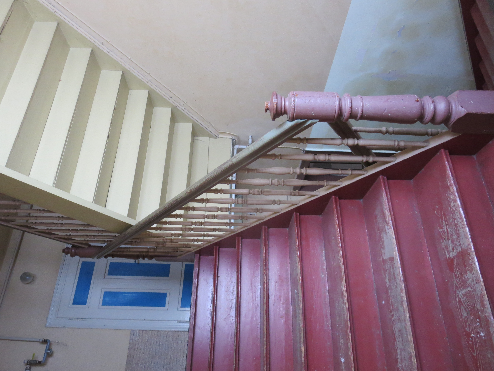

# Kanthäuser Wurzen

> Living equality, self-determination and acceptability

* Wiki space: [yunity.atlassian.net/wiki/spaces/WW](https://yunity.atlassian.net/wiki/display/WW/WuppHaus+Wurzen+Home)

