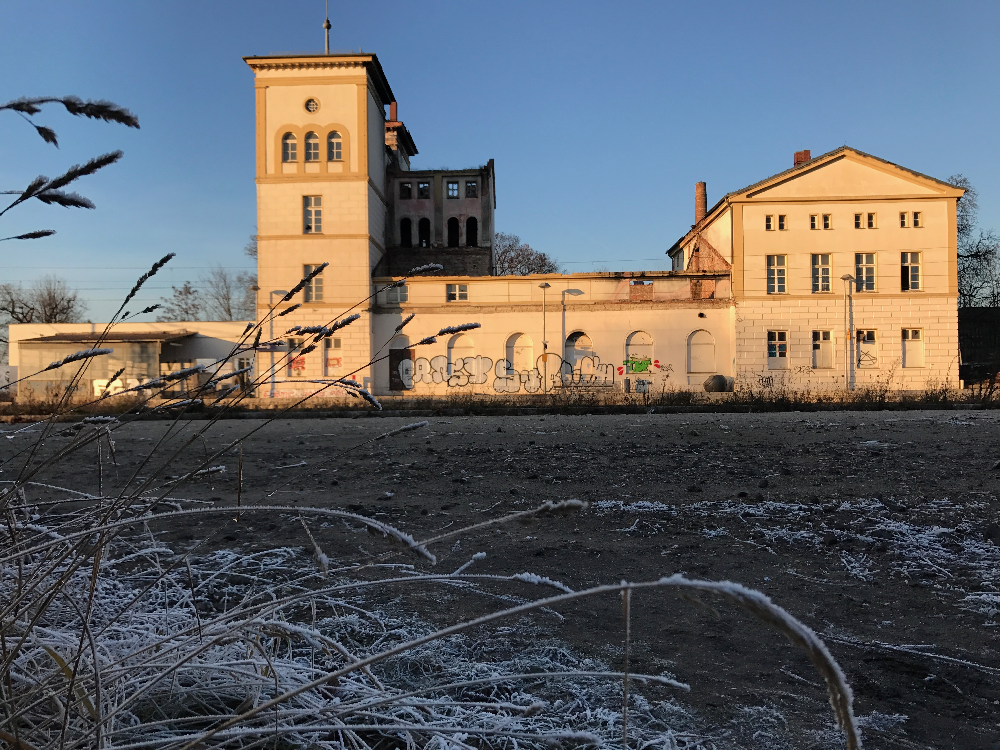

# Wupphaus Bad Dürrenberg

> A place of sharing in favor of community change

** This project is currently on hold. [If you are interested to continue it, have a look on the Gemeinschaftsstifter website](https://www.gemeinschaftsstifter.info/badduerrenberg/) for more information. **

* Former public website: [wupphaus.yunity.org](https://wupphaus.yunity.org/?target=_blank)
* Former wiki space: [yunity.atlassian.net/wiki/spaces/BADUE](https://yunity.atlassian.net/wiki/spaces/BADUE?target=_blank)
