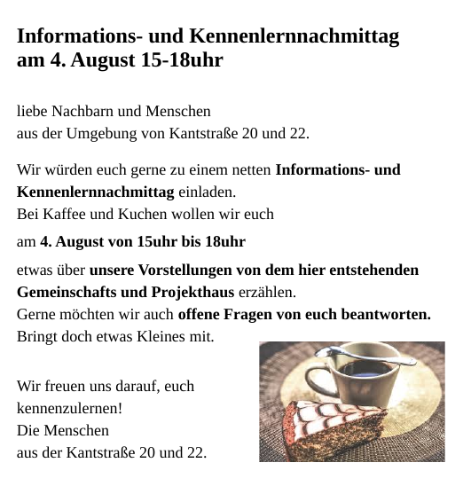

We want to get in contact with the neighbors of our housing project in Wurzen. We want to tell them what we are all about and we want to hear what they might have in mind.

Since we want to play an active role in the city of Wurzen it is of utmost importance to us to get along with the other citizens, to include them into our actions and to create an atmosphere in which we want to help and support each other.

This is the invitation we distribute prior to the event:

And we hope we'll be able to offer some cake as nice as this one... ;)
