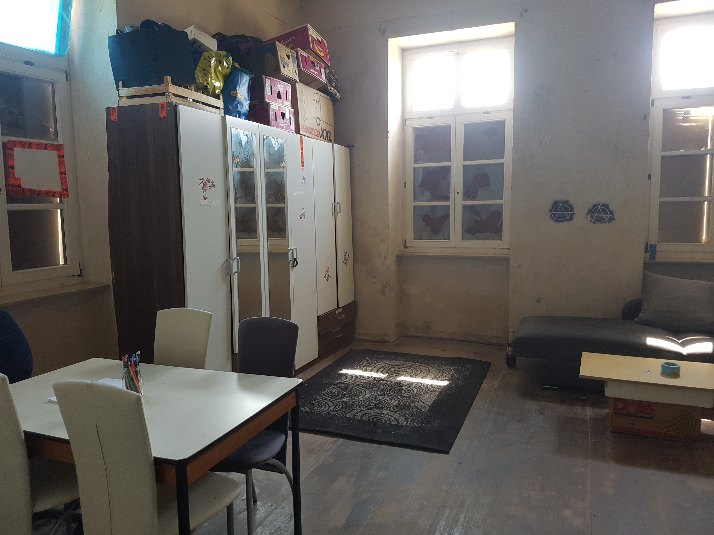
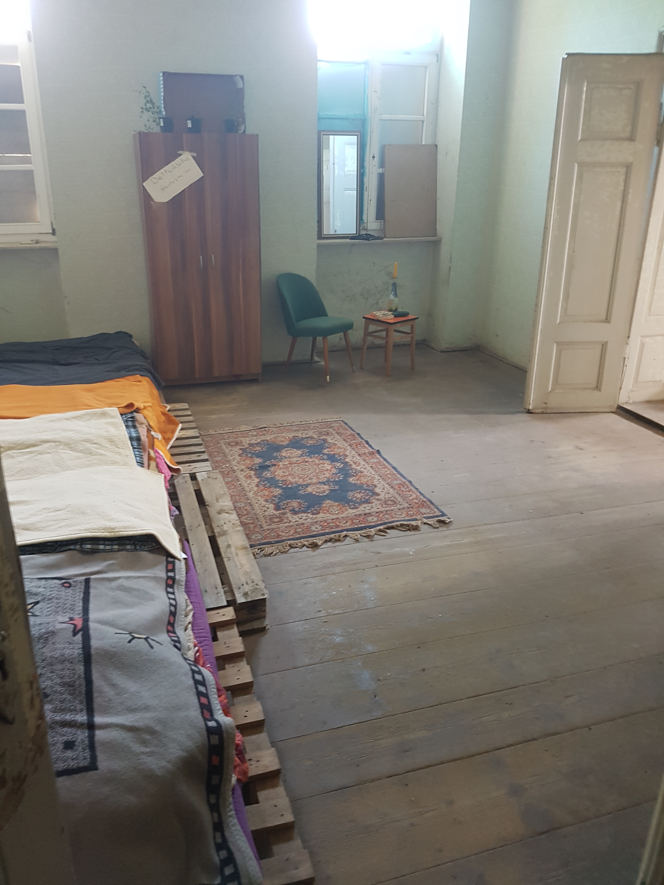
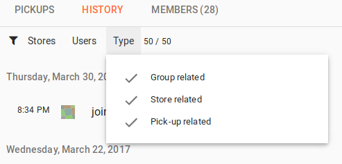

**The yunity heartbeat** - news from the world of sharing, fresh every two weeks.

## House Projects

### Bad Dürrenberg

We said it was on a hiatus, but thanks to Mandy and Curtis there is still progress in the old train station of Bad Dürrenberg. Mandy recently shared some pictures with us in [#wupphaus-badue](https://yunity.slack.com/messages/C0KPUD3L7/) on [Slack](https://slackin.yunity.org/). The ones below are just a preview, all of them can be found [on our wiki](https://yunity.atlassian.net/wiki/pages/viewpage.action?pageId=91131426).

### Wurzen

After a lot of dreaming and talking the plannings for the housing project in Wurzen are becoming more concrete, as [Matthias](https://github.com/NerdyProjects) pointed out with his recent post in [#wupphouse-planning](https://yunity.slack.com/messages/C3RS56Z38/) on [Slack](https://slackin.yunity.org/), which was directed at everyone interested: 

TL;DR Update wupphouse wurzen:
- doug/frank/me, august, 6months+
- informal agreements right now
- need more money by 2017-06-02 (tell until 2017-05-28 if/how you want to contribute)

So another update:
It is currently just Doug, Frank and me going to Wurzen beginning of August. Some of us might head there earlier, but all three of us commited for 6 months more or less full time beginning at August.
We have an association, hopefully soon a bank account and paperwork is being prepared by Mr. Sauer as soon as I give him the details which should happen next monday.
We tried to do community processes in #harzgerode and failed to get proper outcomes. Basically we now have some informal agreements I would summarize at follows:
- We start with a small, coherent group, that should slowly grow
- Decisions about the house are done by the group. People not formally in the group are Guests (overnight) or Visitors (during day) and may take part in some decisions where it is reasonable, but ultimately it is the group who decides
- The house will be mostly closed to guests and visitors in the first time until it is "ready" to accomodate those. An exception are people who help with renovation work.
- The first months should be focussed on growing the group (by 1/2/3 people), getting the house ready, inviting people to help us
- More formal decisions will be made as soon as necessary.
- Conflict resolution and communication is important :)
- We imagine the house as a combination of communal space, hackerspace, place for activists to make, plan, recover
- The general focus should be on "doing something good" while you are in the house - whatever this means. We want to be open to most kind of activities and projects, come by, talk to us, let's try it out. If people see problems, we will speak about those.
- We don't hesitate to use exclusion of people as a very last measure if repeated unwanted behaviour exposes danger to community life or the project as a whole. For sure, this should be the exception and a lot of conflict resolving must have failed beforehand.Because of the small group and the unforeseen future, there is a plan B:
If we somehow fail or lose interest, the houses including the association can be given to other people who want to do a housing project themselves.Because of all these circumstances, we now also have a problem gathering all the money. The current group thinks, it is also fine to work with private lendings to accomodate for the circumstances. We need about 45000€ by 02.06.2017. So who wants to donate or lend money that is available at that time?
As an example, to show you how I feel in regards to this project/money:
- I will donate 10000 euros
- I will give another 10000 euros as a lending (0% interest )with a fixed time of 12 months. I plan on making this a donation if the project succeeds, otherwise I will basically get it back from the other housing project that will take over. I might as well then still think it makes sense to donate to that project.
- I will give another 8000 euros as a lending (0% interest) with a fixed time of 3 months because I literally need that money to survive the upcoming 12 months. I want to keep a buffer that always allows me to have an "exit plan" - when everything fails, money can still help you survive these days.
Please either publically here or privately to me in private message disclose how much money you would like to contribute either as donation or as a lending (with what conditions) that could be on our bank account by 02.06.2017.
I will personally step out of the projekt Wurzen and communicate the lack of money towards Mr. Sauer when there is not 45k€ confirmed by the 28.05, (this sunday). Don't take this as a threat but as a "I will not be doing this alone".

### Dargelütz

[Joachim](https://yunity.atlassian.net/wiki/display/~Joachim+Thome) recently took the lead of an already existing housing project in Dargelütz (a tiny village in Brandenburg). Now they are building with clay, learn about e.g. non-violent communication and systemic consensus together and enjoy their time at the construction site. Read more about the general circumstances [on this wiki page](https://yunity.atlassian.net/wiki/display/YUN/Dargeluetz+near+Parchim) and about the current proceedings on [Joachim's German project blog](http://dargeluetz.weebly.com/blog) 

### Research

[Arno](https://yunity.atlassian.net/wiki/users/viewuserprofile.action?username=Arno) recently pointed us towards the [Eco Hacker Farm](https://wiki.ecohackerfarm.org/start), which is a project that functions following the main idea of having "sustainable living using appropriate technology and permaculture principles". With this primary objective, they are very close to what many of us are aiming for. That's why [Doug](https://yunity.atlassian.net/wiki/pages/viewpage.action?pageId=4227232) decided to pay them a visit at [Kuckucksmühle](https://wiki.ecohackerfarm.org/kuckucksmuehle:start) last week and wrote down his observations for us in a nicely digestible way. If you have a full account on our wiki (meaning editor rights), then you can access it on [this wiki page](https://yunity.atlassian.net/wiki/pages/viewpage.action?pageId=91132229).

## Foodsaving Worldwide

### News from foodsaving groups 

- On May 18-19 the [REFRESH Food Waste 2017 conference](http://eu-refresh.org/conference2017) was held in Berlin. It was an event that brought together people from various backgrounds to develop strategies to minimize food waste. [Janina](https://yunity.atlassian.net/wiki/spaces/~Janina) took part on behalf of foodsharing.de and helped out in the disco soup event on the 18th. It was an interesting evening and she mostly enjoyed getting to know the other volunteers from [The Real Junk Food Project Berlin](https://realjunkfoodberlin.wordpress.com/about/) and [Feedback](http://feedbackglobal.org/), while having real contact on eye-level with the more business-minded participants proved difficult. We _do_ have a different perspective after all...
- Especially Feedback has already achieved quite a lot and offers resources to other motivated people, like this [guide to holding a 'Feeding the 5000' event](http://feedbackglobal.org/wp-content/uploads/2016/12/F5K-The-Introductory-Toolkit-1.pdf) or [this one](http://feedbackglobal.org/wp-content/uploads/2016/12/F5K-Disco-Chop-Small-Scale-Event-Toolkit.pdf) that helps you organize a normal, small disco soup evening.
- In April the extended board of the German foodsharing e.V. published an official statement regarding liability issues and possible organizational structures for local groups. We now had it translated and made it accessible [on our wiki](https://yunity.atlassian.net/wiki/display/FSINT/foodsharing.de+statement+on+liability+and+organizational+structures).

### [foodsaving.today](https://foodsaving.today)

Due to current relevance we published the call for participation in foodsaving on big commercial music festivals in Germany on foodsaving.today. This is an official [foodsharing.de](https://foodsharing.de) document, that you can read as reference, take as inspiration for your own saving and sharing endeavors on festivals or celebrate as the first contribution to our interational blog page, that comes from good 'ol Germany... ;) To read the whole thing just [click here](https://foodsaving.today/en/blog/2017/05/14/foodsharingde-festival-call)!

### [foodsaving.world](https://foodsaving.world)

Wonderful news: Team NK42 was chosen at the [Rails Girls Summer of Code 2017](https://railsgirlssummerofcode.org/blog/2017-05-22-teams-2017) to work on foodsaving.world from July to September. Congratulations to Marie and Ines!

Besides that, there has been some progress in the last two weeks. Here's a brief overview:

- Group history page gained extensive filtering capabilities ([details](https://github.com/yunity/foodsaving-frontend/pull/449)) 
- Added an option to browse back into group history. Before, it showed only the 50 most recent entries, now you can click a "load more" button at the end of the list. ([details](https://github.com/yunity/foodsaving-frontend/pull/494))
- Look up details of group history entries via the **i** icon, if available. For example, you can see who has changed the group description or the time of a pickup date. ([details](https://github.com/yunity/foodsaving-frontend/pull/494))
- Solved a problem in the backend to record only changed values to store history. Before, all values were recorded, making the store history details less helpful. ([details](https://github.com/yunity/foodsaving-backend/pull/298))
- The frontend now gives direct feedback if a group name (or a store name inside a group) is already taken. ([details](https://github.com/yunity/foodsaving-backend/pull/495))
- The website now remembers the loaded group ([details](https://github.com/yunity/foodsaving-frontend/pull/471)) and shows it when logged in ([details](https://github.com/yunity/foodsaving-frontend/pull/497))
- The backend gained the option to save chosen language, making it possible to persist the language choice across different devices (web browser and mobile phone). ([details](https://github.com/yunity/foodsaving-backend/pull/299))
- Code refactoring
  - Make the logout directive into a controller function ([details](https://github.com/yunity/foodsaving-frontend/pull/482))
  - Newly introduced the `SessionUser` service to keep data of the logged-in user. Deprecates `Authentication.data` and prevents repeated calls to `Authentication.update()` ([details](https://github.com/yunity/foodsaving-frontend/pull/499))

## About the heartbeat.

The heartbeat is a biweekly summary of what happens in yunity. It is meant to give an overview over our currents actions and topics.

### When and how does it happen?

Every other weekend we collect information on a wiki page and publish it on Sunday or the following Monday as a wiki blog article.

Afterwards we add a nice abstract and share it on [facebook](https://www.facebook.com/yunity.org/).

### How to contribute?

Talk to us in [#heartbeat](https://yunity.slack.com/messages/heartbeat/) on [Slack](https://slackin.yunity.org) about the content, the layout or any other heartbeat related issues and ideas!