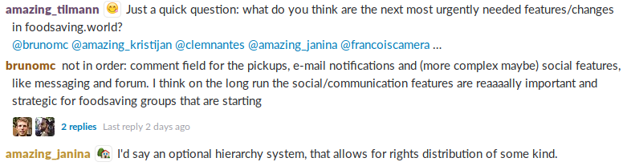
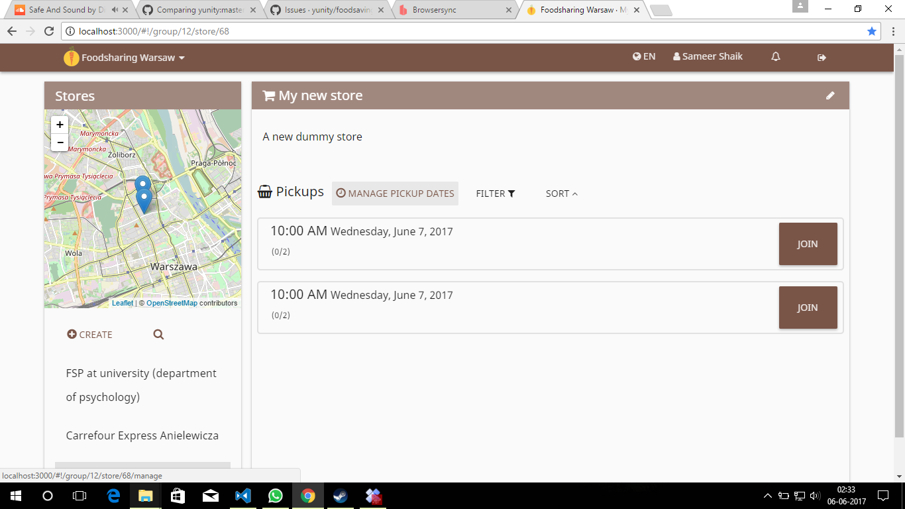

**The yunity heartbeat** - news from the world of sharing, fresh every two weeks.

## Multisharing platforms

### Online

Thanks to the new energy brought in by Bruno and the enthusiastic movement in Gothenburg, we're talking about building online multisharing services again. On June 4th [we held a call](https://yunity.atlassian.net/wiki/display/MULTI/2017-06-04+Conference+call) to discuss the basic concept and share ideas on how to proceed. Some of the questions raised were the following:
* app or website?
* one central service provided by us or individual local instances?
* what is already out there and how can we make use of it?
From the experience we already made with the yunity project some practical advice emerged as well, e.g. by Tilmann:
> Do not try to develop everything on your own, it will take ages and discourage volunteer devs. Rather develop a system or a protocol how to connect existing websites/tools. Go for integrations and plugins instead of stand-alone websites.

In the end Bruno took the time to type out his takeaway from the discussion, which makes a nice resumee:
> Developing a new platform/app is too big of a task for the few resources and skilled people we have in this network, which is kind of the original (de)motivation problem with yunity. What we do have, however, which is of great value, is a wide range of people with experience in sharing and using digital tools, and some people also with technical skills, and all of us (or most of us, at least) express a demand or desire to have a more appropriate tool for sharing. The existing options are lacking in one way or another. One of my suggestions then was to do some mapping of existing tools and name the pros and cons so we can have later a more solid concept of the basic and really important features that should be included in such a platform (not down to the minimum detail though). WHY, if we can't actually do this? This would be an exercise in participatory design and an important source of information for when we do get resources to develop this [...].
Another thing from the discussion we had and that is a constant when talking about technology in general is that IT IS NOT (only) ABOUT A SOFTWARE. It is a lot about COMMUNITY BUILDING, which is why we should focus on the local (the prominent unity being a city) whenever developing or suggesting the use of new digital tools for sharing. How are people sharing, what are the existing local initiatives and how could that be improved by any platform? I believe there is a global common denominator (hence global in design) but you can only build a solid user base and get people engaged in sharing communities if you promote it locally, perhaps with a local identity as well.
That being said, my suggestion is to start exploring the basic question "What kind of digital tool do we need and that would promote more sharing on a local basis?". [...]

### Offline

The offline version of a multisharing platform currently in use is the flake. The flake is an installation, that gives space for people to offer and look for things, skills, spaces, ideas and whatever you can imagine. It's like a small, local, offline version of the full-fledged yunity platform and it works via big pieces of white cloth, which are held up by wood planks and provide categorically seperated areas for people to pin their needs, ideas and offers. So it is a way for people to connect and share whatever they like in their direct environment. This year the flake will travel to various festivals and maybe even city centers in Germany. Over this journey the concept will be improved so that people can make use of it as easily and conveniently as possible.
In case you were wondering: It's called 'flake' because from above it looks just like a snowflake.

## Festivals

During the summer lots of festivals take place and provide us with great opportunities to network, learn and save resources in a fun and social environment!

### Humus Festival

From the 4th to the 11th of June the [Humus Festival](http://humus-festival.de/) took place at [Kulturgut Freiland](http://kulturgut-freiland.de/gelaende/) in the North-East of Germany. It was meant to bring together people from the different but related backgrounds of foodsharing, permaculture and wilderness awareness - and that's exactly what it did! It was a week full of interesting workshops treating all kinds of subjects from Thai massage to Bokashi composting, from sensing nature to sewing wounds and from hypnosis to baking bread. Every day we were fed three amazing vegan/vegetarian meals, that were made partly from saved food. Butze was there from the very beginning and made sure a [flake](https://www.youtube.com/watch?v=73SRZKvHqUA) was installed to enable people to share whatever they want directly on the spot - without the need for any kind of online platform.
We bathed in the lake, we sweat in the floating sauna and we sang at the fire. And just like that a lot of new connections were established, so that there is e.g. a newly found - and hopefully growing! - network of people in Berlin, who are united by the need to build something bigger, that is beneficial for the city, the people and the world. Do you want to join in as well? Then visit the [humus forum](http://humus-festival.de/forum/index.php), create an account and take part! ...or tell Janina on [Slack](https://slackin.yunity.org) and she will connect you! ;)

### MOVE Utopia

Next week the [MOVE Utopia conference](http://move-utopia.de/wp-content/uploads/2017/03/Aufruf_eng.pdf) will take place in Berlin and bring together lots of different movements working for social and ecological change. Some of us have been involved in organizing this big event from the very beginning, so we're looking forward to amazing outcomes, which then will be covered by a whole specialized issue of the [Oya magazine](http://www.oya-online.de/home/index.html)!

### Foodsharing.de festival season

With the Hurricane and Southside festivals taking place in two weeks in the North and South of Germany respectively, the festival season for German foodsavers is opening as well! Let's save tons of food, tents, camping chairs, sleeping bags and all the other camping supplies, like sunscreen, toothpaste! And all the good beer can't go to waste either, of course... ;) Do you also want to do food and resource saving on a festival in your area? Check out [this guide](https://yunity.atlassian.net/wiki/display/FSINT/Foodsaving+at+festivals) on how to do it!

## Foodsaving Worldwide

### Hackathon plannings

We have been planning an event focused on the development of [foodsaving.world](https://foodsaving.world) and foodsharing.de. It currently seems that we will meet in Berlin mid of July, with a follow-up event in the Harz mountains shortly afterwards. If you are interested in coding with us at these locations, please join us in #hackathon on [Slack](https://slackin.yunity.org).

### [foodsaving.today](https://foodsaving.today)

Part four of the series from Gothenburg will be published shortly. We had the hope, that we'd get a German translation before publishing, but now it's time to stop the waiting and just let you read in English about the future of solikyl!

### [foodsaving.world](https://foodsaving.world)

In our [Slack chat](https://slackin.yunity.org), we started to gather priorities for upcoming feature development. The following points were mentioned:
- comment field for the pickups ([more info & feedback on this](https://github.com/yunity/foodsaving-frontend/issues/158))
- e-mail notifications ([more info & feedback on this](https://github.com/yunity/foodsaving-frontend/issues/257))
- social features: messaging and forum ([more info & feedback on this](https://github.com/yunity/foodsaving-frontend/issues/520))
- optional hierarchy system, that allows for rights distribution ([more info & feedback on this](https://github.com/yunity/foodsaving-frontend/issues/356))

The following features have been implemented during the last two weeks:

- On the store page, the *create pickup* button has been replaced with a *manage pickup dates* button, increasing the accessibility of the page ([details](https://github.com/yunity/foodsaving-frontend/pull/512)) 
- A history tab has been added to the Store page, showing all activity related to the selected store ([details](https://github.com/yunity/foodsaving-frontend/pull/516))
- The user profile pictures in the history tab now show the user's initials on top of the random picture ([details](https://github.com/yunity/foodsaving-frontend/pull/513))
- The date selector for creating and editing pickups now only allows clicking on today or days in the future ([details](https://github.com/yunity/foodsaving-frontend/pull/517))
- After verifying a changed mail address, now the new address gets shown in the frontend ([details](https://github.com/yunity/foodsaving-frontend/pull/510))
- Code refactoring: As usual, a significant portion of our time went into making the code more uniform, better to understand and hence easier to contribute to
  - migrate to the `SessionUser` service, which also provides a  `isLoggedIn` helper function ([details](https://github.com/yunity/foodsaving-frontend/pull/511))
  - change `*.styl` files to uniform code style ([details](https://github.com/yunity/foodsaving-frontend/pull/514))

## About the heartbeat.

The heartbeat is a biweekly summary of what happens in yunity. It is meant to give an overview over our currents actions and topics.

### When and how does it happen?

Every other weekend we collect information on a wiki page and publish it on Sunday or the following Monday as a wiki blog article.

Afterwards we add a nice abstract and share it on [facebook](https://www.facebook.com/yunity.org/).

### How to contribute?

Talk to us in [#heartbeat](https://yunity.slack.com/messages/heartbeat/) on [Slack](https://slackin.yunity.org) about the content, the layout or any other heartbeat related issues and ideas!
