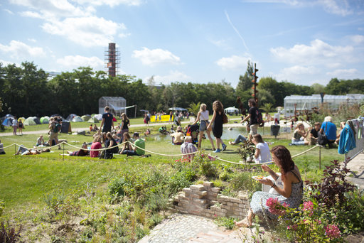

**The yunity heartbeat** - news from the world of sharing, fresh every two weeks.

## Planning a multisharing platform

The discussion about a better software platform for sharing is going on! Bruno is working on [research on existing platforms](https://yunity.atlassian.net/wiki/pages/viewpage.action?pageId=91267179) and we want to collect feedback on [features that we deem important](https://yunity.atlassian.net/wiki/display/MULTI/Features).
We had discussions about [P2P architecture](https://yunity.slack.com/messages/C5FFR125V/convo/C5FFR125V-1497623179.189265/), the user *unic0rned* presented us his [ideas of the *Karma* gift website](https://yunity.slack.com/archives/C5FFR125V/p1497680699352423) and Nick provided insight on [how to create a productive work environment](https://yunity.slack.com/archives/C5FFR125V/p1498296473141521).

===

*Note*: If you can't visit some of the links above, you might need to [join our Slack chat](https://slackin.yunity.org) first.

## Hackathon plannings

We have been planning our next ["Code for Change" hackathon](https://yunity.org/en/events/2017-06-14-hackathon) event as the previous one was very successful for us. This time we are delighted to welcome the [trustroots.org](https://www.trustroots.org) team as well. [Co-up](http://co-up.de/) were very pleased with our event last time and are happy to host us again. This time we have sponsored drinks from a co-operative in London ([outlandish.com](https://outlandish.com/)) who are interested in supporting our mission. This time we put more focus on developing three active and live websites, and on building developer community and productivity. See details [here](https://yunity.org/en/events/2017-06-14-hackathon).

## [foodsharing.de](https://foodsharing.de)

Raphael W has been busy working on converting [foodsharing.de](https://foodsharing.de) to use the [Laravel framework](https://laravel.com/), now that he is supported by the prototype fund. We look forward to combining this work with the new [foodsharing light](https://github.com/foodsharing-dev/foodsharing-light) initiative at the [hackathon](https://yunity.org/en/events/2017-06-14-hackathon).
Matthias also had a productive phone call with Manuel from foodsharing.de in which he appreciated our efforts to keep the development going, and we hope to make stronger connections in the future.

## [foodsaving.today](https://foodsaving.today)

The [fourth and last part of the Foodsharing Gothenburg blog post series](https://foodsaving.today/en/blog/2017/06/27/foodsharing-gothenburg-part4) was released!

> What happens here is that this food sharing point, with the fridge, the shelves and the big IKEA boxes [...] constituted a very basic infrastructure that people could use to engage in the act of sharing whatever food excess they have or find.
>
> There is no need for constant supervision of the fridge by any kind of formal organization (a company, a charity or public authorities), which would be responsible for the giving and taking happening on this food sharing point. There is no need either for a boss, whether from a company or from a non-profit, to organize or dictate how these interactions are going to take place.

Happy reading!

## [foodsaving.world](https://foodsaving.world)

The last two weeks have been rather quiet for the foodsaving tool that powers foodsaving.world. Still, even in those times, we move forward!

- Added chinese translation
- Showing translation progress in the language chooser
- We now enforce code style rules for our `*.styl` files

## yunity.org website

Tilmann finally pulled the plug on the old yunity.org website and migrated the existing content onto different places. Existing links will be redirected to the new locations.

## Plannings for WuppHaus Wurzen

Matthias, Doug and Laurina are discussing a paragraph of the buying contract which is not 100% clear. We are bound to renovate the building within 5 years, otherwise the current owner has the right to buy it back from us. Matthias is about to get a clarification on what they mean with *renovation*.

## Foodsharing Festival registrations are open

From August 18th to 20th the [foodsharing festival](http://www.foodsharing-festival.org/) will take place in Berlin. Registrations are [open](http://www.foodsharing-festival.org/)!

## Dargeluetz House Summercamp

In Dargeluetz there will be a Summercamp starting from July 29th. The week before (starting July 22nd) there is a meeting of the Schenkerbewegung and interested people. Whoever is interested in helping to prepare or participating, visit: http://dargeluetz.weebly.com/veranstaltungen.html

If people of the yunity team want to visit before or afterwards feel invited and contact Joachim via Slack (@amazing_joachim)

---

## About the heartbeat.

The heartbeat is a biweekly summary of what happens in yunity. It is meant to give an overview over our currents actions and topics.

### When and how does it happen?

Every other weekend we collect information on a wiki page and publish it on Sunday or the following Monday as a wiki blog article.

Afterwards we add a nice abstract and share it on [facebook](https://www.facebook.com/yunity.org/).

### How to contribute?

Talk to us in [#heartbeat](https://yunity.slack.com/messages/heartbeat/) on [Slack](https://slackin.yunity.org) about the content, the layout or any other heartbeat related issues and ideas!
