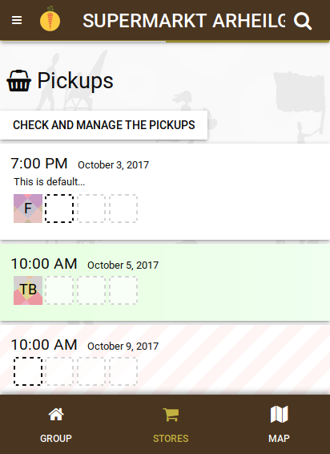

**The yunity heartbeat** - news from the world of sharing, fresh every two weeks.

## Foodsaving Worldwide
The [Hackweek](../2017-09-17) is over and we are back to working together in a remote way. But we're still feeling the momentum brought to us through the time of being closely together and we achieved quite much:
* We have a prototype for a static info page that is to be reachable via foodsaving.world
* Our hosted instance of the Karrot software will move to app.foodsaving.world (_to be decided_) to make it more clear that foodsaving worldwide and Karrot are _not_ the same
* Karrot-frontend gets steadily rewritten and foodsharing.de development sees a surge of activity. Read more about these two topics down below:

## Karrot

After the end of the Hackweek, progress on the new VueJS-based frontend slowed down. Still, Nick, Lars and Tilmann have been working on the [_Megalist_] (https://github.com/yunity/karrot-frontend/issues/619 tasks. Tests were added, the state management was improved, group conversations were enabled and the pick-up list got a nice fancy design.

Back-end wise, Ines and Marie have been improving the pick-up feedback model. They also wrote a nice introductory report for new back-end developers, to be published soon in [our blog](blog.foodsaving.world).

The Rails Girls Summer of Code (RGSoC) is now finished. A great __thank you__ to Ines and Marie for their motivated work! We hope that they stay close to the foodsaving worldwide project. Also, we will probably apply again at the next RGSoC(-like) event.

## Foodsharing.de development
In a [new blog post](https://devblog.foodsharing.de/2017/09/19/a-plan.html) Nick explains in more detail how he imagines the foodsharing.de development to work from now on.

## Kanthaus Wurzen

## WuppDays Dargeluetz Planning

## Harzgerode
Stuff is happening again! The three ["getting to know each other" meetings](https://www.gemeinschaftsstifter.info/gemeinschafts-initialtreffen/) are over and the community is being founded.

There was a very concrete and motivating meeing about who "could" move in right away and under what basic conditions. It seemed to be sort-of-consensus that things like paying rent (and money in general) and using spaces would be solved solidarily. The group that met generates enough monthly and one-time funding to pay for the upkeep of the place and the heating system (which apparently is already ordered). A possible scenario for the yunity-ish people here could be: make one or two very improvised clay ovens in the Inspektorenhaus before winter, sleep there and have a community room that can be heated with wood (at least a bit ;)  And use community rooms in Ost for working and hanging out, spending time with the other people of the community, etc. In the long term (from next spring on) concentrate on making the Oberarzthaus nice and usable, do some immediate things now to prevent further decay.

Other yunity-ish people interested in Harzgerode in the next weeks/months/years?: Wolfi, Anna (Oldenburg), Steffen, Lise

_by Bodhi_
