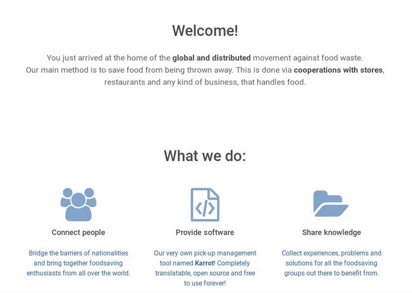
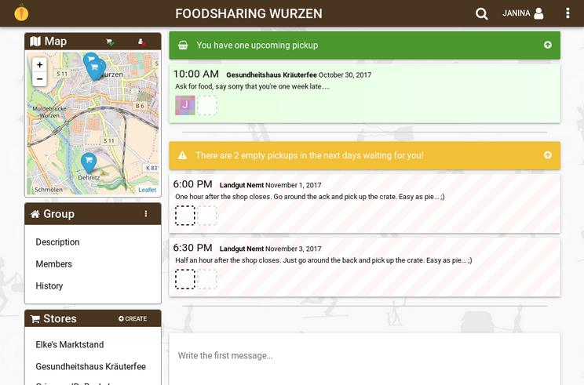

**The yunity heartbeat** - news from the world of sharing, fresh every two weeks.

## Foodsaving Worldwide
Sooo many mails! You guys out there are really amazing! And all of a sudden you all reach out to us! :D This is exactly what we wanted, but lately we really feel a shortage of (wo)manpower to handle all the communication needed to answer everybody's questions. So if you wrote a mail to us and have not yet received an answer, please don't be disappointed: We will definitely get back to you, it may just take a while. Sorry!

### foodsaving.world
The huge influx of emails motivated us, however, to speed up the process to put the new landing page for foodsaving.world online. It will make much more information directly accessible to people, who just come by and want some answers to questions like:
- How to start a foodsaving group?
- How to manage pick-ups and cooperations?
- How to set up a Food-Share Point?
- What other groups are already out there?
- Who can I talk to, to get more in-depth coaching?
- Where can I share my group's story of success and/or the challenges we face(d)?

_by Janina_

## Karrot

We updated our road map that describes the next tasks to discuss and work on. You can [view it here](https://github.com/yunity/karrot-frontend/blob/6850450e5410e1aae02339a0f1db0d5259ad9de3/ROADMAP.md). Nick is currently working on group roles and [agreements](https://github.com/yunity/karrot-frontend/pull/660), as well as a hybrid app for Android and iOS. Chandi works [on store statuses](https://github.com/yunity/karrot-frontend/issues/628) to show if a store is ready to co-operate. Tilmann is busy with form validation error handling, API simplification and added a shortcut button to [add groups and store location](https://github.com/yunity/karrot-frontend/pull/664). Lars wants to refine the design of the soon-to-be-released website.

With all that progress, we are coming closer to release the rewritten client. We added a hint to the current deployment:

> We developed a new version of foodsaving.world. Use your existing password to login to alpha.foodsaving.world and gives us feedback via [e-mail](mailto:karrot@foodsaving.world). The new version will go online around mid of November 2017.

_by Tilmann_

## foodsharing.de

We managed our first release with the new structured approach with contributions from 7 people, here are the [release notes](https://devblog.foodsharing.de/2017/10/18/release.html). I'm really impressed with the progress, even if there is not much to see for users of the site.

We also [put out a request](https://devblog.foodsharing.de/2017/10/15/we-need-your-help.html) for a developer to help us out with a new landing page design. [@TimFoe](https://gitlab.com/TimFoe) was able to help us out with a vagrant development setup (it runs the docker-compose setup inside it and is useful if you cannot run docker-compose directly, should be helpful for Windows users especially). [@thinkround](https://gitlab.com/thinkround) has continued enthusiastically and it's been great to see the [really active discussion](https://gitlab.com/foodsharing-dev/issues0/issues/247) bringing in a wider set of people. I feel very positive we get a solution here now, thanks everyone!

Matthias also worked on getting us towards a really crucial milestone for the refactoring by [moving one of the existing modules into the new PSR4 structure](https://gitlab.com/foodsharing-dev/foodsharing/merge_requests/168).

_by Nick_

## Ukuvota
- Ukuvota has a new results page with tab layout to switch between the emoji view and the data table.
-  Also Ukuvota now has vuex as its state management improving developer experience and allowing states to be synchronized between multiple components.
- Voters in the results page can be deselected in the emoji view.
-  Multiple tooltips have been added to make it clearer what buttons do
- You can now export data as text file or directly take a screenshot with a press of a button
- Storybooks and Jest have been implemented by Nick to add tests and to view single components individually

_by Wolfi_

## Kanthaus
Nick and Cille became volunteers and Janina finally moved in! Nick wants to organize hackathons at Kanthaus and make sure, the place can support events like those. Cille wants to help where she can and follow spontaneous surges of creative energy to improve the house. Janina wants to push the official foodsaving and intensify contact to the food bank.

On Thursday 26th the second monthly foodsharing Wurzen meeting was held and the facebook group Rainer founded already has attracted more than 80 members, one of which is mayor Jörg Röglin. The next steps are to contact more small stores and maybe even take over some cooperations of the food bank, which has limited resources at the moment and therefore stopped most of its pick-ups.

This weekend until Tuesday 31st the Germany-wide foodsharing festival season 2017 retrospective meeting also takes place at Kanthaus. It's the first bigger event and we are all very excited how it will play out. Our nice neighbor Sven provided electricity for this important weekend and hopefully the weather will stay warm, so that we won't miss heating too much... ;)

_by Janina_

## Solidarity economy Wuppdays + Community meet-up
At the end of November there will be two events back-to-back at Dargelütz, an intentional community in the Northeast of Germany. The first event is a Wuppdays on the theme of Solidarity Economy. A 'Wuppdays' is something like running an interactive conference on top of a camp: events are organized by the people who go there, accommodation and food are collectively arranged. The theme, Solidarity Economy, is a broad term to describe ways of working together and sharing resources which serve everyones interests as far as possible. Check out [this page](http://dargeluetz.weebly.com/yunity-wuppdays.html) for more details!

The second event is a meeting about communities. It's an opportunity for people already in communities to present them and communicate information, experience or needs. It's also an opportunity for people interesting in joining/starting communities to get some ideas, ask questions or raise concerns. Check out [this page](http://dargeluetz.weebly.com/gemeinschafts--vernetzungstreffen.html) (German) for more details!

Come to one, come to both and/or tell your friends.

## About the heartbeat.
The heartbeat is a biweekly summary of what happens in yunity. It is meant to give an overview over our currents actions and topics.

### How to contribute?
Talk to us in [#heartbeat](https://yunity.slack.com/messages/heartbeat/) on [Slack](https://slackin.yunity.org) if you want to add content, change the layout or any other heartbeat related issues and ideas! We are also happy about any kind of feedback! ^_^
