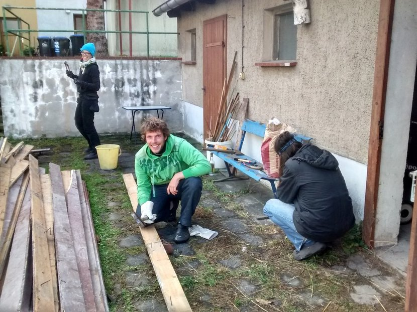

**The yunity heartbeat** - news from the world of sharing, fresh every two weeks.

## Karrot

Launch of a new version!

## Kanthaus

After the foodsharing festival meeting we talked about in the last issue, the group staying at Kanthaus slowly but steadily grew sammer again. Right now we are only six people and it feels like the houses are pretty much empty.

Last week we got the opportunity to save lots of old floorboards from a skip just a few hundred meters from our doorstep and we made good use of it! Over two days we moved wood into our yard and over two more days we removed quite some nails from the old boards. This task is not yet finished but out shed is pretty full with good, usable wood already!

The most memorable day for all of us was probably last wednesday, when finally our heating system got connected! To appropriately test it we got electricity from our nice neighbor again and that led to radiadors, which actually _spread heat_! Without our own power connection this was only temporarily working, but it still warmed up our hearts and minds - and when the day will finally come, on which we will connected to the power grid, we know that we can directly use central heating.

_by Janina_

## foodsharing.de development

## Solidarity economy Wuppdays + Community meet-up

Mark the date if you don't have already: **From November 20 to 27 we'll have our next WuppDays!**

It's gonna be about intentional communities and the challenges they face. The first five days we'll occupy ourselves with the many different questions that come with the decision to live solidarity in a community: How can we work together effectively? How can we make decisions in a fair but also timely manner? How can we best support each other? How can we be closely bonded together while also allowing for as much personal time and space as needed? The talks and workshops will be self-organized by the people on site next week. Check out [this page](http://dargeluetz.weebly.com/solidarity-economy-wuppdays.html) for more details!

On the weekend we'll hold a community meet-up. It will be an occasion for existing and potential communities to present themselves and for interested individuals to see, if they can find a community to join. Do you want to take part to either show off what makes your community special or to have a look if you can find the community you belong to? Check out [this page](http://dargeluetz.weebly.com/gemeinschafts--vernetzungstreffen.html) (in German) for more details!

Come for the week, come for the weekend or come for the whole 7 days and/or tell your friends!

_by Janina_

## About the heartbeat.
The heartbeat is a biweekly summary of what happens in yunity. It is meant to give an overview over our currents actions and topics.

### How to contribute?
Talk to us in [#heartbeat](https://yunity.slack.com/messages/heartbeat/) on [Slack](https://slackin.yunity.org) if you want to add content, change the layout or any other heartbeat related issues and ideas! We are also happy about any kind of feedback! ^_^
