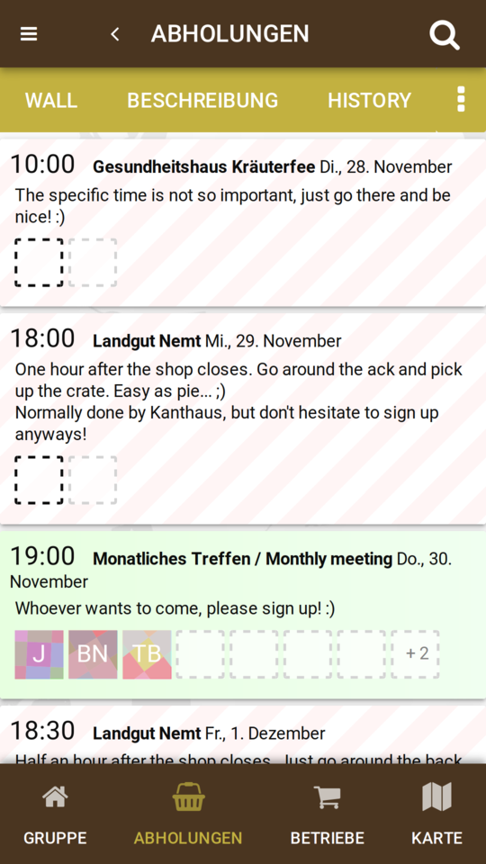
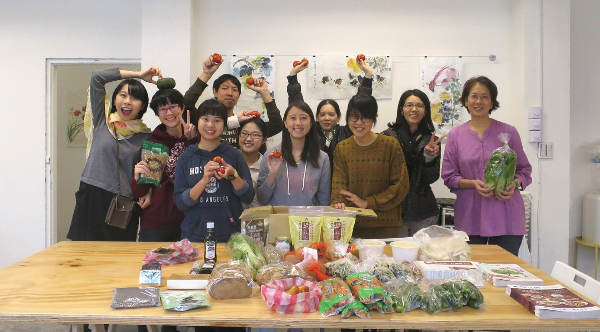
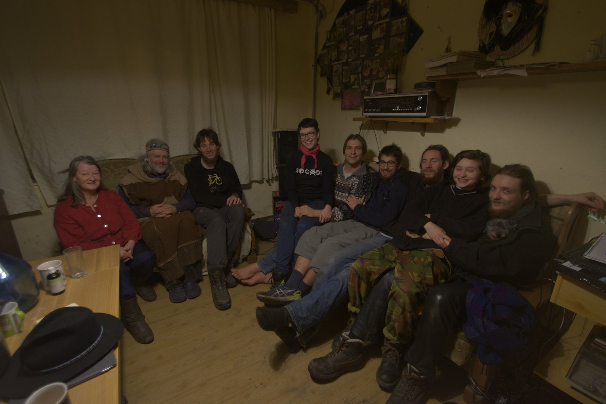

**The yunity heartbeat** - news from the world of sharing, fresh every two weeks.

## [Karrot](https://karrot.world)

"Steady progress" could be an apt summary for the last two weeks. Nick got the Android app ready for testing and kept thinking about the best way to deliver automated builds to beta testers. Janina worked with Tilmann on the groups pickup page, fueled by user feedback. There's still [an ongoing discussion](https://github.com/yunity/karrot-frontend/issues/741) about which pickup dates to show in which place, input is highly welcome. Lukas finished his first [Karrot coding task](https://github.com/yunity/karrot-backend/issues/368), which was about improving the backend code structure. Tilmann spent most of his karrot coding time in refactoring, bringing the code into better shape. The focus lies on improving the backend API structure, the frontend state management, error handling code and data loading.

_The new central pickup page (that doesn't satisfy all needs yet...)_

Aside from all the coding, Nick and Lukas worked on an application for the [DIAL grant](http://www.osc.dial.community/), their notes can be found [here](https://pad.disroot.org/p/dial-funding-application).

Nick deployed [another instance of karrot](https://tw.foodsaving.world) on request of Stefan from Foodsharing Taiwan. This puts more emphasis on the implementation of _branding_ features to be able to customize karrot to local needs.

_by Tilmann_

## [Foodsaving.world](https://foodsaving.world)

Foodsharing Quito is expanding! The group in the capital of Ecuador already has 3 cooperations running and is in contact with two more stores. On top of that they saved food at a vegan food festival and have an active group with 50 members on facebook. Keep going strong! :)

Foodsharing Taiwan held their first event on Friday 11/24 in Yonghe District (永和) of Taipei City for a cooking activity that turned leftover food into lovely little dishes.
They teamed up with three other local groups that work on waste cooking, ugly fruits and upcycling.
About 20 people took part in the event, where participants were encouraged to bring surplus food to cook or exchange with other people. Furthermore, Ann Huang (黃尹宣) from Pick Food Up kitchen, had contacted restaurants and food suppliers to gather some of their surplus food before the event.
It was great to see a happy crowd of people getting active on food waste and the event was a nice start with hopefully lots more to come soon!

At the same time Foodsharing Taiwan is working on setting up more public fridges and store cooperations in Taiwan. For the public fridges you can now find a list on [foodsharing.tw](https://foodsharing.tw/fridges/) (in Chinese), which is steadily growing and will be kept up to date.
They are also making progress in approaching new stores, while some of the stores are worrying, that they might lose customers because of their cooperation. One bakery apparently even reported that some of the foodsavers were customers before and now buy less. This is not easy to resolve, but we'll do our best to work on a solution together!

_by Janina and Stefan_

## WuppDays Dargelütz

Over the course of the last week the [WuppDays Dargelütz](http://dargeluetz.weebly.com/solidarity-economy-wuppdays.html) took place! The focus lay on community and the question of how to organize communal economy in a way that fits the value of solidarity. We were a group of around 10 people, who gathered in the tiny village of Dargelütz, where the [VFS](http://dargeluetz.weebly.com/der-vfs-ev.html) has property and commits it to experiments of community since more than 20 years.

There were talks and workshops about alternative currencies, experiences with different communities and how they chose to organize their economies, as well as warm baths - heated up sustainably via the newly-built [Biomeiler](https://de.wikipedia.org/wiki/Biomeiler) - and vegan food. It was small, cozy and surprisingly chill WuppDays this time... ;)

_by Janina_

## Kanthaus

Matthias held a workshop on Arduino programming, which resulted in a temperature and humidity sensor station for usage inside the Kanthaus. Followed by suggestions from Rosina and Björn, a room-planning meeting about K22 will take place next week.

Axel, Lise, Janina and Matthias were busy driving the SIL application forward. A lot of new ideas came up and much time was needed to put old and new ideas into nice paragraphs. Ideally, this will be followed by a "pitch" presentation.

Other news: the big "random stuff storage" was nicely sorted into a DIY shelf - Investigation showed that the floor wood in K22 attic is fine - looking for somebody to open the windows in K20 basement, despite heavy spider presence

_by Tilmann_

## About the heartbeat.
The heartbeat is a biweekly summary of what happens in yunity. It is meant to give an overview over our currents actions and topics.

### How to contribute?
Talk to us in [#heartbeat](https://yunity.slack.com/messages/heartbeat/) on [Slack](https://slackin.yunity.org) if you want to add content, change the layout or any other heartbeat related issues and ideas! We are also happy about any kind of feedback! ^_^
