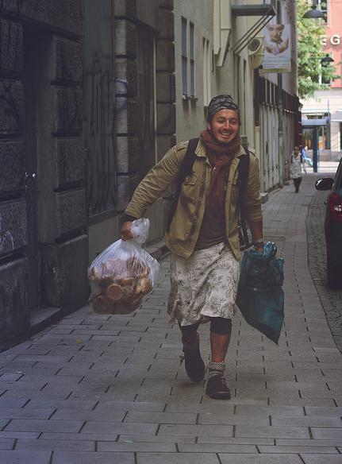
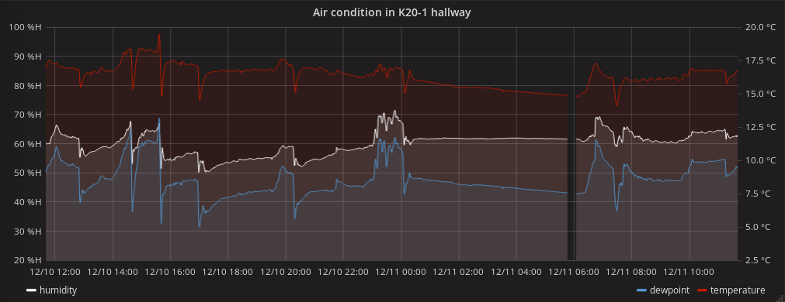
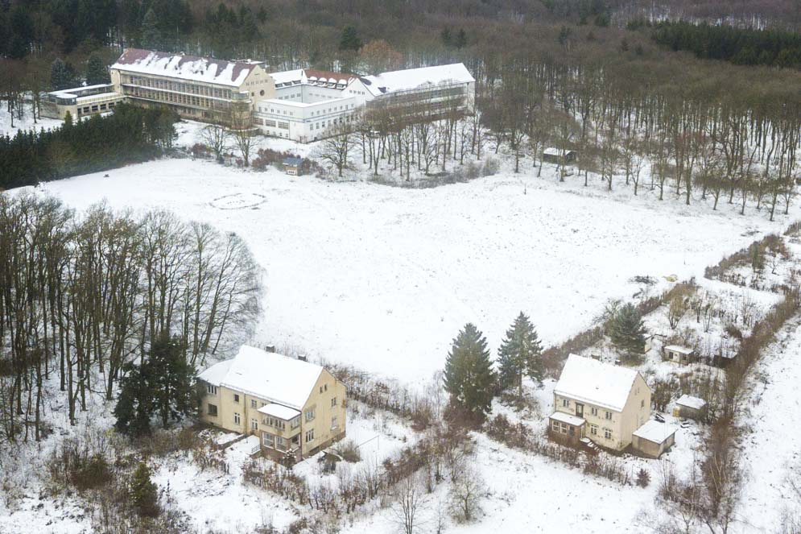

**The yunity heartbeat** - news from the world of sharing, fresh every two weeks.

## [foodsharing](https://foodsharing.de)-dev

Happy Birthday, foodsharing! The 12.12.2012 was a big date - when lebensmittelretten.de and foodsharing.de merged into what you know of as foodsharing.de today.  
This date was also chosen as the launch date for a new media campaign to spread the word about foodsaving and foodsharing even more. This is why a new landing page is published at the same time as this heartbeat.

===

The new page should make foodsharing.de more newcomer friendly. Thanks to [@thinkround](https://gitlab.com/thinkround) for all the work around the landing page! To me, it is very worth it.

At the same time, this date reminds me of my own start of foodsharing. I joined the team shortly before the websites got merged for the 12.12.2014 - and quickly became the maintainer of it.

The changes since the last release on 18.10.2017 are mostly related to spelling (Thanks to [@peter.toennies](https://gitlab.com/peter.toennies) for always keeping up on this topic!), as well as a lot of refactoring and testing sent emails.

_by Matthias_

## [Foodsaving.world](https://foodsaving.world)

Fausto is in Quito, the capital of Ecuador, since a while now and he [pretty successfully started foodsharing](https://www.facebook.com/groups/666293733578955/). Now the question is if it is going to be sustainable as well. In the beginning he built up everything on his own, did all the pick-ups and redistributions and lacked support of others in the daily foodsaving work. He will be leaving Quito in the end of December, so let's hope that he can make the sparks fly until then!

Itai from Tel Aviv sent us a mail in which we were told that they already have a small foodsharing initiative going: They save food from a farmer's market and redistribute it via a FoodShare-Point. They now wrote to us to request some advice on how to expand and happily looked into our [manual on how to build and maintain cooperations with stores](https://yunity.atlassian.net/wiki/spaces/FSINT/pages/46203075/How+to+build+and+maintain+cooperations+with+stores). We are looking forward to hearing about their progress!

Carlo jumped in to push the start of foodsharing Valencia. He connected some interested individuals in the area and translated the [FSP rules sheet into Spanish](https://yunity.atlassian.net/wiki/spaces/FSINT/pages/110428163/FoodShare+Point+Rules+Sheet+ES). While doing the latter he came across some conceptual differences with regards to use-by and best-before dates, which yet need to be figured out. If anybody out there has a good understanding of the Spanish system of declaring food, please [let us know](mailto:foodsaving@yunity.org)!

Lotta is a German foodsaver, who currently spends a year abroad in Sweden. She lives in the small town of Boras, only an hour away from Gothenburg, and she is keen on starting foodsharing in Boras, too. She already connected to the [Solikyl](http://solikyl.se/about/) folks and is now in the process of gathering people to help her in this endeavor. More info to be coming!

_by Janina_

## [Kanthaus](https://kanthaus.online)

After the oh so long time of waiting we finally have our own connection to the power grid! This means that we can now use our central gas heating independently from our lovely and super helpful neighbor Sven, who provided for us up until now. After an initial period of intense heating to dry the walls, we are now figuering out which temperatures and heating times make most sense.

Easily accessible electricity raises some more sustainability and efficiency questions:
- Does it make more sense to operate a dishwasher to save water, than to do dishes by hand and use gas to heat it up? (Depends on the frequency of usage...)
- Does it make more sense to operate a dryer than to dry laundry in heated rooms? (The answer is a clear yes!)
- Does it make more sense to boil water in a pot on a gas stove or in an electric kettle? (The answer is not clear and depends on how well the pot fits the flame and such. In general the stove is the slightly better choice. We will still operate an electric kettle in the downstairs office soon, since the difference is really not big.)

Since we had a lot of problems with and discussions about humidity, Tilmann installed a sensor in the hallway of K20-1. It now logs temperature, humidity and dewpoint and transmits it to the yunity server, where a nice graph is created by grafana. This graph then gets displayed on an old smartphone in K20-1 again, so that everyone in the house can have an overview. This is what it looks like:

_by Janina_

## [Harzgerode](https://gemeinschaftsstifter.info)
There’s something going on in Harzgerode.
The ecovillage-like community is taking shape slowly but steadily. Currently a constitution is being written to provide a structure how to become a member or how decisions are being made.

A big part of this ecovillage style is, that different groups with their yunique lifestyles are very much appreciated.
So the plan is that one of the outbuildings (most probably Inspektorenhaus/Oberarzthaus) will be provided for a group of people interested in intense sharing, functional living etc.
Harzgerode is ideal for such a project, because due to the main community (Gemeinschaftsstifter) there won’t be any paperwork to do or ground tax to pay.

Currently Steffen is the only resident yuniteer. Well. Sharing doesn’t work THAT well while being alone 😉. So he’s always happy about visitors.
By now he is preparing everything that this yunity-ish subproject can start with full throttle at the very latest in springtime.

_by Steffen_

## [WurzenerWinterTage](https://kanthaus.online/events/2017wuwita/)
Winter time should be a relaxing time. It is spend best with good friends: Cuddling, sharing feelings, sharing knowledge.

The WurzenerWinterTage will take place at Kanthaus and provide the opportunity to reflect on the last year as well as meet again with friends and nice new people.

We will have different workshops to share our experiences, stay long in our cozy sleeping rooms and just enjoy a good time together.

_by Matthias_

## About the heartbeat.
The heartbeat is a fortnightly summary of what happens in yunity. It is meant to give an overview over our currents actions and topics.

### How to contribute?
Talk to us in [#heartbeat](https://yunity.slack.com/messages/heartbeat/) on [Slack](https://slackin.yunity.org) if you want to add content, change the layout or any other heartbeat related issues and ideas! We are also happy about any kind of feedback! ^_^
