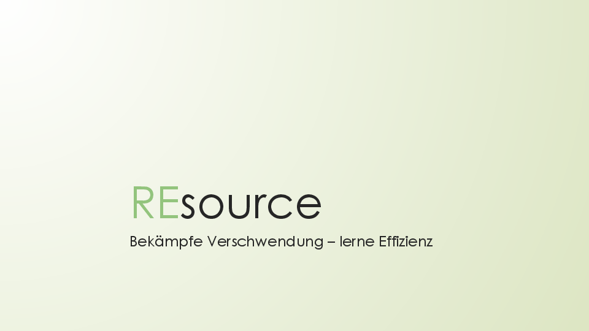
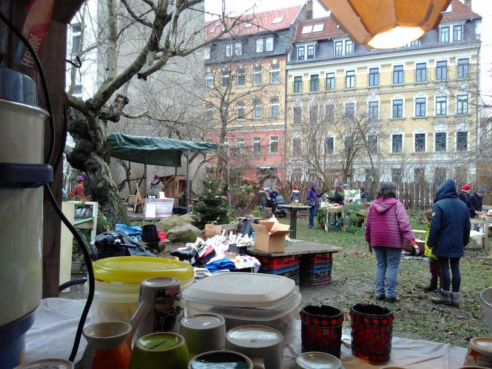

**The yunity heartbeat** - news from the world of sharing, fresh every two weeks.

## [Karrot](https://karrot.world)

We're planning the first foodsaving worldwide hackweek at the end of February 2017 in Wurzen (close to Leipzig, Germany). If you're interested in joining us, be it as developer or communication manager, tell us [via e-mail](hackweek@foodsaving.world).
Karrot will most likely also be part of the [one-day CivicTecGbg hackathon](http://civictechgbg.se/) at March 10th in Gothenburg, Sweden - thanks to Bruno for arranging this!

We received praise from Kristijan:

> Nice work- haven‘t looked into karrot for a while- like the person sleeping in the bed if there are no pickups. Nice little new things here and there to explore

Chinese translations were updated by _shangkuanlc_.

Code-wise, also some things happened! Tilmann upgraded the server-side code to Django 2.0, contributed bugfixes to Django REST Framework and Django itself, refactored all frontend state management modules into a simpler style and added snapshot tests for frontend components.
Lars started working on the [pickup feedback UI](https://github.com/yunity/karrot-frontend/pull/803), Janina adjusted the frontend code style to conform more with the VueJS style guide, Lukas started working on token-based actions for backend and Nick added an ansible-based configuration to our deployment on the _yuca_ server.

Discussions on [store teams](https://github.com/yunity/karrot-frontend/issues/360#issuecomment-353068660) and [admin capabilities](https://github.com/yunity/karrot-frontend/issues/798#issuecomment-353184062) received some new input, awaiting further input and a decision.

_by Tilmann_

## [Kanthaus](https://kanthaus.online)

On December 14 Lise, Bodhi, Matthias, Janina and Axel held a pitch at Social Impact Lab Stuttgart. They presented the newly created project _REsource_, which acts as an umbrella for all the things happening at Kanthaus. The pitch itself lasted only 5 minutes, followed by 5 minutes of questions, but it was prepared for hours and hours over weeks before. As you can imagine it was not easy at all to explain the idea of sustainable living, based on community and trust instead of money and luxury to a jury of entrepreneurs in such a short time. They basically did not understand what we are doing and of course they were missing a business plan, so we were not picked. But this was neither surprising nor sad to us and we all had the feeling that we learned a lot from this experience and that all the thoughts we had and the texts we created will definitely be of use in other contexts again.

Apart from that Björn and Janina went to [Querbeet]() on Saturday 16 to help out with a foodsharing KifA (Kitchen for All) at the sustainable Christmas market, that was taking place in this neighborhood garden on that day.

You may have noticed that we had some problems regarding translations on our homepage so far. That's why Matthias recreated it using grav and now other language versions should work much more smoothly. It is not yet deployed to our main link, but you can have a peek already at [grav.kantaus.online](https://grav.kanthaus.online).

_by Janina_
