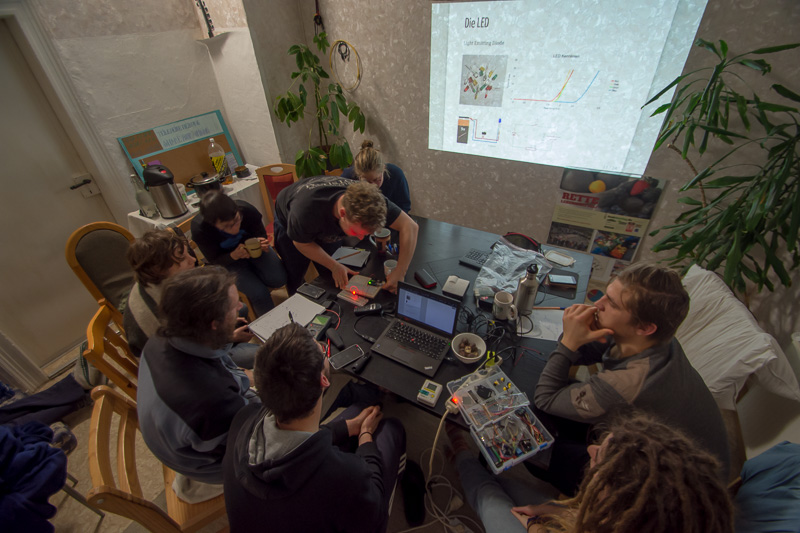
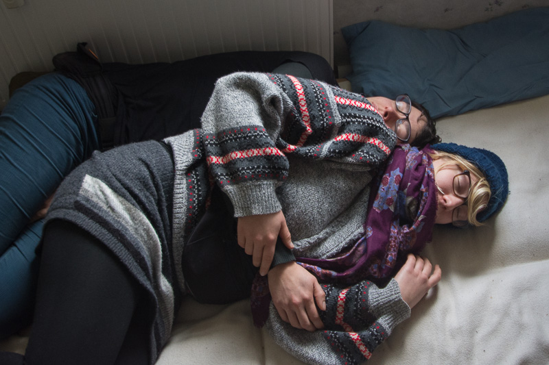
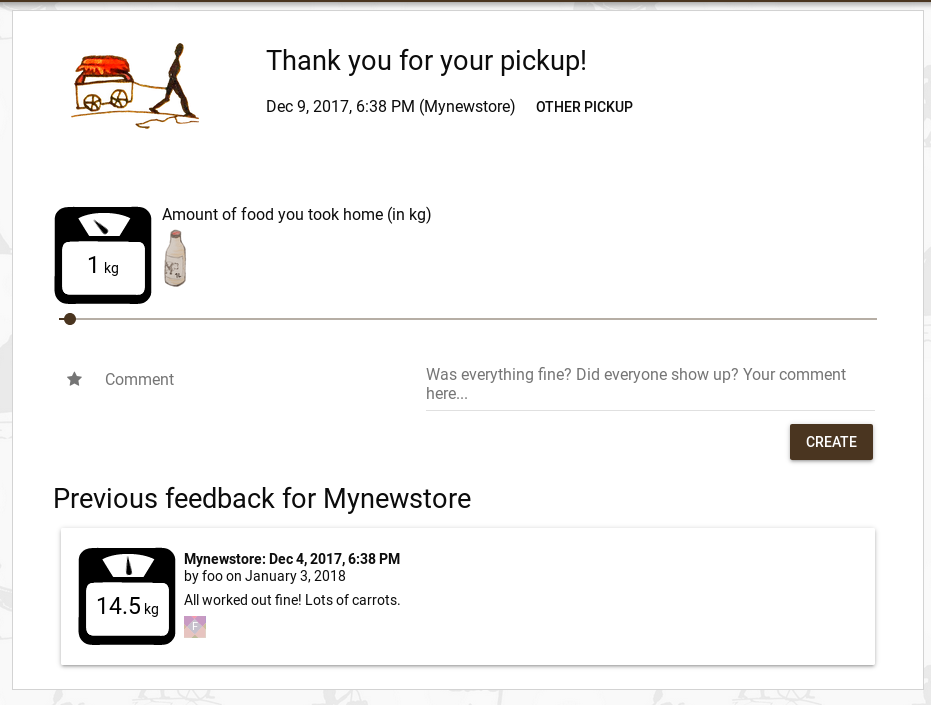

**The yunity heartbeat** - news from the world of sharing, fresh every two weeks.

## [Kanthaus](https://kanthaus.online)

Kanthaus becomes more and more cozy and more and more things are happening here, which is why for the first time it gets its own _subsections_ on the heartbeat. What a start into 2018! ;)

===

### WuWiTa 2017

On December 27 the WuWiTa (Wurzener Wintertage) did officially start. Foodsavers, yuniteers and friends met up at Kanthaus to celebrate the turn of the year together. There were many workshops covering a broad spectrum of topics. Some of the most popular being:
- Introduction to electronics ([Slides from Matthias](https://nerdyprojects.github.io/ElektrotechnikEinfuehrung/))
- The female reproductive cycle and natural ways to prevent pregnancy ([Slides from Matthias](https://nerdyprojects.github.io/weiblicher-zyklus-workshop/))
- Knitting and darning socks
- Introduction to [Arduino](https://www.arduino.cc/)
- How to make fire when it rains
- Basic timber joints
- Crafting wooden rings
- Basic sailor's knots

Apart from lots of learning and input we also had a classic party on New Year's Eve, where we danced, sang, talked, cuddled and drank saved drinks. There were also different kinds of games and many movies over the wholw of the WuWiTa.

On January 3 the event ended and the overall feedback was overwhelmingly positive. People who came by not knowing anybody before felt super welcome and warmly integrated into the community. Apparently we succeeded in reviving the spirit of WuppDays and this is a huge achievement for many of us!

### Direct Action Training

On January 15 the [direct action training hosted by Jörg Bergstedt](https://gitlab.com/kanthaus/kanthaus-public/blob/master/events/creative%20action%20methods%20flyer.pdf) will begin in Kanthaus. Jörg will teach us creative ways to protest against what doesn't make sense in this world. If you're in the area you're most welcome to stop by and attend the workshops! Of course everything is free of charge and staying for some days at Kanthaus is no problem. If you _plan_ on staying overnight, however, we'd appreciate receiving a [mail](mailto:hello@kanthaus.online) beforehand so we know how to allocate sleeping space.

### New website

Matthias and Janina finally went through with deploying the new website! When visiting [kanthaus.online](https://kanthaus.online) now you'll see a fancier layout and some more content. There will be more content coming, as soon as we figured out how to do that without cluttering the website too much. There's balance needed when wanting to be transparent and informative, because there's always the risk of overwhelming the user with too much data.

_by Janina_

## [Foodsaving Worldwide](htpps://foodsaving.world)

Since this is the first heartbeat of the year a small retrospective of 2017 seems to be in order. I started writing it directly on here, but the list got longer _very_ quickly. So just [click here](https://foodsaving.world/en/home/history) is you want to read about all the accomplishments of last year.

To continue our success story and build on it we already plan the next [foodsaving worldwide meet-up](https://yunity.org/en/events/2018-02-24-fsww-hackweek) in February. It will be a week for foodsaving enthusiasts to come together, share their passion and strengthen the global community of foodsavers, as well as a karrot hackathon. It will also be an opportunity to check out Kanthaus, as this will be our venue this time... ;)

_by Janina_

## [Karrot](https://karrot.world)

Lukas, Lars and Tilmann spent some time on karrot in the last two weeks to add features, improve design and refactor code. Lukas worked on verification codes in the backend, Lars added pages for the feedback feature and Tilmann connected them to the frontend data management and the backend.

** All changes: **

- Feedback frontend (Lars, Tilmann)
- Show non-empty pickups on the group wall in addition to joined pickups (Tilmann)
- Support for custom recurrence rules in pickup series, e.g. every two weeks or every month (Tilmann)
- Improved sidebar design and highlight buttons (Lars, Tilmann)
- Collapsible sidebar (Lars)
- Switch "time" and "message" fields in wall messages (Lars)
- Add shortcut to create first store and first pickup (Tilmann)
- Unify pickup management icons (Lars)
- Improve page loading speed (Tilmann)
- Improved "not found" page (Lars)
- Check old password when changing password (Tilmann)
- Improve frontend validation errors (Tilmann)

_by Tilmann_

## [foodsharing.de](https://foodsharing.de)-devblog

Foodsharing.de will also have its very own hackweek in Kanthaus! It will take place from February 10 to 18 and you're warmly invited to take part! Read more about it [here](https://yunity.org/en/events/2018-02-10-fsde-hackweek).

_by Janina_

## About the heartbeat.
The heartbeat is a fortnightly summary of what happens in yunity. It is meant to give an overview over our currents actions and topics.

### How to contribute?
Talk to us in [#heartbeat](https://yunity.slack.com/messages/heartbeat/) on [Slack](https://slackin.yunity.org) if you want to add content, change the layout or any other heartbeat related issues and ideas! We are also happy about any kind of feedback! ^_^
