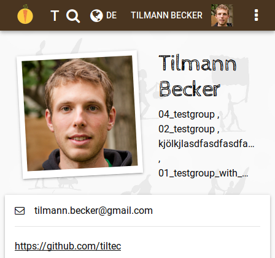
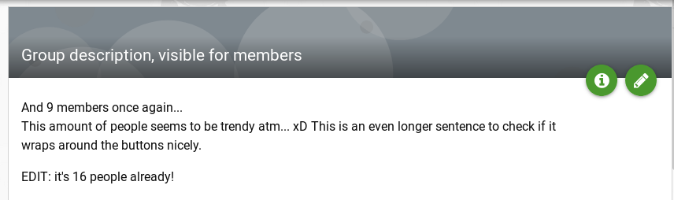

**The yunity heartbeat** - news from the world of sharing, fresh every two weeks.

## [Karrot](https://karrot.world)

The possibility to upload user profile photos was added to [Karrot's development version](https://dev.karrot.world) by Tilmann, based on work by Nick.

Lars submitted a design improvement with lots of changes and added group banners, Tilmann added editing of feedback and and made it possible to set a location just by clicking on the map.

Lukas refactored the e-mail verification code and will use the same data models for other verification purposes next.

Arnaud, a new contributor, worked on fixing the cancel buttons in the store edit form.

 _Profile photos_

 _Group banners_

 _Editing of given feedback_

As usual, this is just a rough overview and misses out all the small contributions that are needed to keep karrot running!

_by Tilmann_

## [Kanthaus](https://kanthaus.online)
Last week we hosted a [direct action training](https://kanthaus.online/events/2018-01-15_direct-action) with [Jörg Bergstedt](https://de.wikipedia.org/wiki/J%C3%B6rg_Bergstedt). The participants practiced to think freely and to find creative ways to go about situations of injustice: Chalk, humor and a little boldness are often enough to make a difference and there's no need for special occasions or expensive material as long as you know how to make use of what you have. It was definitely an inspiring seminar that was enjoyed by all participants.

More events will follow over the next weeks, the first being a [building week](https://kanthaus.online/events/2018-01-29_building-week) starting on January 29. ([Click here](https://kanthaus.online/events/upcoming) to get an overview of upcoming events.)

As you have probably guessed due to all those events, our basic infrastructure is ready! So now we need to figure out how to sustain it in the long run. Water, gas, electricity, internet and some building material are things we did not yet figure out how to get through non-monetary sharing alone, and let's not talk about health insurances...
Since none of us is currently working for money, we had several meetings about different ways to finance what we do (like two meetings about aquiring public or foundation money, one [business proposal party](https://gitlab.com/kanthaus/kanthaus-public/blob/master/2018-01-13_businessParty.md) and of course many more casual talks about the general topic in smaller groups). We all share the opinion that events at Kanthaus should always be free of charge and that we don't want to take money from people who need it, but we also realized that we made it quite hard for people who _do_ have enough and _want_ to give money to us. We're working on that and in the meantime: If you happen to be a wealthy person and want to be a benefactor of the sharing culture at Kanthaus, please transfer your donation to our association's bank account:  
IBAN: DE85 8605 0200 1041 0436 90  
BIC: SOLADES1GRM  
Thank you! :)

## About the heartbeat.
The heartbeat is a fortnightly summary of what happens in yunity. It is meant to give an overview over our currents actions and topics.

### How to contribute?
Talk to us in [#heartbeat](https://yunity.slack.com/messages/heartbeat/) on [Slack](https://slackin.yunity.org) if you want to add content, change the layout or any other heartbeat related issues and ideas! We are also happy about any kind of feedback! ^_^
