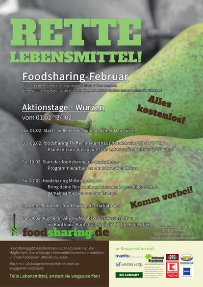
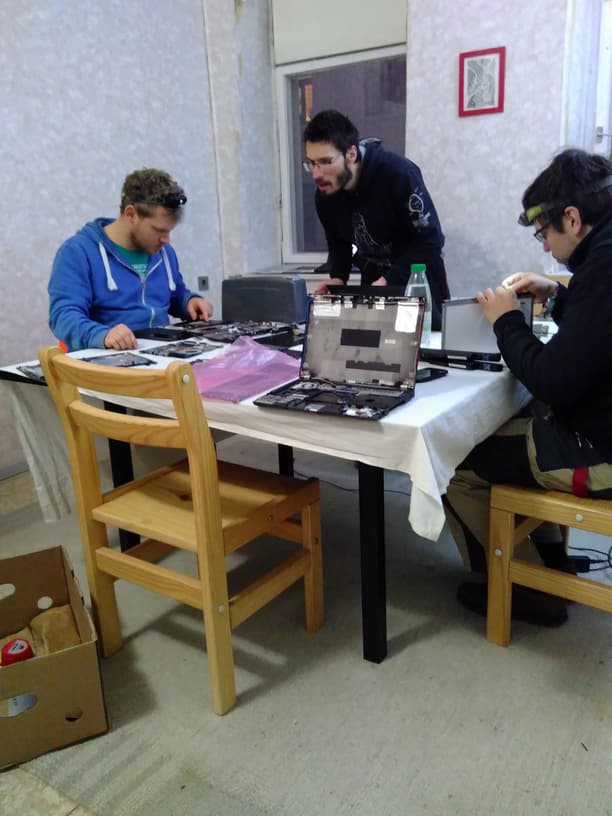

**The yunity heartbeat** - news from the world of sharing, fresh every two weeks.

## [Karrot](https://karrot.world)
The [Rails Girls Summer of Code](https://railsgirlssummerofcode.org/) has not even started but we already have many interested coderettes joining our Slack. We are very happy that there is so much interest again! Now we only need to come up with more starter tasks for the girls to work on...^^ But Tilmann already thought of [quite a lot](https://github.com/yunity/karrot-frontend/issues?utf8=%E2%9C%93&q=is%3Aissue+is%3Aopen+label%3Astarter-task)!

He also added websockets to many parts of the page, which means that other people's changes will be updated in real-time. This is true for joining and leaving pickups, creating stores, changing profile pics and much more. For now this is only the case in the [dev-version](https://dev.karrot.world) of Karrot, but soon there's gonna be a new release, which will finally put all the amazing changes of the last weeks live! :D

_by Janina_

## [Kanthaus](https://kanthaus.online)
During our [building week](https://kanthaus.online/events/2018-01-29_building-week) we managed to get quite some embellishments done! Silvan (our newest Volunteer) painted the hallway of K20 in white and orange, Björn the one of K22 in white and green and Nancy painted some beautiful birch trees in the free shop. But there's also new useful features: Bodhi and Rosina put the bathtub in the washing room a meter higher, so that things can be cleaned with a straight back now. Tilmann built a new storage shelf in the dry food storage and Doug removed moldy wallpaper and made the shower waterproof again. Matthias and Bodhi fixed a lot of bikes, Matthias and Tilmann continued their work on the greywater system and Tilmann installed more light.

Apart from that the Foodsharing February started and Björn and Janina already made 3 rounds through the city to put up posters and talk to people. So far resonance is great and we hope that many people will show up for our events this month - the first being the [monthly metting of foodsharing Wurzen](https://kanthaus.online/events/2018-02-08_fs-monthly-meeting) on February 8.

Another thing that started is the weekly [RepairCafé](https://kanthaus.online/projects/repaircafe), hosted by Matthias. It's meant to connect people interested in electronics, mechanics and IT and to serve as an open space to play with technology. And people who want their devices fixed can also come by of course... ;)

_by Janina_

## [Foodsaving Worldwide](https://foodsaving.world)

- [Foodsharing Quito](https://www.facebook.com/groups/666293733578955/) held their very first disco soup event and shared this beautiful picture in the [fsww facebook group](https://www.facebook.com/groups/foodsaving.worldwide/).

- We got contacted by Miho from Nagoya, Japan, who met up with some foodsavers of Berlin and now wants to bring the movement to her home country. Janina connected her to Aki, another Japanese contact of hers, and hopes for the best.

- Ferret from Valencia is checking out Karrot and organizing the first events to get foodsharing going again.

- Isa's time in Barcelona is over and she traveled further South, but she said quite some interested people came together at the info event she organized and she's positive about the future of foodsaving in the capital of Catalonia.

- Joakim from Straßbourg is reaching out to get more information about the legal situation of foodsharing. Generally people seem to expect contracts between stores and foodsavers and are quite surprised in most cases when they find out that in Germany the waiver is signed by the foodsavers only: It is an agreement the foodsavers commit to, the stores don't have to worry about anything.

- Robin and Betty from [DeKaskantine](http://www.kaskantine.nl/) in Amsterdam contacted us to find out ways to distribute a surplus of saved food. We gladly forwarded them to the existing initiatives in Amsterdam, namely [Taste before you Waste](http://amsterdam.tastebeforeyouwaste.org/) and Robin Food(https://robinfoodkollektief.nl/). We really hope to get a better, more personal contact to the foodsavers of the Dutch capital now! :)

- Students from Malmö, Sweden, contacted us to ask us for our opinion on peer-to-peer foodsharing apps and told us that they'd do one as a project

- Karolina from Warsaw told us that they have 10 FSPs in the capital now and 30 in all of Poland! She wanted to know when there's gonna be user roles and notifications for empty slots in Karrot, because these features are the ones they are still missing painfully.

_by Janina_
