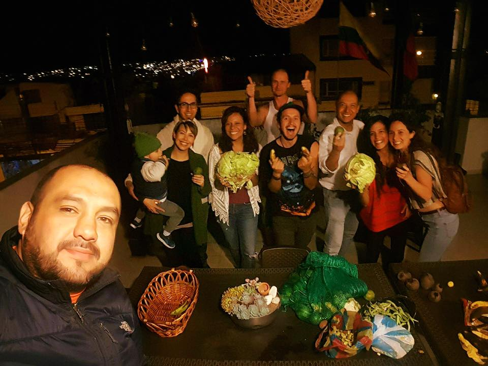

**The yunity heartbeat** - news from the world of sharing, fresh every two weeks.

## [Karrot](https://karrot.world)

## [Kanthaus](https://kanthaus.online)

## [Foodsaving Worldwide](https://foodsaving.world)

- [Foodsharing Quito](https://www.facebook.com/groups/666293733578955/) held their very first disco soup event and shared this beautiful picture in the [fsww facebook group](https://www.facebook.com/groups/foodsaving.worldwide/).

- We got contacted by Miho from Nagoya, Japan, who met up with some foodsavers of Berlin and now wants to bring the movement to her home country. Janina connected her to Aki, another Japanese contact of hers, and hopes for the best.

- Ferret from Valencia is checking out Karrot and organizing the first events to get foodsharing going again.

- Isa's time in Barcelona is over and she traveled further South, but she said quite some interested people came together at the info event she organized and she's positive about the future of foodsaving in the capital of Catalonia.

- Joakim from Straßbourg is reaching out to get more information about the legal situation of foodsharing. Generally people seem to expect contracts between stores and foodsavers and are quite surprised in most cases when they find out that in Germany the waiver is signed by the foodsavers only: It is an agreement the foodsavers commit to, the stores don't have to worry about anything.
