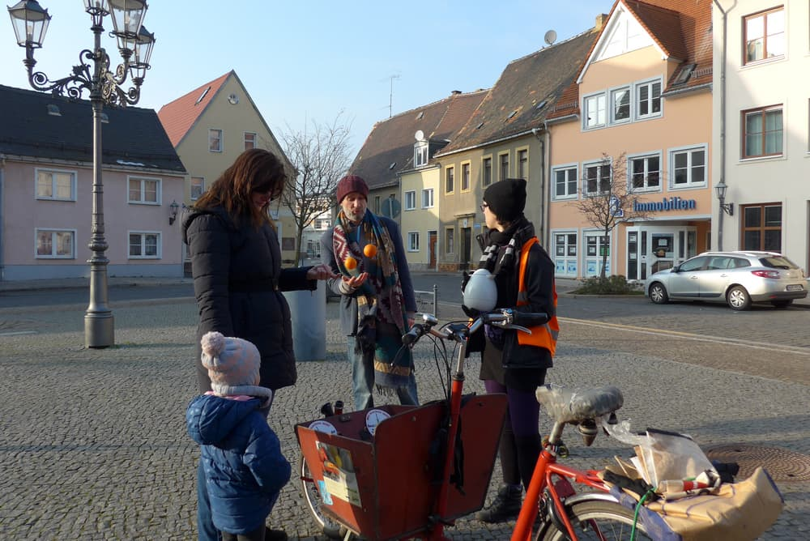
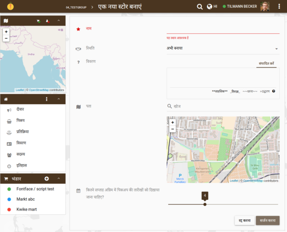
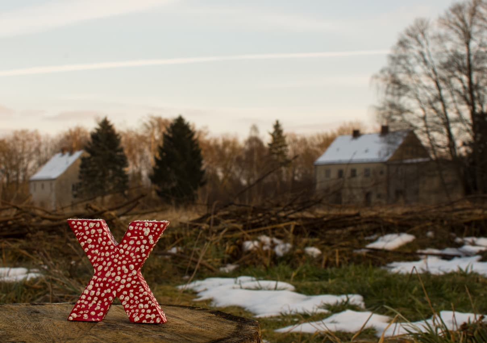

**The yunity heartbeat** - news from the world of sharing, fresh every two weeks.

## [foodsharing.de](https://foodsharing.de)-dev
Wow, what a week!
Long ago, that we had 7 people working on [foodsharing.de](https://foodsharing.de) [software platform](https://gitlab.com/foodsharing-dev/issues0/issues) related topics in a room.
We can proudly say, that a lot has happened:
- Matthias, Nick and Tilmann were mostly focussing on refactoring the foodsharing.de codebase.
- Basti and Chandi stepped into the codebase getting an insight and working on smaller features.
- Kristijan and Jörg discussed data privacy issues.

Tilmann tried hard to dive deep into the data model of the software platform and managed to create seeders, that provide developers with lots of test data for different parts of the platform.
Nick thought about how to progress the structure of the platform in a more separated, modular, testable way and shew us the right steps to get rid of global dependencies.
Matthias spent most of the time moving globally called functions into instance methods as well as step by step getting rid of globally used data in favor of a more functional programming style.
In the last day, we have been lucky to find a nasty error in our [CI-Scripts](https://en.wikipedia.org/wiki/Continuous_integration) that silently stopped updating the code before running the tests, resulting in tests always passing and in the result deploying broken code. After some minutes, the reasons were tracked down and we had a good story of that day :-)

All in all, we had a great time together and really felt progress again.
Unfortunately, the past has shown that progress and motivation got slower after the hackathons again.
We would like to keep it up at least a little bit, so we will have regular slack calls on every last friday of a month at 7pm to update each other on what we have been doing and speak about future work.

If you are interested in helping out the development of a project with
- a legacy PHP codebase, that gets refactored into modern architecture using bleeding edge PHP technology
- more than 20000 regular users
- more than 1 million page views per month
- a team that likes technology

get in contact with us via the [yunity slack](https://slackin.yunity.org)!

## [Kanthaus](https://kanthaus.online)
Apart from hosting the foodsharing.de hackweek, the foodsharing February continued. Björn and Janina talked to quite some people in the streets of Wurzen, Laura - a foodsharing ambassador from Leipzig - came to our [monthly meeting](https://kanthaus.online/events/2018-02-08_fs-monthly-meeting) and the first ever [foodsharing leftover brunch](https://kanthaus.online/events/2018-02-11_fs-brunch) brought some people to our house. Also, thanks to Silvan we now have a [facebook page](https://www.facebook.com/kanthaus.online/), which makes us way more visible to a lot of Wurzeners.

We also had many people visiting again this week. A group from [living utopia](https://livingutopia.org) came by, as well as many other personal friends. There was a surpsiring amount of birthdays and cakes and it was generally lively in Kanthaus again. :)

_by Janina_

## [Foodsaving worldwide](https://foodsaving.world)
There is a really nice new blog page maintained by the foodsavers of Gothenburg! They [document their pickups on steemit](https://steemit.com/@solikyl) now, so that even more people can witness the sheer amounts of waste and what can be done about that right here and right now.

_by Janina_

## [Karrot](https://karrot.world)

New karrot version is deployed to [karrot.world](https://karrot.world), containing all changes since mid of January:

- Profile photos
- Immediate updates when data was changed by other users
- Group banners
- Hindi and Gujarati language
- "Back to top" button

_Karrot translated to Hindi_

Furthermore, the deployment of karrot.world and dev.karrot.world (our staging site) is now [managed via Ansible Playbooks](https://github.com/yunity/yuca). This should make it easier to set up a new deployment from scratch and should eventually help other groups who want to maintain their own karrot instance.

Lots of interested newcomers, mainly from Rails Girls Summer of Code, are working on our [starter tasks](https://github.com/yunity/karrot-frontend/labels/starter-task) and are looking forward to contributing more in future.

We're always looking for more translations for karrot - if you speak a language that isn't in karrot yet, maybe [you are up to contributing a translation](https://www.transifex.com/yunity-1/karrot)?

_by Tilmann_

## Haus X Harzgerode
The start of the project is closing in!

Haus X is gonna be a place of "directly lived sustainability". A place to try unconventional ways of living, sharing, upcycling and saving the environment in a stunning place amidst beautiful nature.
Read the full initial vision in German [here](https://etherpad.net/p/Eingangsvision_Haus_X) (English version can be made on request).

The plan is, to live in the smaller _Inspektorenhaus_ for a few months, while making the first floor of _Haus X (Oberarzthaus)_ habitable.

When finished with that (~June) we'll move there and get the ground floor ready for hosting groups of guests for different workshops during the summer. For example building a Biomeiler, ShowerLoop  or whatever we come up with.
This project is an almost blank page, your creativity is very much appreciated and all kinds of skills are needed.

Interested? Fancy a visit?  
Contact @steffen on [Slack](https://slackin.yunity.org)!

_by Steffen_

## [Flake](http://flake.world)
We are happy to announce that we finally could include the Flake in the list of yunity projects! :D

The basic idea is that of a sharing board, but the implications go much further:
- Through deep contact and talks people come to realize that sharing can be the basis of a whole new way of living.
- Due to the heartfelt commitment of the Flake team the sheets which collect needs, skills, ideas and projects (just to name a few of all the possible categories) become a networking node.
- The effect of people actually _doing_ what they talk about inspires others to join in and do the same.

Over the course of 2017 the Flake team traveled from festival to festival and from conference to conference and promoted sharing towards all the people on their way. Do you want to be a part of it in 2018? Then be sure to join the first videocall of the Flake season on February 19: Just write a mail with your Skype name to [info@flake.world](mailto:info@flake.world) and become a member of the Flake team!

_by Janina_
