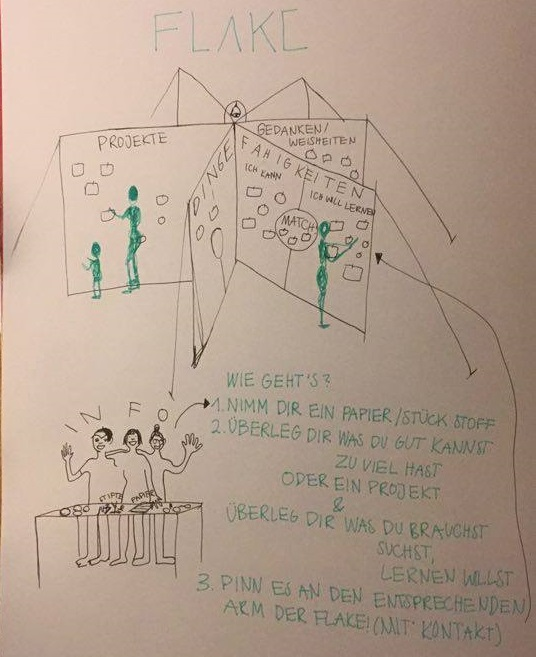

**The yunity heartbeat** - news from the world of sharing, fresh every two weeks.

## [foodsharing.de](https://foodsharing.de)-dev
A whole week of hacking and thinking about foodsharing.de lies behind us. We can proudly say that a lot has happened:
- Tilmann created seeders, so that devs have some fake data to populate the software with when trying out things
- Kristijan and Jörg discussed data privacy issues

## [Kanthaus](https://kanthaus.online)
Apart from hosting the foodsharing.de hackweek, the foodsharing February continued. Björn and Janina talked to quite some people in the streets of Wurzen, Laura - a foodsharing ambassador from Leipzig - came to our [monthly meeting](https://kanthaus.online/events/2018-02-08_fs-monthly-meeting) and the first ever [foodsharing leftover brunch](https://kanthaus.online/events/2018-02-11_fs-brunch) brought some people to our house. Also, thanks to Silvan we now have a [facebook page], which makes us way more visible to a lot of Wurzeners.

We also had many people visiting again this week. A group from [living utopia](https://livingutopia.org) came by, as well as many other personal friends. There was a surpsiring amount of birthdays and cakes and it was generally lively in Kanthaus again. :)

_by Janina_

## [Foodsaving worldwide](https://foodsaving.world)
There is a really nice new blog page maintained by the foodsavers of Gothenburg! They [document their pickups on steemit](https://steemit.com/@solikyl) now, so that even more people can witness the sheer amounts of waste and what can be done about that right here and right now.

_by Janina_

## Haus X Harzgerode
The start of the project is closing in!

Haus X is gonna be a place of "directly lived sustainability". A place to try unconventional ways of living, sharing, upcycling and saving the environment in a stunning place amidst beautiful nature.
Read the full initial vision in German [here](https://etherpad.net/p/Eingangsvision_Haus_X)

The plan is, to live in the smaller _Inspektorenhaus_ for a few months, while making the first floor of _Haus X (Oberarzthaus)_ habitable.

When finished with that (~June) we'll move there and get the ground floor ready for hosting groups of guests for different workshops during the summer. For example building a Biomeiler, ShowerLoop  or whatever we come up with.
This project is an almost blank page, your creativity is very much appreciated and all kinds of skills are needed.

Interested? Fancy a visit?

Contact @steffen on [Slack](https://slackin.yunity.org)!

_by Steffen_

## [Flake](http://flake.world)
We are happy to announce that we finally could include the Flake in the list of yunity projects! :D

The basic idea is that of a sharing board, but the implications go much further:
- Through deep contact and talks people come to realize that sharing can be the basis of a whole new way of living.
- Due to the heartfelt commitment of the Flake team the sheets which collect needs, skills, ideas and projects (just to name a few of all the possible categories) become a networking node.
- The effect of people actually _doing_ what they talk about inspires others to join in and do the same.

Over the course of 2017 the Flake team traveled from festival to festival and from conference to conference and promoted sharing towards all the people on their way. Do you want to be a part of it in 2018? Then be sure to join the first videocall of the Flake season on February 19: Just write a mail with your Skype name to [info@flake.world](mailto:info@flake.world) and become a member of the Flake team!

_by Janina_
