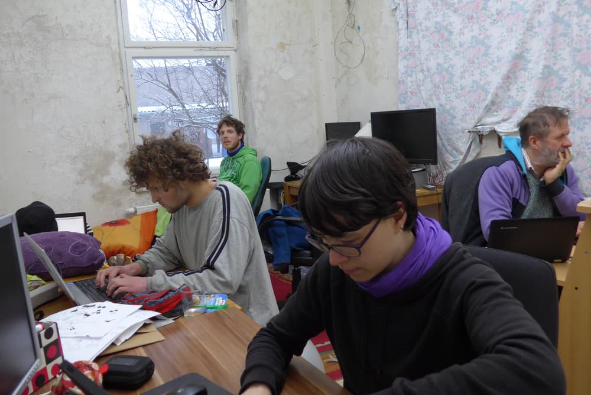
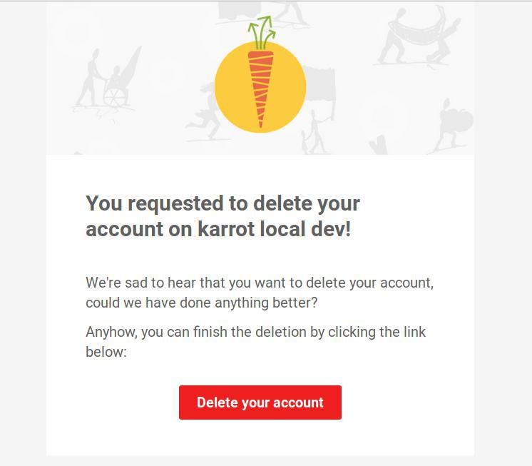
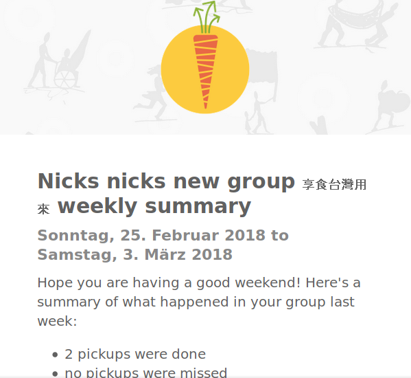
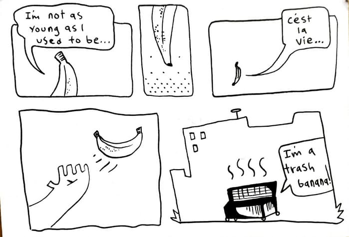
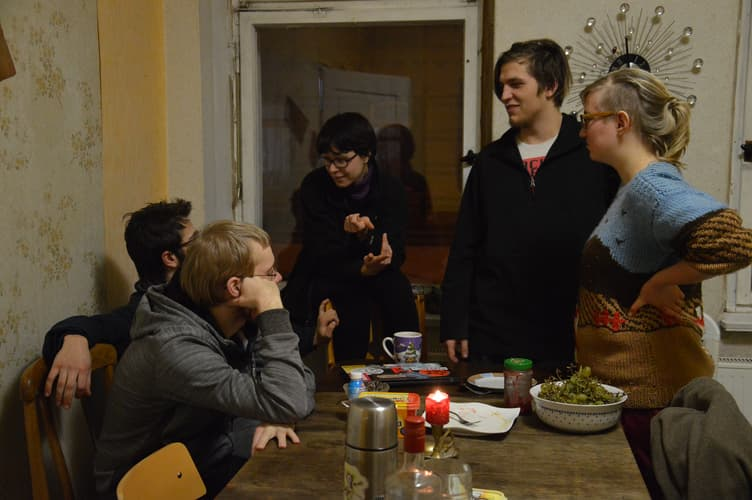

**The yunity heartbeat** - news from the world of sharing, fresh every two weeks.

## [Karrot](https://karrot.world)

Just two weeks ago we had the [foodsharing.de](https://foodsharing.de) hackweek and now it was karrot's turn!

During the hackweek, we worked on many things, including

- emoji reactions to group messages @mrkvon
- e-mail notifications for group messages with reply-by-email feature @tiltec
- Markdown formatting support for group messages @tiltec
- weekly group summary e-mail and notification settings page @nicksellen
- request-to-join for groups (will eventually replace the group password feature) @NerdyProjects
- removal of inactive users from groups @djembejohn
- site usage statistics @nicksellen
- e-mail authentication for sensitive account actions @mr-kojo
- HTML e-mails @nicksellen @tiltec @djahnie
- Rewrite and improve backend setup instructions @mr-kojo @tiltec
- add huey, a runner for background tasks @NerdyProjects

_Authentication for sensitive actions_

_Weekly group summary e-mails_

We had an extensive discussion about user roles in groups and permissions. @djembejohn wrote an in-depth description of current features and possible changes. It was posted in the yunity Slack, but we plan to publish it somewhere else too. As quick overview, these were points we talked about:

- Keep revisions when data changes and offer undo (Wikipedia model)
- Self-chosen roles in groups that come with additional rights but also requirements
- Require approval from equal group members for sensitive actions
- Voting system for most sensitive actions (e.g. removal of users)
- Kamikaze system for most sensitive actions: you can remove someone but get removed yourself; requires request-to-join to get back into the group
- Web of trust with explicitly expressed trust between group members

Besides the hackweek, there was also lots of activity:

- Add phone number field to user profiles @DevipriyaSarkar @swekshajha12
- Edit button in user profile page @agarwalpooja
- Search box for group gallery @searchingfor
- Map view for group gallery page @D0nPiano
- Translation updates for Chinese, Spanish and Polish languages

_by Tilmann_

## [Foodsaving Worldwide](https://foodsaving.world)

Due to no networking people showing up for the [karrot and fsww event](https://yunity.org/events/2018-02-24-fsww-hackweek), Janina mostly concentrated on karrot. Still, some communicative tasks were tackled as well:

- Basically all the people we're already in touch with were contacted again and news were exchanged.
- We finally put the [English version of the article about Foodsharing Poland](https://foodsaving.today/en/blog/2018/02/27/fsps-in-poland), which was first published by cojestgrane24 a year ago, on foodsaving.today.

And we held our very first karrot user call! It was organized via the [foodsaving worldwide facebook group](https://www.facebook.com/groups/foodsaving.worldwide/) and took place on discord. The info that was collected beforehand, as well as a write up of the most important topics can be found [here](https://yunity.atlassian.net/wiki/spaces/FSINT/pages/177078273/Karrot+user+call+1).

_by Janina_

## [Kanthaus](https://kanthaus.online)

On the day the Karrot hackweek started, the Foodsharing February officially came to an end and was celebrated with our biggest public event so far: The pancake KifA!

Around 25 Wurzeners came to our house and spend the afternoon/evening with us! We were overwhelmed by the interest and super happy that all the nice pancakes we prepared were eaten over talks about sharing culture. This first KifA definitely was a huge success and we're already looking forward to the next one!

More and more people start coming by because they've heard of us and want to say hi. That's awesome! [Our facebook page](https://www.facebook.com/kanthaus.online/) has almost a hundred likes already and posts on there regularly elicit quite some reactions. On the other hand does this make us realize that most of us actually are introverted nerds and that we'd _really_ like to have more people in the house who actually enjoy talking to visitors on a regular basis. Do you feel addressed? Then please [get in contact](mailto:hello@kanthaus.online)!

Other noteworthy events were the hosting of our first [official couchsurfer](https://www.couchsurfing.com/people/hopefullyunique), who spent the night and left a nice reference, and our first [workawayer](https://www.workaway.info/367874778735-en.html), who just arrived and will probably stay for some weeks. His name is Kurtis and he's an awesome artist, as you can see here:

And for people more interested in structural matters the most important news could be that [our Constitution](https://kanthaus.online/en/governance/constitution) saw its first major amendment, which prescribes member revaluations, adds a visitor section and a completely rewritten evaluation paragraph, as well as some minor changes in phrasing. Bear with us though, because there are still mistakes (!), the German version is not updated yet and we are planning the next big amendment already...

_by Janina_

## About the heartbeat.
The heartbeat is a fortnightly summary of what happens in yunity. It is meant to give an overview over our currents actions and topics.

### How to contribute?
Talk to us in [#heartbeat](https://yunity.slack.com/messages/heartbeat/) on [Slack](https://slackin.yunity.org) if you want to add content, change the layout or any other heartbeat related issues and ideas! We are also happy about any kind of feedback! ^_^
