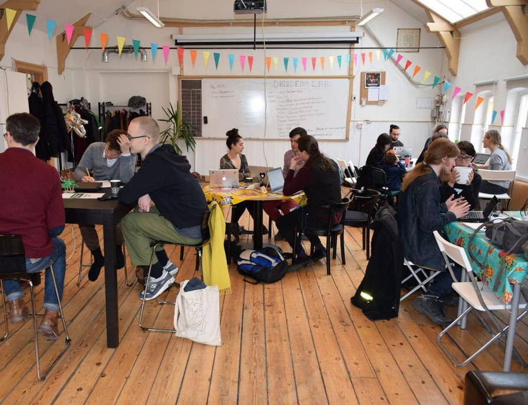
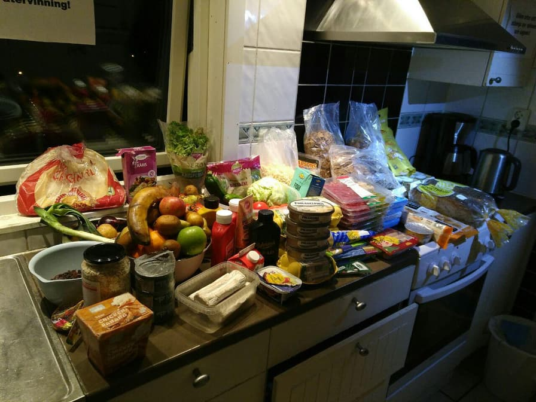
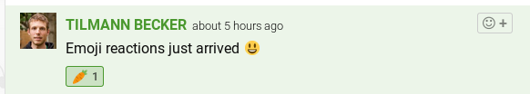
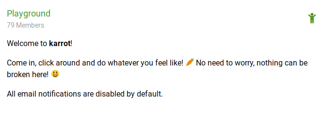
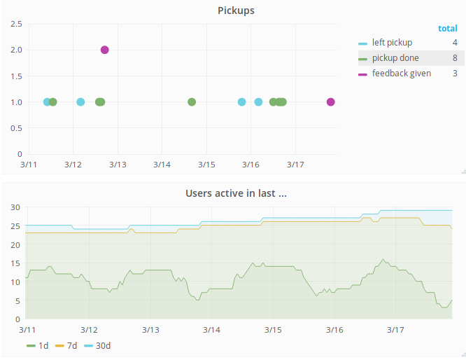
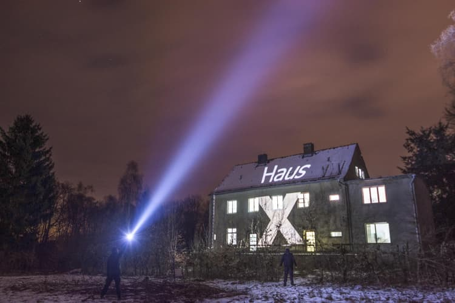

**The yunity heartbeat** - news from the world of sharing, fresh every two weeks.

## [CivicTechGbg](http://civictechgbg.se/)
Organized by Bruno and others in [Digidem Lab](http://digidemlab.org/en/) in Gothenburg, Sweden, Civictech is going to be a series of hackdays and networking events to bring active people from civil society closer together and to thus form a coherent movement to tackle the problems of our current times in an open, collaborative and non-commercial way. The first event took place on March 10 at Viktoriahuset in Gothenburg.

Karrot (and foodsaving in general) was one of four projects participating, the others were:
- [Hyresrättskollen](http://hyresrattskollen.se/) - collecting data to counter gentrification
- [DinRiksdag](https://www.dinriksdag.se/) - adapting [consul](http://consulproject.org/en/) to make the Swedish democracy more interactive
- Jetabörg - a multisharing plattform for Gothenburg

_by Janina_

## [Foodsaving Worldwide](https://foodsaving.world)
Thanks to CivicTechGbg Janina and Tilmann finally managed to meet the foodsavers of [Solikyl](http://solikyl.se) in Gothenburg! Bruno and Madde hosted us for over a week and we got many opportunities to build stronger bonds to various members of Solikyl. It was amazing to see all the food they save (professionally documented on steemit, [check it out](https://steemit.com/@solikyl)!) and what a tightly-knit, productive group they built! We hope to see them again in the not so distant future and wish them all the best until that time comes. :)

Being already in the area, visiting Lotta in Borås was the logical thing to do. She is still planning on starting a foodsaving group in the smaller Swedish city as well and got a boost of new motivation after doing an epic dumpster dive together with Tilmann and Janina. On top of that she already arranged a networking meetup with Taras - our contact in Stockholm - and will drop by Solikyl's friday hang-outs once in a while.

But there's even more foodsaving going on in Sweden!

The [foodsavers of Lund](https://www.facebook.com/groups/829765127111133/) also welcomed Janina and Tilmann and will be visited for some days, and Teddy already announced the second meeting to build up [Foodsharing i Östersund](https://www.facebook.com/groups/194858781249133/).

_by Janina_

## [Karrot](https://karrot.world)

After the hackweek end of February, lots of started work had to be finished and merged. The playground group is ready (@tiltec), as well as reactions to messages (@mrkvon). The group member list separates active from inactive users and the store list optionally shows archived stores too (@tiltec). The karrot mobile app is not released yet, but it's already quite usable with the new feature to pull fresh data when it switches from background to foreground (@nicksellen).

There's another type of notification email: if there's a pickup with free slots on the next day, you will get an email in the evening before. We added pickup feedback to the weekly summary email (@nicksellen).

We started collect internal statistics about group activity to find out more about how Karrot is used (@nicksellen). In future, we plan to display some of those statistics on karrot itself.

The foodsavers from Poland updated their language, which fits together with their plans to use karrot in the coming months.

_Message reactions_

_Playground group_

_Statistics_

## [Kanthaus](https://kanthaus.online)

## Haus X Harzgerode
Winter came back to Harzgerode with full force and made us delay the practical part of the project a bit. But there's a lot of planning and thinking to do anyways. Haus X is not just a house project. It will be one of many groups building the future ecovillage in Harzgerode.
- Which tasks will be our part?
- How can Haus X be open and free for everyone without sabotaging the accommodation- and event business of the main community (which is used to fund the project and enable Haus X to exist in the first place)?
- Haus X is going to have the privilege to allow moneyfree living. How can this be managed without freeloading the rest of the community?

Lots of questions, but none of them unsolvable. A small group (Lise, Bodhi, Josi, Steffen) will meet this upcoming week to chat about circumstances to participate in the project an maybe about some of those questions

_by Steffen_

## About the heartbeat.
The heartbeat is a fortnightly summary of what happens in yunity. It is meant to give an overview over our currents actions and topics.

### How to contribute?
Talk to us in [#heartbeat](https://yunity.slack.com/messages/heartbeat/) on [Slack](https://slackin.yunity.org) if you want to add content, change the layout or any other heartbeat related issues and ideas! We are also happy about any kind of feedback! ^_^
