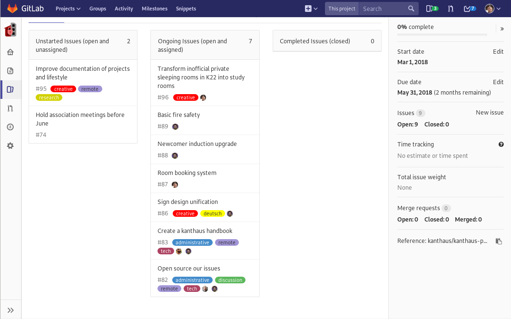
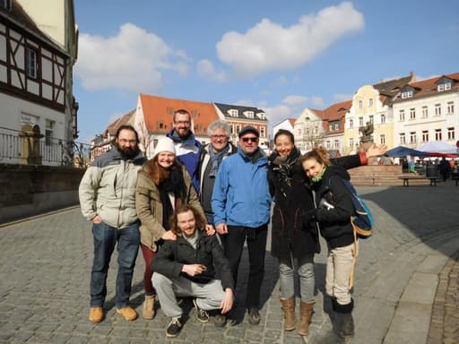
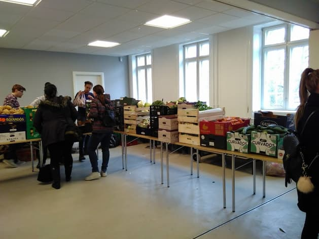
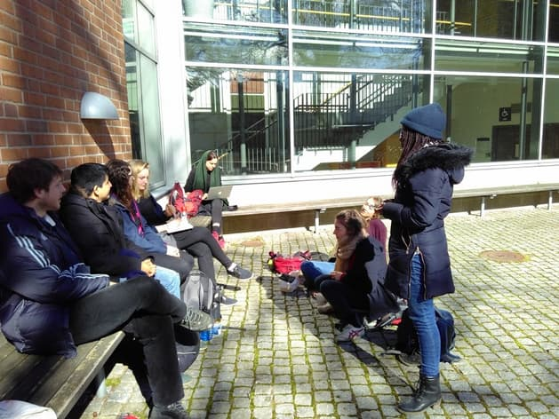
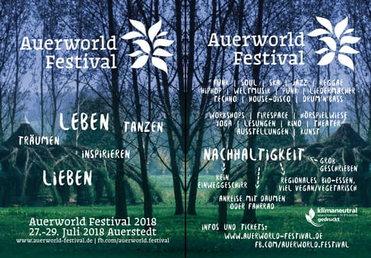

**The yunity heartbeat** - news from the world of sharing, fresh every two weeks.

## [Kanthaus](https://kanthaus.online)

Leticia from Uruguay came to our house via [workaway](https://www.workaway.info/367874778735-en.html) and Héloise from France via [warmshowers](https://www.warmshowers.org/). We have a second operational dishwasher, that will be very useful during larger events. The greywater system is improved and doesn't produce badly smelling toilet flushes anymore. Spring is around the corner and we had our first big barbecue the other day. With Matthias the last founding member got revaluated and finally legitimated through the formal process everybody undergoes. The roadmap tasks for spring are slowly but steadily tackled.

_The spring roadmap issues, which are already on Gitlab_

Last weekend we hosted the [foodsharing board meeting](https://kanthaus.online/events/2018-03-23_fsde-board-meeting). You can read a more detailed summary of what happened in [this German blog article](https://foodsharing.de/?page=blog&sub=read&id=231&noprocess) written by board member Miriam.

_The board of the German foodsharing e.V. on Wurzen's market square_

The coming weekend the orga crew of the [Humus festival](http://humus-festival.de/)'s North-East edition will use our space for a [planning session](https://kanthaus.online/events/2018-04-05_humusmeeting) to progress this great and sustainable event. It's not too late to get involved! :)

_by Janina_

## [Karrot](https://karrot.world)

In a [Mini Roadmap Meeting](https://yunity.atlassian.net/wiki/spaces/FSINT/pages/221446145/2018-03-28+Mini+Roadmap+Meeting) Tilmann, Nick, Janina and Matthias specified the topics in karrot development for the upcoming months. It will be more focused on maintenance and finishing tasks that have been already started then on opening up new issues. This means that we'll put our mobile app in the play store soon and that we'll fine-tune the notification mails. Other recurring tasks like keeping dependencies updated and gathering user feedback will of course be taken care of as well.

_by Janina_

## [Foodsaving Worldwide](https://foodsaving,world)

There is a [blog page made in Russia](https://foodsharing.ru/blog/) and it's just like [foodsaving.today](https://foodsaving.today)! The main girl behind it - Anna - is happy to collaborate and lets us translate and repost all her articles, like [this first one about foodsharing Germany](https://foodsaving.today/blog/2018/03/23/fsde-from-russian-perspective)! [This one about the UK](https://foodsaving.today/en/blog/2018/03/31/fsuk) is also already translated and put live. But there's a lot more to come over the coming weeks!

Finally Janina got the opportunity to visit [Foodsharing Copenhagen](http://foodsharingcph.org/) herself! Their system which completely revolves around huge distribution events was strange to her at first, but after some time to think about it she came to appreciating it as a slightly different approach of foodsaving and foodsharing, which works perfectly fine for the Copenhageners. Thanks again to James for hosting her and Tilmann for two nights!

_Distribution event in Copenhagen_

Equal thanks to Albertas in Lund, who made it possible for Janina and Tilmann to join not only the weekly lunch meeting of [Lund's foodsavers](https://www.facebook.com/Food-Saving-Lund-197379657517070/) but also to engage in a [competition about dumpster diving bananas](https://www.youtube.com/watch?v=qNmrvY7Fy64)... ;)

_Lunch meeting in Lund_

On top of these really nice in-person meetings we received info that there already are people who are starting [foodsharing Japan](https://www.facebook.com/%E3%83%95%E3%83%BC%E3%83%89%E3%82%B7%E3%82%A7%E3%82%A2%E3%83%AA%E3%83%B3%E3%82%B0%E3%82%B8%E3%83%A3%E3%83%91%E3%83%B3-Food-Sharing-Japan-2014852785397936/) and that there is _a lot_ of momentum in France right now. It seems that there might be bigger France-wide movements forming soon - stay tuned! Or even better - [get active as well](https://foodsaving.world)!

_by Janina_

## [Foodsharing.de](https://foodsharing.de)

For a long time we had been thinking how to handle the refactoring of the frontend JavaScript, and it's a kinda big topic, so was easy to delay. However, I finally got my head around it and pushed forward with a webpack-based setup.

We deployed the first webpack'd pages (the logged out homepage, and the logged in dashboard page), and not too many errors arrived! Seems to work :) It'll still be a lot of work to roll out the new style to the rest of the site though. [Wanna help?](https://slackin.yunity.org)

Matthias did an amazing job switching over to using [Symfony Forms](https://symfony.com/doc/current/forms.html) (on just one form for now). In general we are trying to use standardised library components instead of custom implementations and form handling is one of the big topics for web applications.

With the new approach we get much improved validation and error handling and remove a lot of the existing code once the transition is complete (again, [wanna help?](https://slackin.yunity.org)).

_by Nick_

## [Auerworld-Festival 2018](https://auerworld-festival.de/)

From July 27 to 29 there will be the Auerworld-Festival in Auerstedt, Thuringia, and Silvan is one of the main project planners. It is a festival that emphasizes sustainability, well-being and the asthetics of nature. Only 4 months are left until it starts, thats why the plannings are firing on all cylinders:
- marketing online ([facebook](https://www.facebook.com/auerworld.festival/), [website](https://auerworld-festival.de/), etc.) and offline (flyers, posters)
- orga-meetings and the more casual "Stammtische" in Jena and Leipzig
- coordinating helpers and external service providers
- building a shower trailer
- and much more... :)

Next weekend there will be the "Weidenbinden" in Auerstedt, where we maintain the sallow palace. Planting new sallow sprouts, removing old ones, bending bigger branches to fit the shape of the palace and cleaning the festival area from remains of storm "Friederike" - everyone is invited to join in for this weekend :)

_Official German flyer, front and back_

_by Silvan_

## About the heartbeat.
The heartbeat is a fortnightly summary of what happens in yunity. It is meant to give an overview over our currents actions and topics.

### How to contribute?
Talk to us in [#heartbeat](https://yunity.slack.com/messages/heartbeat/) on [Slack](https://slackin.yunity.org) if you want to add content, change the layout or any other heartbeat related issues and ideas! We are also happy about any kind of feedback! ^_^
