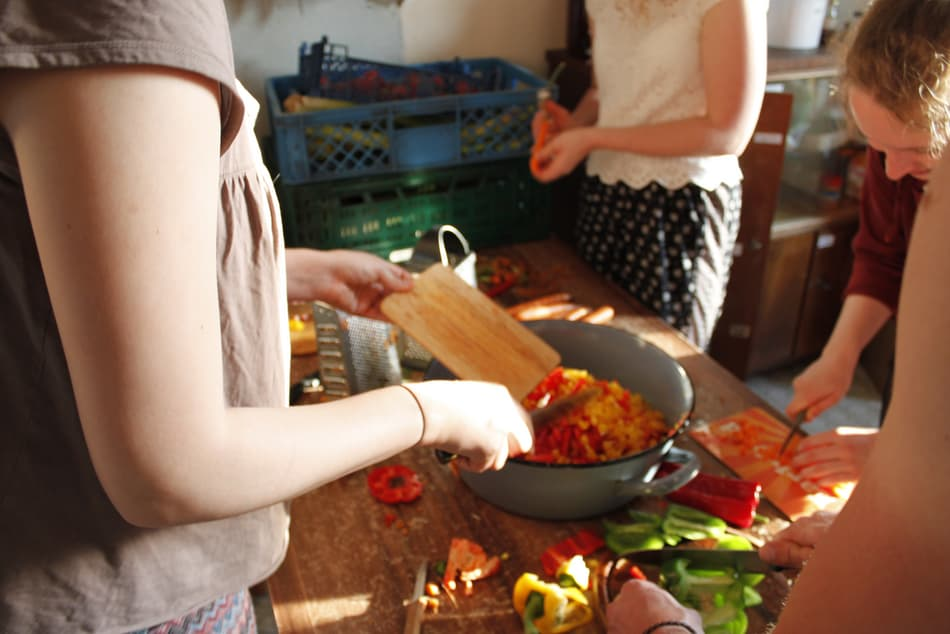

**The yunity heartbeat** - news from the world of sharing, fresh every two weeks.

## [Foodsaving Worldwide](https://foodsaving.world)
On the 2nd ever [World Disco Soup Day](https://www.slowfood.com/what-we-do/international-events/world-disco-soup-day/), soup and tunes united Disco Soupers at [more than 100 events](https://www.google.com/maps/d/u/0/viewer?mid=12ypv0JDXaQSlnLgye0NMxf_PGS6UETtU&ll=-3.81666561775622e-14%2C13.948718060292208&z=1) all around the globe, in the fight against food waste! What a huge success for [Slow Food International](https://www.facebook.com/slowfoodinternational/) and all foodsavers!

Enjoy some pictures:

_Coquimbo, Chile_

_Soweto, South Africa_

_Vermont orgnized a true party in a club!_

 
_Janina made sure that Bielefeld participated, too... ;)_

_Iran hosted three events, this is on one of them._

 
_More than 600kg of food were saved in Paris!_

_by Janina_

## [Karrot](https://karrot.world)
More and more users find their way onto Karrot! There are new groups for Warsaw and Genève and the groups for Bilbao, Quito, Östersund, Maastricht, Wageningen and Lund are steadily growing! That makes it fitting that user support is the thing mostly done in the Karrot department right now and development is mostly on hold. Nick is cycling and maintaining family bonds, Tilmann spends more of his time and energy on Kanthaus building tasks and Lukas and Lars are busy with their studies.

A rather sad piece of news is that - even though we were one of the most popular projects - we did not get any [RGSoC](https://railsgirlssummerofcode.org/blog/2018-04-21-rgsoc-2018-crowdfunding-campaign) team this year. It's probably due to them not having found as much money as in the past, but it's unexpected still. Only upside: Tais and Janina will become Karrot Rails Girls anyways, so the general summer of code will happen after all! More internally that is... ;)

_by Janina_

## [Kanthaus](https://kanthaus.online)
Two weekends since the last heartbeat and two groups stayed with us! First a group of psychology students who are in the process of forming an initiative to develop a critical perspective towards modern-day psychology. They focused on group building activities and were very grateful for the spirit of community and sharing, which they encountered at Kanthaus.

_Some of the critical psychologists in our garden_

The second group was [living utopia](http://livingutopia.org/). They came together to get more clarity about the future, their plans and how to bring both together. They filled Kanthaus with singing, even more communal spirit and a frequent smell of awesome vegan food.

_Many hands preparing saved veggies_

Apart from that we managed some rearranging and building work: There is a snack kitchen now, where our first bathroom was before. (The idea being that people who cook are not disturbed by people just preparing some slices of bread for themselves.) The kinda life-threatening shelf in the dry food storage (you know, full of cans and other heavy stuff...) is fixed to the wall now, new shelves have been built and the overdue (and massive...) random stuff storage sorting operation is finally tackled as well.

_by Janina_

## Haus X
We had a very nice week in Harzgerode with Steffen, Josi, Micha, Julia, Bodhi, Anna and Lise. We did lots of chatting, discussing and dreaming. All of us are in different stages in our lives. Some of us are involved (with time and heart) in other projects. Still, the time together and the deep exchange of ideas has been quite overwhelming and feels very much like we are a "we" now :)

_Julia, Micha, Lise, Josi and Bodhi, photographed by Steffen_

But of course we did not only talk but also did some first work on the house: we worked on the solar installation and the very temporary operation of our fridge, on remaking the back yard terrace, making a nice fireplace with a fire bowl that should even please the authorities and the setup of our propane-oven and inauguration by Micha with gratinated cheese!

Most of the functions and rooms that are to be united in the Oberartzhaus / Haus X are still spread across the premises of the old children's clinic. The solar shower next to the compost toilet and the communal office in the main building. Sleeping and brushing teeth happens in the Inspektorenhaus, also a part of the communal closet has been moved there from the main building. Kitchen and food storage have already been moved to the Oberarzthaus. In the following year we plan on living on the ground floor with more temporary installations while we make the upper floor really nice. Then we move up there next spring and make the ground floor nice.

To get some work done we began to write a todo catalog which will also be worked off in the planned building weeks, the first of which is to take place May 18 to 25. We are looking forward to many helping hands to progress renovation and also start creative tasks! Contact @lise via slack or email (lisemen@gmx.de) to take part.

_by Lise and Bodhi_

## [Auerworld-Festival 2018](https://auerworld-festival.de)
From April 6 to 8 the traditional "Weidenbinden" took place in Auerstedt - as announced in [last month's heartbeat](../heartbeat/2018-04-01). Apart from the usual Auerworld folk, some Kanthaus people took part as well. Overall we were about 25 people, had much fun with working, cooking and campfire and got all the work done. The dumpster god was very friendly to us and sent us lots of food :) We brainstormed a lot about the festival and what we want to offer our guests.

_You can already imagine the glorious dome the sallows will form in summer_

This week the grass is due to be cut, so the next trip to Auerstedt is already scheduled and Kanthaus people will support us once again. Mowing the meadows will need to be done every 4 weeks from now on, if you'd like to take part at some point, just [write a mail](mailto:silvan@auerworld-festival.de) and we'll be happy to have you! :)

_by Silvan_

## About the heartbeat.
The heartbeat is a fortnightly summary of what happens in yunity. It is meant to give an overview over our currents actions and topics.

### How to contribute?
Talk to us in [#heartbeat](https://yunity.slack.com/messages/heartbeat/) on [Slack](https://slackin.yunity.org) if you want to add content, change the layout or any other heartbeat related issues and ideas! We are also happy about any kind of feedback! ^_^
