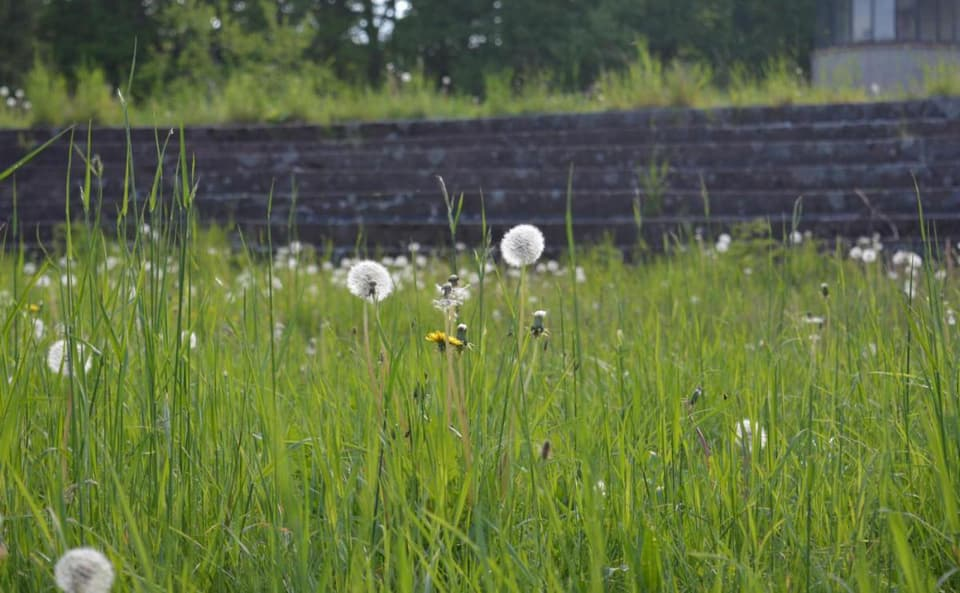
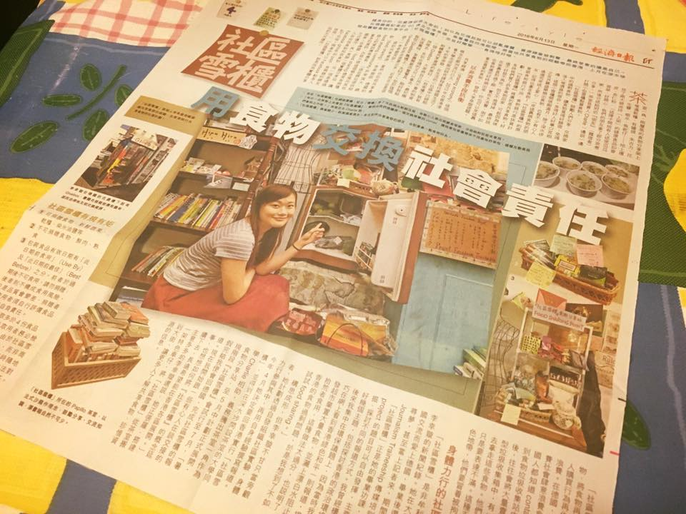
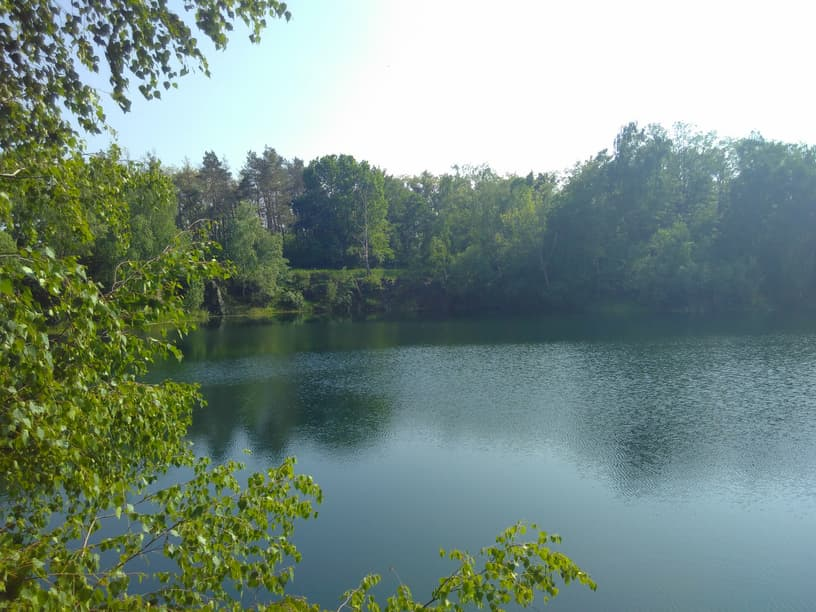

**The yunity heartbeat** - news from the world of sharing, fresh every two weeks.

## Haus X

Spring is here, the spirits are high and the core group has formed - the perfect time to get things rolling in Harzgerode! That's why a series of building weeks will take place over the coming months, starting with [the initial event](https://www.facebook.com/events/239901443233979/) over the coming weekend.

It's not too late to take part! Just contact Lise (lisemen@gmx.de) or Bodhi (bodhi.neiser@gmail.com) and experience the joy of communal working in the stunning nature of the Harz mountains.

_Spring is beautiful in Harzgerode!_

_by Janina_

## [Foodsaving Worldwide](https://foodsaving.world) & [Karrot](https://karrot.world)

Believe it or not but foodsharing Warsaw already celebrates its [2nd birthday](https://www.facebook.com/events/195561101238000/)! This pioneer group of Poland grew a lot over these two years, so that they recently switched to Karrot and made [this great tutorial video in Polish](https://www.youtube.com/watch?v=l3xIfLbKpPA). Thanks guys and happy saving in the future as well! :)

There is a new article about foodsharing Hong Kong on [foodsaving.today](https://foodsaving.today)! It's the very personal perspective of HangShuen, who wanted to start a Food-Share Point initiative all by herself. Make sure to enjoy the whole three-part series!

_HangShuen and her fridge_

Although we are officially on a break with regards to Karrot development, we held a dev call the other week. But I won't try to hide it: It was mostly socializing... You can read all the details in [the minutes](https://yunity.atlassian.net/wiki/spaces/FSINT/pages/237174785/2018-05-08+Karrot+Dev+Call).

_by Janina_

## [Kanthaus](https://kanthaus.online)

News on the funding front! We made it to round 2 of the [Neulandgewinner program](http://neulandgewinner.de/ausschreibung.html) and had two evaluators from the [Robert Bosch foundation](http://www.bosch-stiftung.de) and the Thünen institute come by. We were slightly nervous before they arrived - given that it was a pretty important visit - but it turned out to be really pleasant, interesting and relaxed. The evaluators were not looking for reasons to kick us out of the program but rather trying to help us get the funding. They said we have an inspiring project and that they'd really like to see us get the money. But they also admitted to saying that to every project they visit, simply because it's always true... We'll see how this turns out.

Apart from that the last two weeks were rather calm: Not many people stayed at Kanthaus, thus not many things happened. We had a nice [foodsharing leftover brunch](https://kanthaus.online/en/events/2018-05-13_fs-brunch) with the usual Wurzeners attending (yes, we have usual Wurzeners now! ^\_^), we sowed some grass and started some veggie beds in the garden, got going with the next iteration of the [room booking system](https://gitlab.com/kanthaus/kanthaus-public/blob/master/drafts/privateRoomBooking.md), built up a new wardrobe, put some carpets in different rooms and sorted all the socks by size. But we also made enough time to enjoy the sun at the beautiful Wolfsberg lake not far from our house.

_The best spot to cool down near Wurzen: The Wolsberg lake_

_by Janina_

## About the heartbeat.
The heartbeat is a fortnightly summary of what happens in yunity. It is meant to give an overview over our currents actions and topics.

### How to contribute?
Talk to us in [#heartbeat](https://yunity.slack.com/messages/heartbeat/) on [Slack](https://slackin.yunity.org) if you want to add content, change the layout or any other heartbeat related issues and ideas! We are also happy about any kind of feedback! ^\_^
