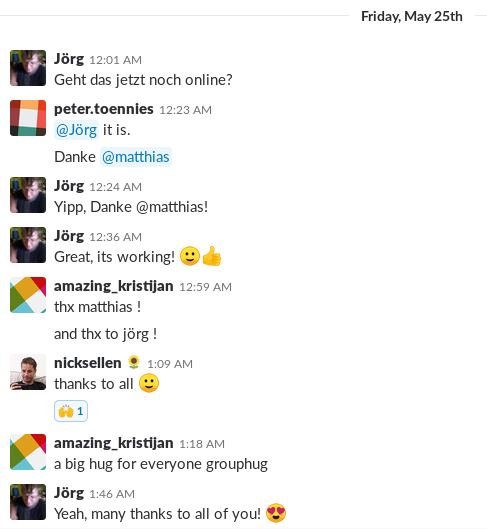
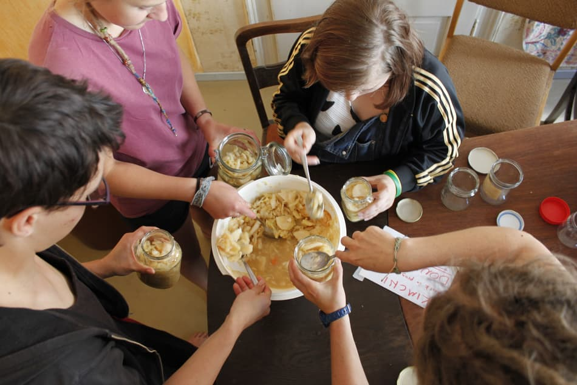
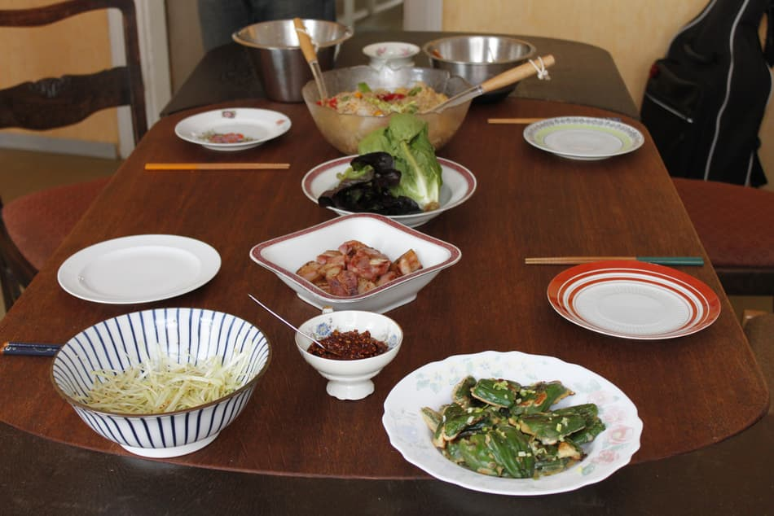
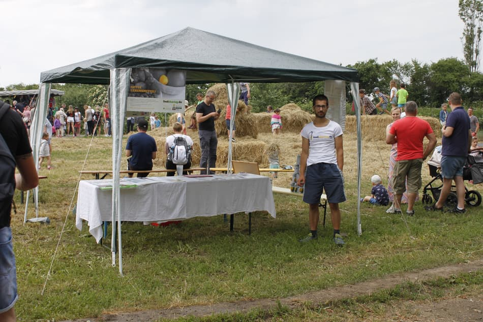
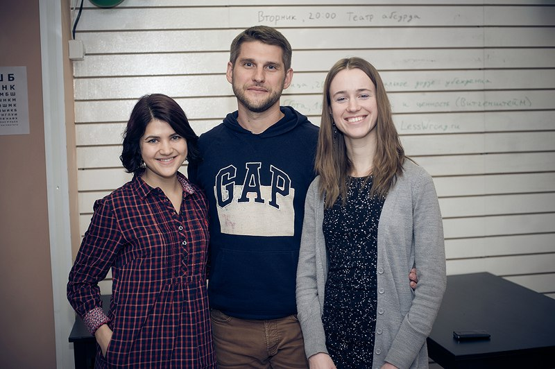

**The yunity heartbeat** - news from the world of sharing, fresh every two weeks.

## [foodsharing.de](https://foodsharing.de)-dev
You probably noticed that you received tons of emails and needed to accept new data privacy statements from basically every service your're using, right? That's all due to [GDPR](https://en.wikipedia.org/wiki/General_Data_Protection_Regulation) and foodsharing.de is not an exception.

A lot of work was done to make foodsharing.de as legal as possible until GDPR was implemented on May 25. There was a real possibility to completely shut down the page if the most pressing requirements were not met in time and pressure was high. But thanks to the awesome work of Matthias, Jörg, Peter, Kristijan and others we managed to keep foodsharing.de online again!

The [changelog of May 24](https://beta.foodsharing.de/?page=content&sub=changelog) lists what was done with regards to GDPR.

_Happy contributors after a stressful period of work._

_by Janina_

## [Kanthaus](https://kanthaus.online)
The calm times where only ~5 people inhabited the houses ended with Korean flair: First we opened the huge Kimchi pot and refilled everything into jars, and then Janina found pork belly in the basement and realized that she could make [Samgyeobsal](https://www.maangchi.com/recipe/samgyeopsal-gui) with it - a Korean barbecue favorite!

_The bowl in the middle was filled 5 times until the giant pot was empty._

 
_A day of cooking and even using bought ingredients led to this feast._

Now Kanthaus got busier again! After that empty phase, we were happy to welcome back some of our members and volunteers, as well as new vistors.

The [undjetzt 2017 retrospective](https://kanthaus.online/events/2018-05-25_undjetzt17-retrospective) took place over the weekend and brought 7 people and a baby to our house. Apart from that, Doug and Janina did a lot of PR work by visiting the official opening of [Der Laden](https://www.ndk-wurzen.de/Aktuelles/-Der-Laden--eroeffnet-in-Wurzen/42d2122/) (a new open space with a focus on culture and arts), together with Matthias going to the party of the Rotters in Altenbach (awesome people, who are really into sharing and change - [their church's website](https://dorfkirche-altenbach.jimdo.com/) shows a lot of the cool things they do) and doing a foodsharing info booth at [Landgut Nemt](http://www.landgut-nemt.de/)'s farm fair.

_Doug promoting foodsharing.de in Nemt._

_by Janina_

## [Foodsaving Worldwide](https://foodsaving.world) & [Karrot](https://karrot.world)
On [foodsaving.today](https://foodsaving.today) we now have a super informative series of 5 articles about foodsharing Moscow. It really is inspiring to read how these crafty Russians made foodsharing work, how much thought and effort was put in and how far they already came. Don't miss it!

_Read more about these pioneers of Russian foodsharing on [foodsaving.today](https://foodsaving.today)!_

We got lots of useful user feedback from foodsharing Warsaw, who recently started organizing their actions with Karrot. Some bugs were pointed out and some problems that occurred on iPhones (which is mainly due to nobody in our team actually owning an apple device...), but the overall message was 'works great' and 'thank you'. :)

_by Janina_
