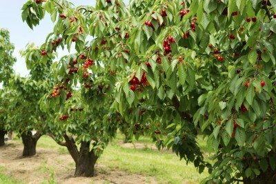
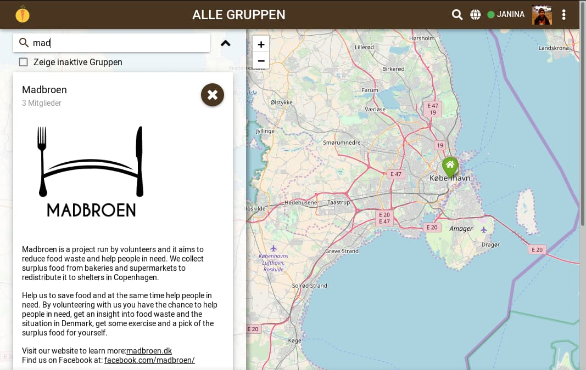

**The yunity heartbeat** - news from the world of sharing, fresh every two weeks.

## [Kanthaus](https://kanthaus.online)
It's summer and lots of stuff is happening! But also people are very “flowy” which is one reason why this is the first heartbeat to not be published on time :( You are very welcome to blame Bodhi and Nick!

Anyway: The spring review had a positive outcome, there were a lot of things we achieved :) There was a vision dreaming session and the [summer roadmap planning](https://kanthaus.online/governance/minutes/2018-06-06_roadmap) lead to some [clear tasks for the next 3 months](https://gitlab.com/kanthaus/kanthaus-public/milestones/7) as well as a good estimation of who is here for what time.

And there are lots of cherries in our garden! Some (or maybe now all?) have been harvested. I don’t know because i’m not there :)

  
_..but here is a picture of a random cherry tree!_

_by Bodhi_

## [Foodsaving Worldwide](https://foodsaving.world) & [Karrot](https://karrot.world)
The folks behind [Foodsharing Copenhagen](http://foodsharingcph.org/) started a new project called [Madbroen](https://www.facebook.com/madbroen/). It's a separate thing because it delivers saved food to charities (which is not _unconditional_ sharing, even though it's cool nevertheless... ;)). These pickups may very well be organized using Karrot soon!

_The group is already created_

But the Danes' potential joining is actually not the best Karrot news we have:  
Last week a **total of 11 groups** carried out **more than 200 pickups** - and more and more groups and people are joining in from all over the world! We are excited and scared at the same time, as this is exactly what we want (the foodsaving movement spreading), but our developer resources are more limited than ever (Lars goes to India for half a year, Lukas to Spain, Nick is jumping back and forth between Karrot and foodsharing.de and Tilmann is actually already busy with maintenance...). So _please_, if you know any web developer that might be able to help Karrot develop further, [guide them to our code](https://github.com/yunity/karrot-frontend)!

For all these foodsavers from all over the world we created a discourse forum and are looking forward to filling it with content! It's not yet completely ready and set up, but you can already [have a look](https://community.foodsaving.world/), if you want. The main purpose of this forum is to create a digital space for you to talk to each other. We want foodsavers to exchange ideas and benefit from each other's experiences. And we also want to get away from facebook (for the [many reasons against it](https://www.google.com/search?q=reasons+to+leave+facebook&ie=utf-8&oe=utf-8&client=firefox-b-ab) and because there are many foodsavers who are not on there after all).

_by Janina_

## [foodsharing.de](https://foodsharing.de)-dev
Foodsharing.de developers are desparately looking forward to the next hackathon that will happen likely within July. There is still a lot of hard-to-test changes undergoing as we are moving all the frontend javascript into modularized, modern javascript. While we theoretically could test everything, the test suites would just be massive as there would be so many things to test.

Little contributions from new developers, as well as more contributions from developers that are with the project for some time already seem to happen steadily now, which is very nice.

_by Matthias_

## About the heartbeat.
The heartbeat is a fortnightly summary of what happens in yunity. It is meant to give an overview over our currents actions and topics.

### How to contribute?
Talk to us in [#heartbeat](https://yunity.slack.com/messages/heartbeat/) on [Slack](https://slackin.yunity.org) if you want to add content, change the layout or any other heartbeat related issues and ideas! We are also happy about any kind of feedback! ^\_^
