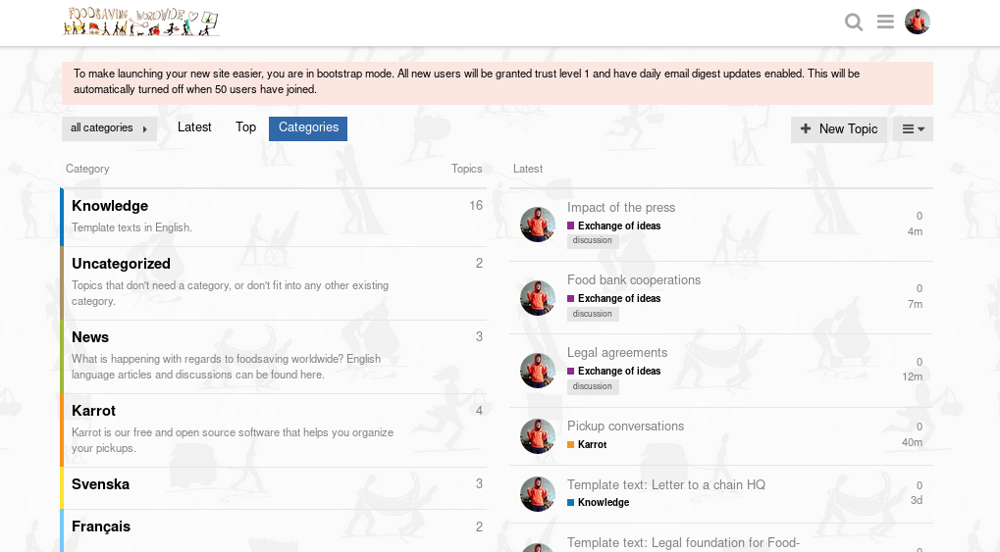

**The yunity heartbeat** - news from the world of sharing, fresh every two weeks.

## [foodsharing.de](https://foodsharing.de)-dev

## [Kanthaus](https://kanthaus.online)

## [Foodsaving Worldwide](https://foodsaving.world) & [Karrot](https://karrot.world)

Our [new forum](https://community.foodsaving.world) is now officially open and we'd love to read you there! :)

It's the new home to our [knowledge library](https://community.foodsaving.world/c/knowledge) and we're continously working on moving _everything_ [from the wiki](https://yunity.atlassian.net/wiki/spaces/FSINT/pages/50069535/Material+to+get+started). The aim is to make it easier for people to discuss articles and to find different language versions - because we created subforums for different languages, so that monolinguals have an easier time navigating things. Still, we need you to populate this place, so please be a part of it!

To get things started you could have a look at some questions and share your thoughts on e.g. [legal agreements](https://community.foodsaving.world/t/legal-agreements/75), [food bank cooperations](https://community.foodsaving.world/t/food-bank-cooperations/76), [the press](https://community.foodsaving.world/t/impact-of-the-press/77) or [Karrot's new pickup conversation feature](https://community.foodsaving.world/t/pickup-conversations/73).

_So many topics, but all just created by me - please help me make this forum more diverse! :)_

_by Janina_

## About the heartbeat.
The heartbeat is a fortnightly summary of what happens in yunity. It is meant to give an overview over our currents actions and topics.

### How to contribute?
Talk to us in [#heartbeat](https://yunity.slack.com/messages/heartbeat/) on [Slack](https://slackin.yunity.org) if you want to add content, change the layout or any other heartbeat related issues and ideas! We are also happy about any kind of feedback! ^\_^
