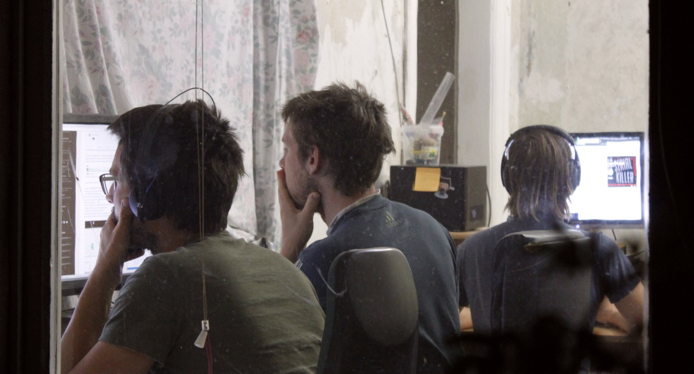
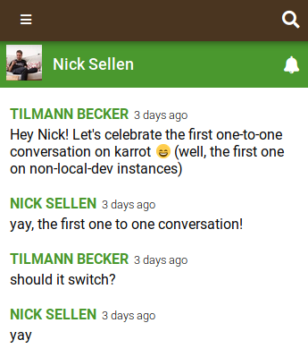
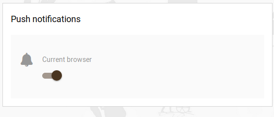
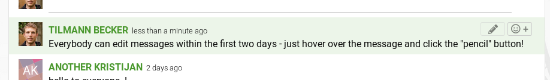

**The yunity heartbeat** - news from the world of sharing, fresh every two weeks.

## [foodsharing.de](https://foodsharing.de)-dev

We are having another hackweek having found it's one of the best ways to get some more focused work completed.

We didn't advertise it very widely and our focus is more for the existing contributors to make progress (as opposed to introducing new people to the project).

As Kanthaus is quite empty at the moment we are even collecting and preparing our own meals, and doing our best to get outside from time to time.

We're also very happy to have a new contributor, Theo, who has has popped down from Berlin to join us for a few days. He's working on adding our first RESTful endpoints, which is very impressive with our slightly confusing codebase. We are happy and looking forward to expanding this approach further :)

_Matthias and Tilmann's co-ordinated thinking, Wolfi reads something related to serial killers :/_

_Theo types text into a black box, that's what we like to see :)_

_by Nick_

## [Kanthaus](https://kanthaus.online)

We have been on the radio in an amazing feature of 30 minutes length! This is what Jörg Wunderlich worked on for more than a year and we are very happy with the result. You can [listen to the full thing](https://kanthaus.online/de/about/press/2018-06-30_mdrgraswurzener) on our website.

## [Karrot](https://karrot.world)

In the last two-and-a-half weeks, Karrot received lots of developer attention. Mostly @tiltec and @nicksellen worked on new features and improvements.

Most notably, two new types of conversations were added: for people who joined a pickup and private conversations to other users. Both conversations support the existing email and app push notifications, but in addition to that, there's a new experimental feature: browser push notifications. This allows us to notify you via your web browser even if you don't have the karrot website open.

{.blog-image .tall-image}
_The mobile user conversation view_

{.blog-image}
_Experimental browser push feature, to be discovered by you in the settings menu_

For all those messaging features, it's also handy to have editing capabilities. We added a new pencil icon in the first two days after the message has been sent. It allows you to modify your previous message and fix all spelling mistakes :)

{.blog-image}
_The pencil icon allows you to edit your conversation message_

Other noteworthy changes in a quick list:

- speed up initial loading and rendering @nicksellen
- sorting and search for the group member list @tiltec
- show failed email notifications @tiltec
- filter controls and back button for fullscreen group map @tiltec
- context menu to create new store in group map @tiltec
- unify color usage @tiltec
- rework of feedback form to allow feedback without weight @tiltec
- refresh most data when karrot app wakes up @tiltec
- mobile "pull-to-refresh" in group wall @tiltec
- automatically mark group as active or inactive @oldPadavan
- send correct email template on resend verification code @pogopaule @tiltec

{.blog-image}
_New map controls on Karrot's fullscreen group map_

_by Tilmann_

## [Foodsaving Worldwide](https://foodsaving.world)

Our [new forum](https://community.foodsaving.world) is now officially open and we'd love to read you there! :)

It's the new home to our [knowledge library](https://community.foodsaving.world/c/knowledge) and we're continously working on moving _everything_ [from the wiki](https://yunity.atlassian.net/wiki/spaces/FSINT/pages/50069535/Material+to+get+started). The aim is to make it easier for people to discuss articles and to find different language versions - because we created subforums for different languages, so that monolinguals have an easier time navigating things. Still, we need you to populate this place, so please be a part of it!

To get things started you could have a look at some questions and share your thoughts on e.g. [legal agreements](https://community.foodsaving.world/t/legal-agreements/75), [food bank cooperations](https://community.foodsaving.world/t/food-bank-cooperations/76), [the press](https://community.foodsaving.world/t/impact-of-the-press/77) or [Karrot's new pickup conversation feature](https://community.foodsaving.world/t/pickup-conversations/73).

_So many topics, but all just created by me - please help me make this forum more diverse! :)_

_by Janina_

## About the heartbeat.
The heartbeat is a fortnightly summary of what happens in yunity. It is meant to give an overview over our currents actions and topics.

### How to contribute?
Talk to us in [#heartbeat](https://yunity.slack.com/messages/heartbeat/) on [Slack](https://slackin.yunity.org) if you want to add content, change the layout or any other heartbeat related issues and ideas! We are also happy about any kind of feedback! ^\_^

