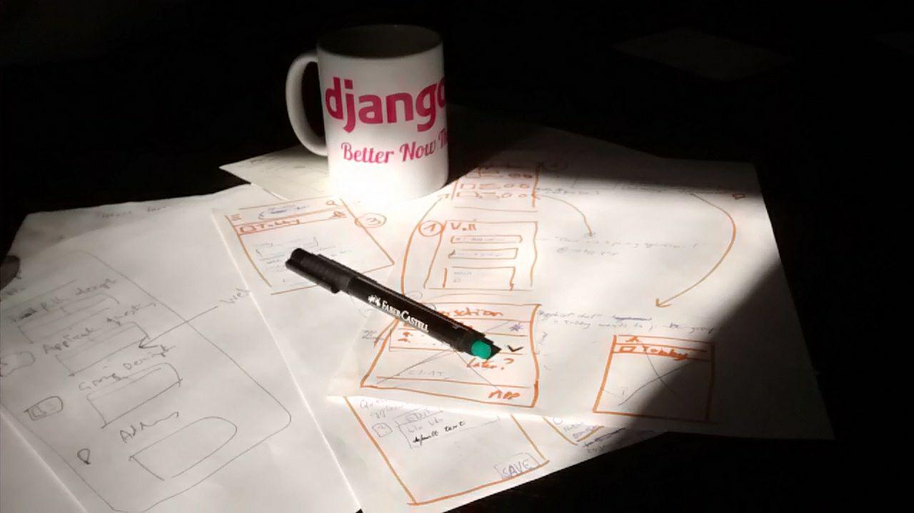
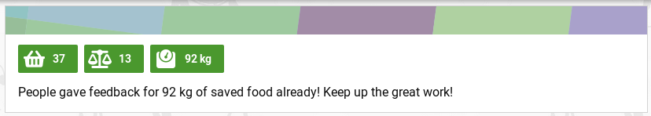

**The yunity heartbeat** - news from the world of sharing, fresh every two weeks.

## [foodsharing.de](https://foodsharing.de)-dev

## [Kanthaus](https://kanthaus.online)

## [Karrot](https://karrot.world)

@taistadam and @djahnie started their *Summer of Karrot* to learn programming whilst contributing to karrot. @nicksellen and @alangecker are teaching the basics of JavaScript, Vue.JS and Git, guiding them step by step towards being independent contributors.

@tiltec summarized the need for user trust levels in a [Github issue](https://github.com/yunity/karrot-frontend/issues/1062) and the first outcome was to (finally) implement a process where users can apply for becoming a group member. At the initiative of @nicksellen we held a _wireframing session_ that gave us [enough input](https://github.com/yunity/karrot-frontend/issues/894#issuecomment-404173085) to start implementing.

_Contrived picture of the wireframing session_

Besides that, @nicksellen is looking into improving navigation user experience in karrot. The work is still in a very experimental phase, but big changes in the mid-term future aren't unlikely.

_Playing with the karrot navigation UI_

@tiltec added proper statistics to the store page, based on pickup feedback given by users. The calculation method is currently quite simple, to keep the numbers predictable. However, there's a discussion going on in our new [Community forum](https://community.foodsaving.world/t/statistics-about-the-amount-of-saved-food/85) about ideas for better statistics calculation.

_Store statistics view on the feedback page_

As a last note, markdown formatting is now possible in feedback comments!

_by Tilmann_

## [Foodsaving Worldwide](https://foodsaving.world)

## [Ukuvota](https://gitlab.com/yunity/ukuvota)

The past weeks were consuming by getting used to F# and figuring out how things work with the fable - the compiler that turns F# into Js.

Ukuvota has a new navigation bar and can now parse markdown files! The next task is to create the interface for a Group view and possibly add some input fields.

_by Wolfi_

## About the heartbeat.
The heartbeat is a fortnightly summary of what happens in yunity. It is meant to give an overview over our currents actions and topics.

### How to contribute?
Talk to us in [#heartbeat](https://yunity.slack.com/messages/heartbeat/) on [Slack](https://slackin.yunity.org) if you want to add content, change the layout or any other heartbeat related issues and ideas! We are also happy about any kind of feedback! ^\_^
