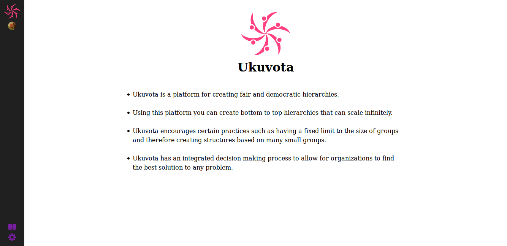

**The yunity heartbeat** - news from the world of sharing, fresh every two weeks.

## [foodsharing.de](https://foodsharing.de)-dev

## [Kanthaus](https://kanthaus.online)

## [Karrot](https://karrot.world)

## [Foodsaving Worldwide](https://foodsaving.world)

## [Ukuvota](https://gitlab.com/yunity/ukuvota)
The past weeks were consuming by getting used to F# and figuring out how things work with the fable - the compiler that turns F# into Js.

Ukuvota has a new navigation bar and can now parse markdown files! The next task is to create the interface for a Group view and possibly add some input fields.

_by Wolfi_

## About the heartbeat.
The heartbeat is a fortnightly summary of what happens in yunity. It is meant to give an overview over our currents actions and topics.

### How to contribute?
Talk to us in [#heartbeat](https://yunity.slack.com/messages/heartbeat/) on [Slack](https://slackin.yunity.org) if you want to add content, change the layout or any other heartbeat related issues and ideas! We are also happy about any kind of feedback! ^\_^

