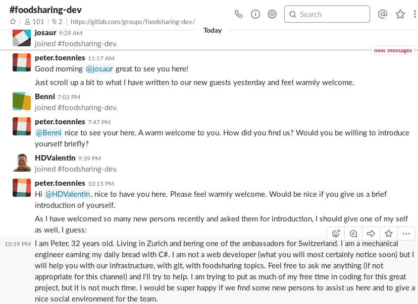
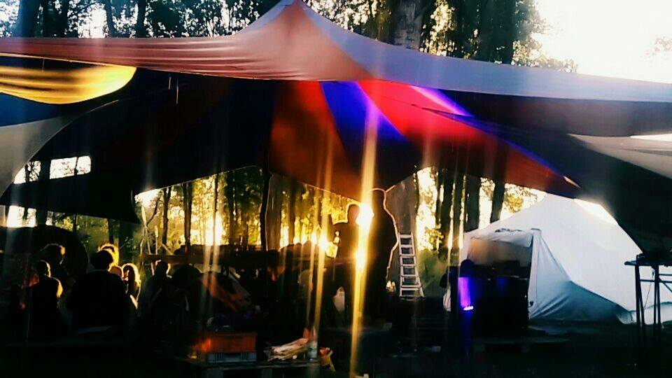
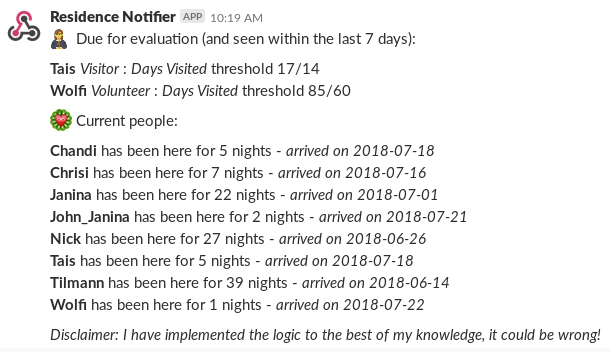
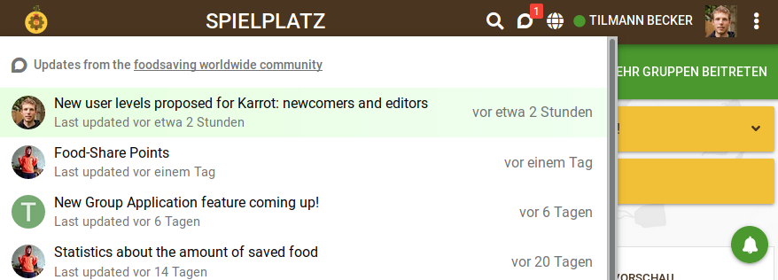
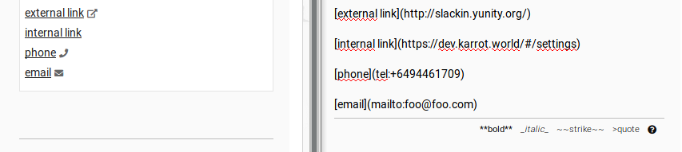

**The yunity heartbeat** - news from the world of sharing, fresh every two weeks.

## [foodsharing.de](https://foodsharing.de)-dev

Peter has issued a new call for developers in the foodsharing forums and - alas - new people are flooding the #foodsharing-dev channel on Slack!

_Caring and polite Peter is taking care of welcoming all the new devs_

After the last hackweek we had some user-facing changes, like the new forum component, and motivation is high to progress further. Finally all the refactoring brought us to a stage in which tangible advantages emerge and new devs can more easily participate. We're looking forward to stable activity levels and maybe the next hackweek in Zurich? :)

_by Janina_

## [Auerworld Festival](https://auerworld-festival.de/)

The Auerworld Festival is taking place right now (July 27 to 29)! Most Kanthausers help Silvan on his friendly and sustainable but nevertheless huge festival. As you can read on their German [facebook page](https://www.facebook.com/auerworld.festival/) Auerworld has everything:
- a big diversity of workshops: from yoga to electronics you can try out everything
- creative - and sometimes interactive - art installations
- a decomposable playground made of hay
- a sharing station called 'TraumTauschBaum' (= dream swap tree)
- lots of great food but no disposable dishes (!)
- a dome made from living willow trees
- a chill space to enjoy audio books all day long
- and of course dozens of bands and musicians

_An impression from last year's Auerworld - this year will be even better! ;)_

I'm already looking forward to giving you the whole summary of what happened in the next issue of the heartbeat! ;)

_by Janina_

## [Kanthaus](https://kanthaus.online)

Due to Auerworld, Kanthaus is almost empty right now. Only 5 developers are left and enjoy the silence in front of their laptops. Our self-organized 'Summer of Karrot' is almost over and Tais and Janina have made a lot of progress!

Apart from that we suffered from the heat (too warm to cuddle...), found new recipes for old bread (chunks of old bread and kimchi fried together in a pan, chunks of old bread mixed with plums, milk and sugar and then put in the oven - both super yummy!) and put more thought into our governance and positions system. We'll probably introduce a host system for visitors and change our website to put more emphasis on project work and less on communal living. And Nick wrote a nice new script that posts the evaluation statuses in a dedicated Slack channel just before the coordination meeting. Look how fancily he formatted it:

_You can't see it, but the female judge icon actually moves!_

_by Janina_

## [Karrot](https://karrot.world)

The Summer of Karrot continues! Our group of four spent most of their time at Kanthaus discussing and coding features for Karrot. The group application frontend gets into shape (find out more in this [forum post](https://community.foodsaving.world/t/new-group-application-feature-coming-up/92)), the [new proposed user levels](https://community.foodsaving.world/t/new-user-levels-proposed-for-karrot-newcomers-and-editors/95) were discussed a lot and we updated the [Karrot roadmap](https://github.com/yunity/karrot-frontend/blob/master/ROADMAP.md) in a concise meeting.

Nick and Tilmann implemented replies to wall messages (also known as conversation threads). You can already try them out on https://dev.karrot.world. To reduce the number of unwanted emails, we had discussions about better notification settings, but didn't come to a final conclusion yet. We did implement merged notification emails though: if messages are being sent in quick succession, then only send one email containing all messages. Also, we don't send emails anymore if the message was already marked as seen.

Some smaller features landed too: a button to show directions between user and store has been added, external links in Markdown text are marked now, internal links open in the same window and new posts from our [community forum](https://community.foodsaving.world/) get highlighted in the topbar.

_Stay updated about new posts in our community forum_

_Recognize the link type in Markdown_

And now the most important bit: improvements to the Karrot developer experience! After some days of fiddling, Nick managed to build our frontend with webpack 4 and babel 7. He also upgraded our backend to shiny new [Django Channels 2](https://github.com/django/channels), which uses async Python to handle websocket communication. And we use [yapf](https://github.com/google/yapf) now to nicely format out backend code!

_by Tilmann_

## [Foodsaving Worldwide](https://foodsaving.world)

## About the heartbeat.
The heartbeat is a fortnightly summary of what happens in yunity. It is meant to give an overview over our currents actions and topics.

### How to contribute?
Talk to us in [#heartbeat](https://yunity.slack.com/messages/heartbeat/) on [Slack](https://slackin.yunity.org) if you want to add content, change the layout or any other heartbeat related issues and ideas! We are also happy about any kind of feedback! ^\_^
