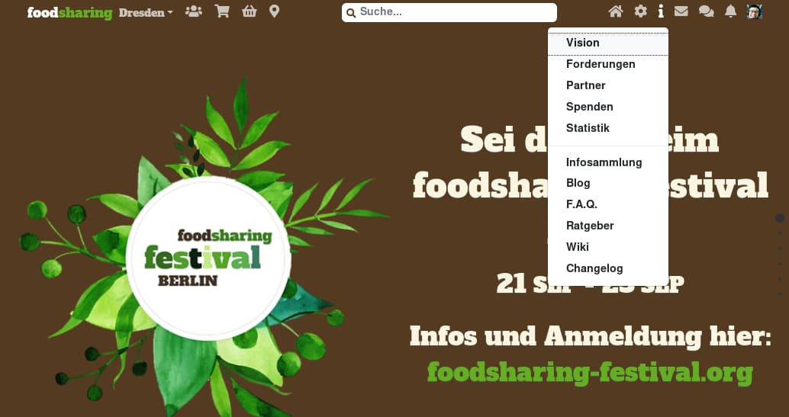
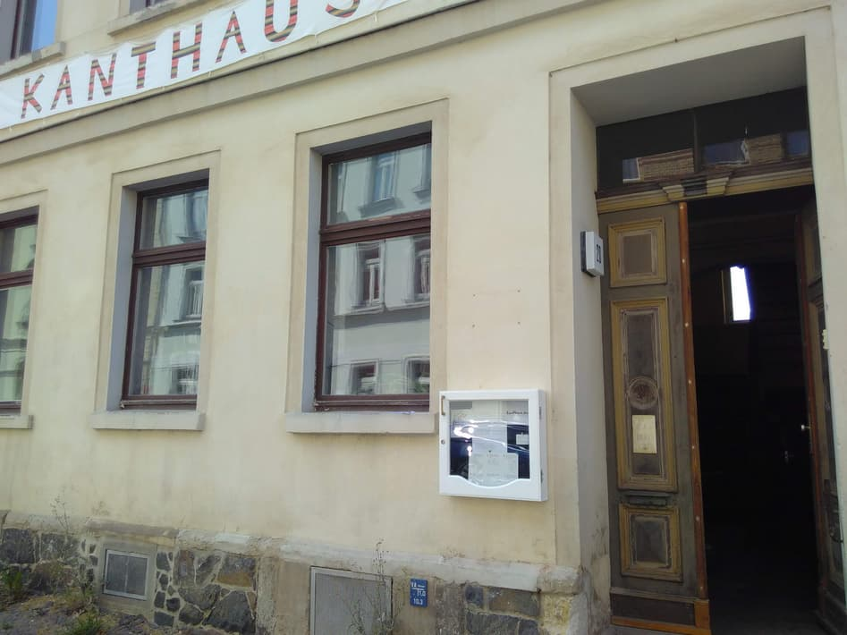
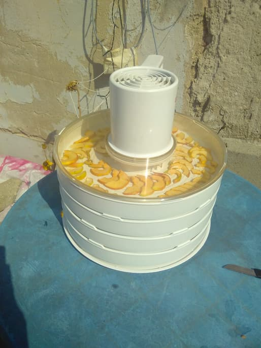
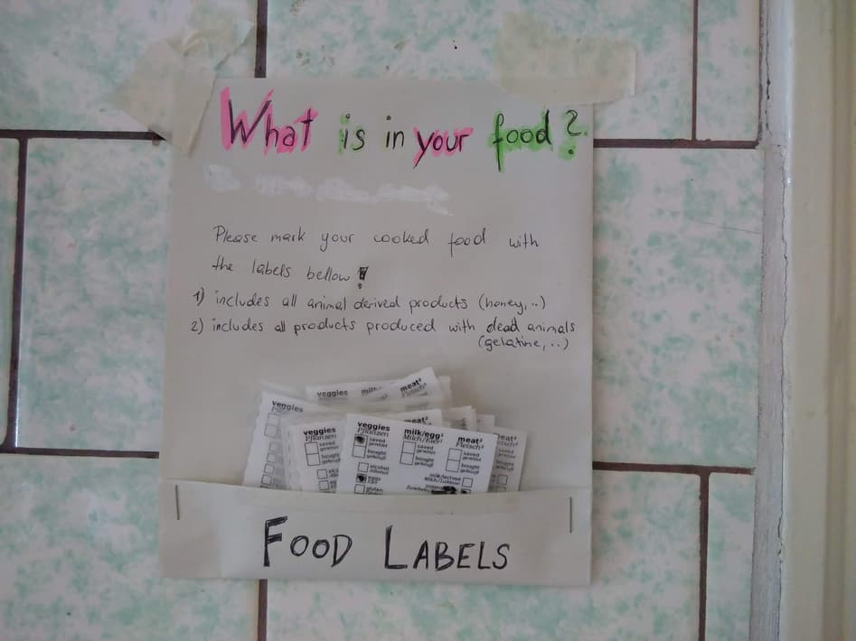
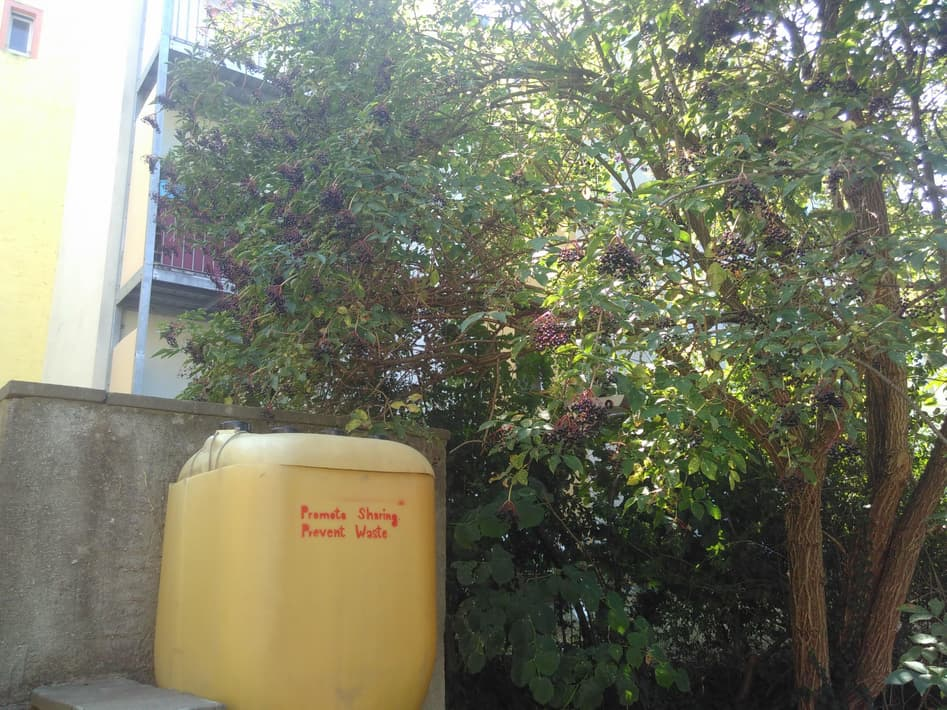

**The yunity heartbeat** - news from the world of sharing, fresh every two weeks.

## [Karrot](https://karrot.world)

After the Summer of Karrot ended three weeks ago, there were still things left to do until the new Karrot version could be released into production. We had one major task - adding the group application chat into the frontend - and some minor tasks - creating a conversation overview page, adding an email notification option for new applications.

Janina and Tilmann sat together to kickstart the group application chat. The [Pull Request](https://github.com/yunity/karrot-frontend/pull/1082) is in its final stage, so you can expect to test this out on [dev.karrot.world](https://dev.karrot.world) within the next week!

Tilmann was busy with the group editors implementation, where especially the frontend turned out to be tricky. With the new trust system, the group membership plays a much bigger role than before. This affects the user profile page, which could either list all memberships, or only the one for the currently selected group. It seems better to go for the latter version, and add a button to switch between the groups.

  
_This is how the user profile page could look like, notice the new trust karrot button!_

Besides that, there was quite a lot of bugfixing to do: wrong group application emails, broken email subjects, failing websocket connection in the app, incorrect unread message counts... the list is long!

  
_Draft for the conversations overview page_

_by Tilmann_

## [foodsharing.de](https://foodsharing.de)-dev

Over a spontaneous hack-weekend myself and Matthias sat down to wrap up various loose ends and release a new, shiny build. One of the most noticeable features is the new, responsive navbar courtesy of Chandi.

_On top: the new navbar with expanded info panel_

The navbar makes use of Vue, a very modern javascript framework. Vue is a great fit for projects like foodsharing due it's philosophy around 'incremental adoption', small pieces of UI can be built in isolation and gradually introduced to an application. This paired with our recently introduced RESTful json endpoints means we're able to build and refactor areas of foodsharing more quickly and safely. We've also put Vue to work on a new sortable stores list, backend reports system and in our forum. Due to the nature of the release and the amount of frontend code touched we naturally introduced a few regressions, however with our patient and dedicated beta users we're able to find and fix bugs :bug: before they make it to production. Thanks to Peter's call for new developers we've also welcomed quite a few new people to our slack and had some great merge requests submitted.

_by Theo_

## [Ukuvota](https://ukuvota.world)

Creating good decision making processes is important. There are different ideas and models that can be used to achieve decisions in groups. At yunity we started to use a decision making process called [Systemic Consensus](https://douginamug.gitbooks.io/a-systemic-consensus-manual-testing/content/sysCon.html) (also called syscon). This lead to a small software project to create an open source app for exactly that.

Doug spent a lot of time writing documentation for Systemic Consensus in English , but after some time he thought that the system could be improved and came up with a model of weighted score voting.

Interested in this topic I decided to make a prototype using Quasar with this idea. I called the application Ukuvota.

I explored a lot of different frameworks and languages since I wasn't completely satisfied with using Vuejs + Quasar. Parallel to that journey I noticed for myself that just using a good decision making process does not mean that people will not get excluded and with more and more people involved in one process it can get a lot more difficult to find a solution where most people are satisfied. This brought me to the topic of fractal organization theory. I liked some models and ideas that are based on this theory, such as having a limited number of people in a group. This limit can be 5 and if a group is larger than 5 people the next process would be to create a new group or split up the existing group.

Playing around with different frameworks and this other idea of focusing on fractional organization theory I started working on a new prototype.

I discovered fable, An F# to Babel converter. I soon fell in love with the language and learned more about it, and decided this is a good balance of what I expect from a language.

Having extra features such as group organization in the same application under the same name (Ukuvota) could become confusing. And using different frameworks and languages while being pretty much the only developer could use up a lot more time.

So I decided to split up the project into two, using the same fable codebase. One focused on just voting (Ukuvota) and the other one focused on governance and group hierarchies (TBA). Like this I will be able to share multiple components that could be useful in either application, and yet give people the freedom to choose what they need.

_by Wolfi_

## [Kanthaus](https://kanthaus.online)

We have a new and more project-oriented landing page for [kanthaus.online](https://kanthaus.online), as well as more blog posts: One from Janina about the [Summer of Karrot](https://kanthaus.online/blog/2018-08-06_summer-of-karrot) and one from Kaja about [fruit kvass](https://kanthaus.online/blog/2018-08-15_fruit-kvass). We finally started to use the nice display cabinet that Benji made and can now easily communicate stuff to people passing by. More nice flyers to be put in there are still to me made but Silvan already expressed motivation for helping with that.

  
_Now we only need to keep it updated... ;)_

There has been progress with regards to newcomer integration, which means that we came up with a new system that we are trying out now. It entails every visitor needing a volunteer or member to act as their host if they want to stay overnight and a check-in round after one week to see how things are going. If this system proves to work well, we'll make it part of the [Collective Agreements](https://kanthaus.online/governance/collectiveagreements) - the document that describes the day-to-day structure of Kanthaus life.

More practical new things are that Tilmann modified a drying device to run mainly on solar power, which means tons of dried apples, apricots, bananas and soon onions; Chandi made reusable labels for people to indicate which possibly controversial or unwanted ingredients have been used in the preparation of a meal; and that Janina made an overview map of K20, which is meant to help newcomers to find their way more easily.

  
_Apples are the most frequently found dried fruit in Kanthaus._

  
_Small, but full of useful information!_

The garden is yielding more and more fruit and veggies! We have tons of great tomatoes, some zucchini, pumpkins and cucumbers and soon the elderberries are ready to be harvested, yum! ^\_^

_There are even more outside of the picture!_

_by Janina_

## About the heartbeat.
The heartbeat is a fortnightly summary of what happens in yunity. It is meant to give an overview over our currents actions and topics.

### How to contribute?
Talk to us in [#heartbeat](https://yunity.slack.com/messages/heartbeat/) on [Slack](https://slackin.yunity.org) if you want to add content, change the layout or any other heartbeat related issues and ideas! We are also happy about any kind of feedback! ^\_^
