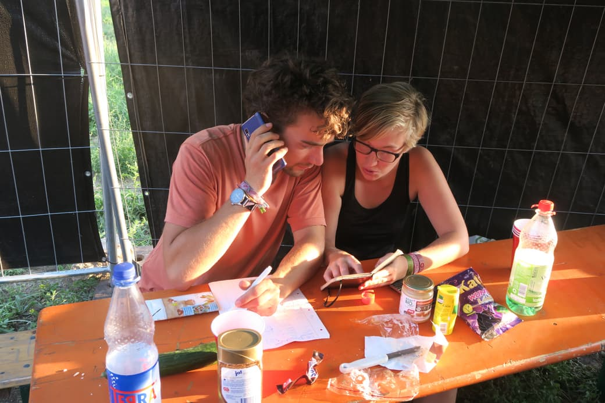
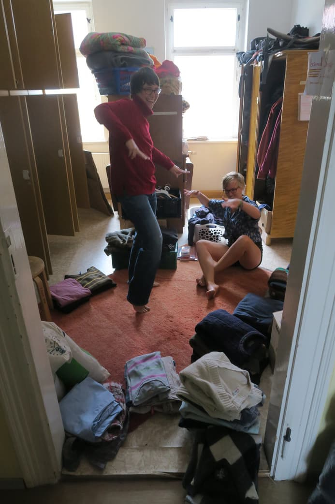

**The yunity heartbeat** - news from the world of sharing, fresh every two weeks.

## [foodsharing on festivals](https://foodsaving.today/en/blog/2017/05/14/foodsharingde-festival-call)

Around 19 festivals had an official foodsharing booth this year. Thanks to dozens of motivated foodsavers in and outside the experienced working group 'festival coordination' we were able to establish 8 new cooperations! E.g. after months of talks with the organizers, the [Fusion festival](http://www.fusion-festival.de/en/2018/home) agreed to hosting us, and we sent a group of 20 foodsavers there, who built and maintained 5 food-share points designed by Silvan.

  
_One of Silvan's food-share points in action_

Apart from the big commercial festivals organized by [FKP Scorpio](https://www.fkpscorpio.com/en/festivals/) (like Hurricane, Southside and Highfield) we also attended the lovely [folk festival in Rudolstadt](https://rudolstadt-festival.de/en/start.html), the brass-only [Brass Wies'n](https://www.brasswiesn.de/index.php) near Munich and the [OpenFlair](https://www.open-flair.de) with much less visitors. Our most spontaneous attendance was definitely at the [Artlake](http://artlake-festival.de/), for which we only had 2 days of preparation before 9 foodsavers realized a well-visited info booth and food-share point, numerous workshops (like naked swimming, AcroYoghurt and preserving food) and a collaborative brunch.

  
_Lise and Malte doing some last-minute organizing at Artlake_

To discuss the experiences of this festival season, share difficulties and success, distribute responsibilities for next year's season and drink some saved beers, the working group 'foodsharing on festivals' will meet over a weekend in October. After that we will go into the well-deserved winter break and tackle tasks like sorting material, writing reports, maintaining communication with the festival organizers and already looking out for people who can imagine more interesting things than staying home and watering the plants on the balcony.

_by Lise_

## [Kanthaus](https://kanthaus.online)

The year at Kanthaus is divided into 4 seasons: Winter (December to February), Spring (March to May), Summer (June to August) and Autumn (September to November).  
As you can see summer just ended, and so did our summer roadmap. Since summer is a pretty busy time, with lots of people going to festivals and events all over Germany and beyond, we did not take on too many tasks to begin with [and made progress with everything we started](https://gitlab.com/kanthaus/kanthaus-public/milestones/7). The autumn planning will take place on Tuesday and we already had a very fruitful room planning meeting which will serve as a good base to build on. Many changes are still to come!

  
_Janina and Lise had a lot of fun sorting the communal closet_

On the more social and/or philosophical side, we got two more blog posts, this time by two of our founding members: Laurina writes about [the balance between doing and being](https://kanthaus.online/de/blog/2018-08-16_balance-doing-being) and Matthias about how for him it works best to [be through doing](https://kanthaus.online/blog/2018-08-31_being-through-doing).

_by Janina_

## [Karrot](https://karrot.world)
