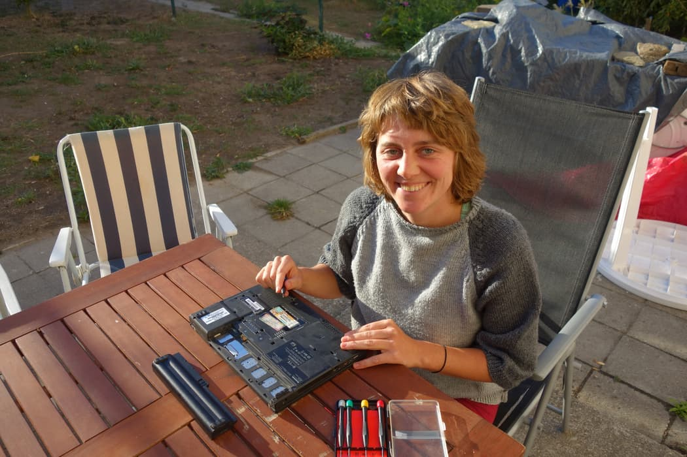
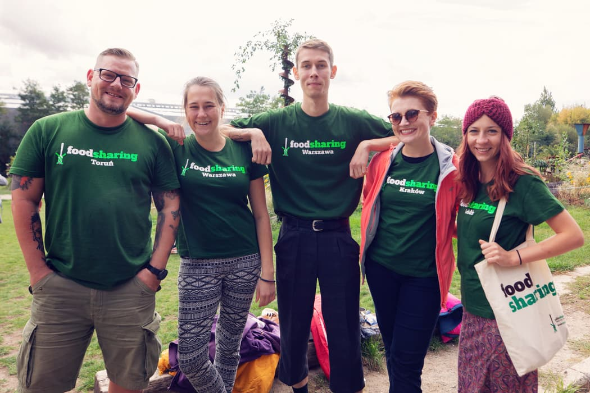

**The yunity heartbeat** - news from the world of sharing, fresh every two weeks.

## [Kanthaus](https://kanthaus.online)

Doug wrote a guide for how to do dishes the thrifty way after encountering one too many wasteful washers in the kitchen. [Read the whole thing here](https://gitlab.com/kanthaus/kanthaus-public/blob/master/drafts/2018-09-28_doug_cleaningKitchenThings.md) and step up your washing game! There is a [new blog post about our weekly repair cafe](https://kanthaus.online/de/blog/2018-09-25_repaircaf%C3%A9) written by Laurina. It tells you not only that our repair cafe is happening every week, but also that it's fun and empowering to learn new things!

 
_Laurina happily disassembling her laptop_

Soon there will be a lot of painting going on, to gather experience with different kinds of (self-made) paints: Doug will use oil paint to fix the window frames and Matthias is [already doing research](https://gitlab.com/kanthaus/kanthaus-public/issues/158) on how to make this kind of paint at home.

_by Janina_

## [Harzgerode / Haus X](http://freiefeldlage.de/)

After a birthday party lured many people to Haus X anyways, Steffen called for a spontaneous building week:

> Hey spontaneous Folks, we'll have a construction week in Harzgerode to get Haus X ready for the winter.
> Wanna lern some plumbing, stone- or woodworks or do creative stuff like painting or designing a food storage concept and meet some people?
> We've got plenty of saved food. Join us in the upcoming week (October 01-07).

_by Janina_

## [foodsharing.de](https://foodsharing.de)

Nick worked more on the native Android app for foodsharing - it's still in a very experimental phase, but the screenshot seems promising!

 
_Native foodsharing.de app with an evening tint..._

If you are interested in joining development, have a look in [Slack](https://slackin.yunity.org), in the channel #fs-dev-android

_by Tilmann_

## [foodsaving worldwide](https://foodsaving.world)

The big, annual [foodsharing festival](http://www.foodsharing-festival.org/) was happening in Berlin from the 21st to the 23rd of September and once again brought hundreds of people together: Foodsavers from all over Germany, Austria, Switzerland, Poland and tons of interested visitors. There were many workshops and seminars happening and great meals from saved food were served over the whole weekend.

 
_The Polish delegation at the Berlin festival_

One week later, Tilmann and Janina met up with foodsavers from foodsharing Warszawa. Things are going well, but some problems exist, similar to other foodsaving initiatives. You can read more about it in the [meeting summary](https://yunity.atlassian.net/wiki/spaces/FSINT/pages/55607369/Existing+initiatives#Existinginitiatives-POLAND-FoodsharingWarsaw).

Nick visited [FareShare](https://en.wikipedia.org/wiki/FareShare) on their open day in Glasgow and wrote some comments about them in a [blog post](http://nicksellen.co.uk/2018/09/23/updates.html). They save lots of food that doesn't even make it into stores and provide it to the poor. In contrast to other initiatives we mention here usually, they seem to have a strong charity aspect and are managed in a less grassrootsy way.

_by Tilmann and Janina_

## [Karrot](https://karrot.world)

Karrot has [a new release](https://github.com/yunity/karrot-frontend/blob/master/CHANGELOG.md#620---2018-08-27)! It includes the newcomer role, the trust system and on-site notifications. Also, the Android app got deployed to the Play Store, you can [test it here](https://play.google.com/store/apps/details?id=world.karrot). Before we release it officially, there are some bugs to be fixed and some legal requirements to fulfill.

From the meeting with foodsharing Warszawa we gathered more ideas for future Karrot features. One typical problem of foodsaving groups is the "first come, first served" behavior of joining pickups. The idea is to either limit how often new people can join a pickup per week or implement a "pickup lottery" in the first day after a pickup has been created. This should increase fairness amongst foodsavers.
Other new ideas include a min and max setting for pickup slots and the possibility to set a pickup to "missed" if somebody didn't show up (in contrast to just assuming everything would go fine after clicking "join").

The Bike Kitchen in Gothenburg wants to [try out Karrot](https://community.foodsaving.world/t/test-karrot-for-bike-kitchen/120) for their non-foodsaving related use case. But this fits in with the idea of Bruno and Nick to make Karrot more multi-purpose.

 
_Is Karrot a good bike-saving platform?_

_by Tilmann_

## About the heartbeat.
The heartbeat is a fortnightly summary of what happens in yunity. It is meant to give an overview over our currents actions and topics.

### How to contribute?
Talk to us in [#heartbeat](https://yunity.slack.com/messages/heartbeat/) on [Slack](https://slackin.yunity.org) if you want to add content, change the layout or any other heartbeat related issues and ideas! We are also happy about any kind of feedback! ^\_^
